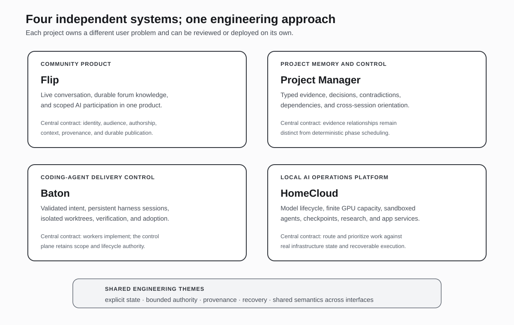

# AI Systems & Data Engineering Portfolio

I build systems that make AI useful inside real products and operational workflows: systems with explicit state, durable context, authorization boundaries, recoverable execution, and evidence that a person or another system can inspect.

This portfolio presents four independent, implemented projects. Each case study begins with the user problem and a representative workflow, then follows the design into architecture and source code. The projects are not presented as a list of frameworks or model integrations; they show how I approach product definition, systems design, data modeling, reliability, and AI control.

## Projects at a glance

| Project | What it is | Central engineering problem | What to review |
|---|---|---|---|
| **[Flip](flip-technical-overview/)** | A real-time community platform in which people and AI can participate in conversation, while selected discussion can become durable forum knowledge. | Preserve conversational speed without losing useful knowledge, leaking private context, or making AI behavior opaque. | Product architecture, real-time state, cross-context authorization, durable background workflows, AI context and provenance. |
| **[Project Manager](project-manager/)** | A project-memory and execution-control system for long-running technical work. | Keep evidence, decisions, contradictions, dependencies, and project history navigable after the original working session has ended. | Typed graph modeling, deterministic scheduling, contradiction and confidence review, retrieval, shared Rust core, CLI/MCP/web interfaces. |
| **[Baton](baton/)** | A control plane for coordinating software work across persistent coding-agent harnesses. | Run parallel agent work without surrendering scope, interaction, verification, or repository authority to the workers themselves. | Goal and plan contracts, provider adapters, persistent-session supervision, isolated worktrees, human decision points, verification and result adoption. |
| **[HomeCloud](homecloud/)** | A local-first AI application and operations platform for finite GPU infrastructure. | Turn heterogeneous accelerators and model services into a dependable runtime for interactive inference, agents, research, and background workloads. | Model-instance lifecycle, GPU claims and priority, sandboxed execution, checkpoint recovery, research workflows, application services. |

## What these projects have in common

The products serve different users and are not components of one deployed system. They share an engineering approach:

- **Begin with the operational problem.** The architecture is organized around what a user or operator is trying to accomplish, not around the availability of a model API.
- **Make state explicit.** Conversations, project evidence, agent runs, checkpoints, resource claims, and verification results are represented as durable state rather than inferred from logs or prompt history.
- **Separate capability from authority.** An AI worker may be able to read, write, execute, or call tools; that does not mean it is authorized to do so everywhere or to declare its own result accepted.
- **Preserve provenance.** Generated conclusions and artifacts remain connected to their source context, execution record, or verification evidence.
- **Design for interruption and recovery.** Long-running work is expected to encounter retries, provider failures, process restarts, blocked decisions, and partial completion.
- **Expose one coherent control surface over multiple implementations.** Shared cores and adapters keep CLI, MCP, web, provider, and hardware-specific paths from becoming separate products with different semantics.

## Representative workflows

### Flip: conversation becomes durable knowledge

A community member participates in a live room and can explicitly summon Flip inside that conversation. The AI receives only authorized, room-scoped context and replies as a visible participant. A useful segment of discussion can then enter a synthesis workflow that produces a durable forum artifact while preserving its origin and access constraints.

The architectural question is not simply how to call an LLM. It is how to move information between real-time chat, asynchronous processing, and long-lived publication without losing authorship, audience, provenance, or failure state.

**[Read the Flip case study →](flip-technical-overview/)**

### Project Manager: project history remains usable

A research result, design decision, failed experiment, constraint, or phase completion is recorded as a typed project object and connected to the evidence that produced or affected it. A reviewer can trace support, contradiction, supersession, dependency, and derivation rather than searching through an undifferentiated archive.

The system also maintains an execution DAG for project phases. Dependency-satisfied phases can be recommended deterministically, while contradiction and confidence analysis provide separate review signals. The distinction is deliberate: project knowledge and project scheduling interact, but they are not treated as the same data structure.

**[Read the Project Manager case study →](project-manager/)**

### Baton: parallel agent work remains controlled

An operator defines an objective, constraints, definition of done, risk, budget, route, and repository scope. Baton validates that contract, selects a compatible coding harness, starts persistent sessions in isolated worktrees, and supervises their progress. Questions, approvals, waits, checkpoints, and failures remain visible to the operator instead of being flattened into text output.

Worker changes are captured and verified through Baton-owned repository mechanics. The worker can propose and implement; the control plane retains authority over scope, lifecycle, verification, and publication.

**[Read the Baton case study →](baton/)**

### HomeCloud: local AI becomes an operating capability

An interactive request, agent task, research job, or media workload enters a runtime that knows which model services are healthy, which GPU slots are available, and which work has priority. The platform can check out an inference instance, schedule or change a model service when the hardware is genuinely idle, execute tools in a sandbox, and checkpoint long-running agent state for recovery.

The result is not merely a local chat endpoint. It is an application platform in which inference, resource management, agent execution, research, documents, connectors, and multimodal services share one supervised runtime.

**[Read the HomeCloud case study →](homecloud/)**

## How to review this portfolio

| Audience | Recommended path | Questions the case studies answer |
|---|---|---|
| **Recruiter or hiring manager** | Read this page, then each project’s **At a glance** and **Representative workflow** sections. | What was built? Who is it for? Why is it technically and operationally non-trivial? |
| **General IT or software interviewer** | Continue into **Architecture**, **Design decisions**, and **Failure handling**. | How are state, interfaces, permissions, retries, persistence, deployment, and maintenance handled? |
| **AI technical lead** | Focus on **AI boundaries**, **context/provenance**, **orchestration**, **verification**, and the linked source modules. | How are model behavior and tool use constrained, observed, recovered, and integrated into a larger product? |
| **Source-code reviewer** | Use each case study’s **Implementation evidence** table. | Which modules carry the claimed behavior, and where are the important contracts enforced? |

A deeper cross-project map is available in **[Portfolio architecture](PORTFOLIO_ARCHITECTURE.md)**.

## Engineering range represented

Across the four projects, the implementation work includes:

- Product and domain architecture for real-time communities, project intelligence, coding-agent operations, and local AI infrastructure.
- Elixir/OTP and Phoenix supervision, asynchronous workflows, LiveView and real-time channels, PostgreSQL, and transactional state changes.
- Rust application and persistence design, typed graph models, deterministic DAG execution, SQLite, CLI, MCP, and web interfaces.
- Node.js orchestration, persistent provider sessions, policy validation, event-driven control, real Git worktrees, verification sandboxes, and secure result export.
- Local inference routing, model-process lifecycle, GPU-aware scheduling, containerized tools, recoverable agent loops, evaluation, and multimodal application services.
- Data modeling that makes evidence, authorship, provenance, access, lifecycle, and operational status queryable rather than implicit.

## Evidence and scope

The portfolio documentation is intentionally code-led. Descriptions are grounded in the implementation repositories and link to representative source modules rather than relying only on planning notes or architecture prose.

The case studies distinguish implemented behavior from intended extensions. They do not use repository size, framework count, or speculative scale claims as substitutes for engineering value. Where two subsystems are adjacent but not yet automatically coupled, that boundary is stated directly.

## Source repositories

| Project | Implementation |
|---|---|
| Flip | [`wahargis/flip`](https://github.com/wahargis/flip) |
| Project Manager | [`wahargis/project-manager`](https://github.com/wahargis/project-manager) |
| Baton | [`wahargis/baton`](https://github.com/wahargis/baton) |
| HomeCloud | [`wahargis/home-cloud`](https://github.com/wahargis/home-cloud) |

---

**William Hargis — AI Systems & Data Engineer**
