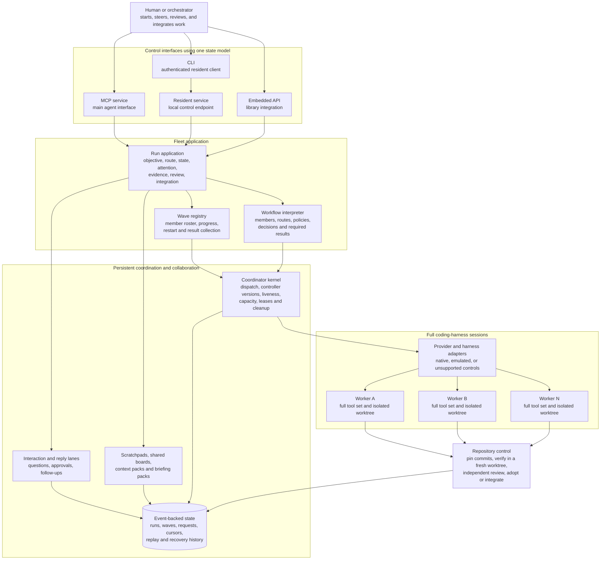
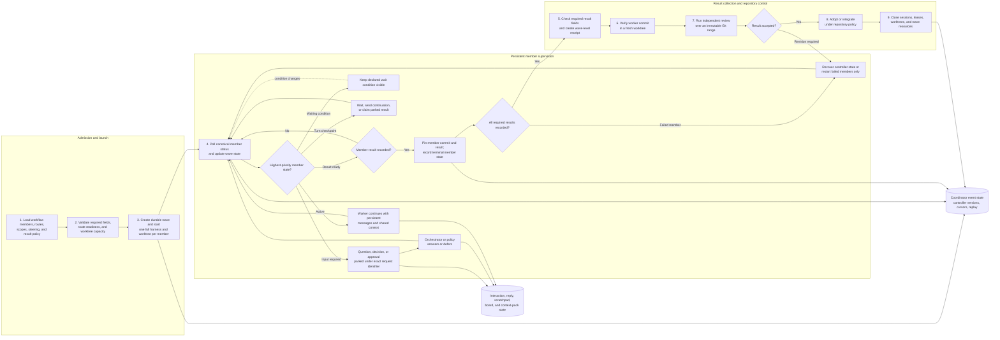

# Baton

[Source repository](https://github.com/Flip-Engineering/baton)

Baton is a cross-harness orchestration system for coding agents. An orchestrator can use MCP, the CLI, a resident local service, or an embedded API to start and control full coding-harness sessions. Each worker keeps its own tools, context management, process tree, and Git worktree. Baton provides the control and state needed to run those workers as one managed fleet.

The implemented system covers single runs, parallel waves, declarative workflows, persistent interaction, shared context, event-based recovery, result collection, independent verification, review, adoption, and integration controls.

## Fleet architecture

All control interfaces use the same run application and state model. The CLI is an authenticated client of the resident service and does not start a separate controller. MCP is the main interface for agents. The embedded API is used when Baton runs inside another process.

The run application owns run, wave, and workflow state. The coordinator kernel handles dispatch, controller-version checks, event cursors, replay, provider process state, capacity, liveness, and cleanup. Provider adapters translate the common control model into the capabilities of each full harness.

## Run, wave, and workflow

### Run

A run is one managed worker objective. The normal application surface includes start, plan approval, status, steering actions, answers, waits, stop, evidence, review, adoption, integration, recovery, and resumed work. The run record keeps the objective, selected route, state, attention items, worker result, verification state, and cleanup state together.

### Wave

A wave groups several runs under one durable identity. Each member has its own objective, route, scope, worktree, and result. The wave registry stores the current roster and member progress. A failed member can be restarted without restarting members that already produced valid results.

### Workflow

A workflow file declares the members, routes, scopes, steering policies, decision handling, and required result content for a complete multi-member operation. The interpreter creates the wave, drives member state, handles declared control actions, collects results, and produces a final workflow receipt. Each workflow therefore uses the same execution and polling implementation.

## Persistent control and collaboration

Baton keeps worker interaction available throughout a run.

- Blocking questions, decisions, and approvals use an interaction lane and place the member in an explicit input-required state.
- Conversational follow-ups use bounded reply chains.
- Turn checkpoints allow the orchestrator to wait, send a continuation message, or claim a parked result without terminating the full session.
- `waitingOn` states report whether a worker needs an interaction, another member, a resource, or another known condition.
- Worker scratchpads, shared boards, context packs, briefing packs, and configured knowledge limits carry information across members and workflow stages.
- Persistent session and recovery state allow a controller to reconnect without treating the worker as a new subprocess.

Provider adapters report whether a control is native, emulated, or unsupported. The application does not present an emulated control as equivalent to a provider-native operation.

## Wave execution and result handling

A managed wave follows these stages:

1. **Compile and validate the workflow.** Member fields, routes, policies, and required result fields are checked before worker launch.
2. **Admit resources.** Baton checks route readiness and repository worktree capacity.
3. **Start members.** Each member receives its own full harness session and isolated Git worktree.
4. **Observe and steer.** The wave driver polls canonical member status. Pending interactions take precedence over waiting state and checkpoints. Active interactions suppress checkpoint nudges and result claims.
5. **Handle decisions and questions.** The orchestrator or a declared policy answers the exact request identifier. Deferred requests remain visible.
6. **Maintain context.** Messages, replies, scratchpad notes, shared boards, and context packs are stored outside transient model output.
7. **Record member results.** Completed member output is pinned to Git state and recorded in the wave result.
8. **Collect workflow results.** The workflow checks required result content and creates a wave-level receipt. Failed members can be restarted separately.
9. **Verify.** Baton checks the worker commit in a fresh worktree. Verification does not trust the worker's existing directory or its self-reported test result.
10. **Review and integrate.** Independent review, adoption, and integration are separate actions with separate policy checks.
11. **Close resources.** Provider sessions, worktrees, leases, and the active resident-service instance are closed through explicit lifecycle operations.

The coordinator event log supports replay after controller restart. Controller-version checks and exact request identifiers prevent stale controllers or repeated answers from applying the same action to the wrong run state.

## Verification and repository control

Worker completion is not the final repository action. Baton separates four states:

1. the worker reports a result and commit;
2. verification runs against that commit in a separate worktree;
3. an independently routed review can inspect the immutable change range;
4. adoption or integration applies the accepted result under repository policy.

Ordinary runs and wave members use the same sequence. Recovery records which repository actions have already occurred.

## Selected implementation paths

| Area | Source path |
|---|---|
| Main run application and event-backed state | [`impl/src/application.mjs`](https://github.com/Flip-Engineering/baton/blob/master/impl/src/application.mjs) |
| Application semantics and status projection | [`impl/src/application-semantics.mjs`](https://github.com/Flip-Engineering/baton/blob/master/impl/src/application-semantics.mjs) |
| Resident deployment, discovery, and lifecycle | [`impl/src/application-deployment.mjs`](https://github.com/Flip-Engineering/baton/blob/master/impl/src/application-deployment.mjs) |
| CLI and authenticated application client | [`impl/src/application-cli.mjs`](https://github.com/Flip-Engineering/baton/blob/master/impl/src/application-cli.mjs), [`impl/src/application-client.mjs`](https://github.com/Flip-Engineering/baton/blob/master/impl/src/application-client.mjs) |
| Wave polling, steering, decision handling, and result recording | [`impl/src/wave-driver.mjs`](https://github.com/Flip-Engineering/baton/blob/master/impl/src/wave-driver.mjs) |
| Provider control contract | [`impl/src/adapter.mjs`](https://github.com/Flip-Engineering/baton/blob/master/impl/src/adapter.mjs) |
| MCP control surface | [`impl/src/mcp-northbound.mjs`](https://github.com/Flip-Engineering/baton/blob/master/impl/src/mcp-northbound.mjs) |
| Wave-driver contract | [`docs/37-wave-driver.md`](https://github.com/Flip-Engineering/baton/blob/master/docs/37-wave-driver.md) |

## Current scope

The source repository labels capabilities as shipped, in flight, or planned. This case study describes the shipped fleet, communication, recovery, and repository-control paths. It does not reproduce the issue roadmap or claim that planned controls are implemented.

Harness capabilities differ by provider. Route and adapter metadata remain part of the runtime decision because not every provider supports the same pause, resume, interrupt, or interaction mechanism.
