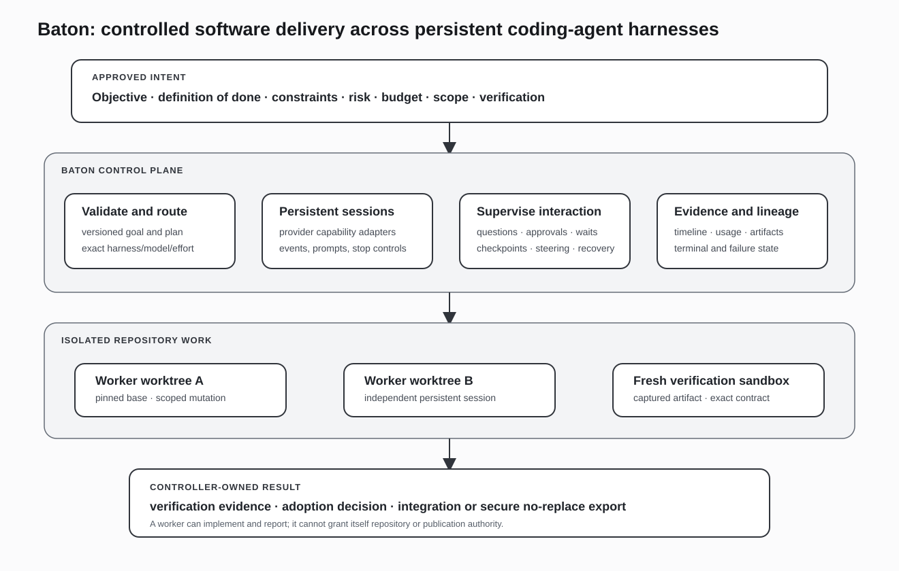

# Baton

**A run-centric fleet application for coordinating persistent full-session coding harnesses across providers.**

Baton starts from an engineering outcome and manages the work required to reach it: plan construction, exact route selection, parallel execution, interaction, steering, shared context, recovery, result collection, review, and integration. Workers are native coding harness sessions with their own tools, context management, and provider behavior—not stateless completion calls wrapped in a queue.

The application exposes one run model through embedded, resident, CLI, and MCP surfaces. A deterministic coordinator carries lifecycle and event state beneath the AI orchestrator, while provider adapters preserve the controls each harness actually supports.

## Run model

A Baton run is a durable coordination object rather than a prompt and response pair. It can represent:

- an objective and approved plan;
- one worker or a parallel wave of workers;
- exact harness, model, effort, repository, and scope assignments;
- provider-session identity and capability;
- questions, decisions, approvals, replies, waits, and checkpoints;
- shared scratch state and context passed among members;
- worktree, commit, artifact, evidence, and review state;
- recovery, re-drive, adoption, and integration decisions.

The same state is projected through all control surfaces. The CLI is a client of the resident application rather than a second controller with its own semantics; MCP exposes the same run operations to an agent orchestrator; the embedded API supports direct integration and evidence drivers.

## End-to-end execution

### 1. Define and compile the work

The operator or orchestrator supplies an outcome, completion criteria, constraints, risk, repository scope, and resource bounds. Baton can execute a direct run, an approved multi-node plan, or a declarative workflow specification.

Plans and workflows are data. They identify members, dependencies, routes, steering policy, required artifacts, and harvest conditions. This makes a reusable multi-worker pattern an application object instead of bespoke driver code that must reimplement spawn, poll, steer, settle, and close behavior.

### 2. Select exact worker routes

A route is the combination of harness, model, effort, and capability required by a member. Provider adapters publish capability cards that distinguish native, emulated, and unsupported controls. Baton therefore does not assume that every harness exposes the same approval protocol, usage signal, interrupt behavior, checkpoint model, or recovery path.

Routing uses those capabilities and live seat state. A display name is not enough; the selected route must resolve to an available and compatible worker session.

### 3. Allocate persistent sessions and isolated work

Each member receives a persistent provider session and a Git worktree pinned to a known repository state. The worktree provides a concrete unit for parallel mutation, status, capture, cleanup, and later integration. Members can operate for many turns without sharing one uncontrolled working directory.

The worker brief carries the member's objective, relevant context, repository and path scope, constraints, expected artifacts, and verification commands. The native harness remains responsible for reasoning and tool execution inside that boundary.

### 4. Coordinate attention and steering

Baton distinguishes work from states that require a different response:

- a blocking question or decision request;
- an approval request;
- legitimate dependency waiting;
- a completed turn checkpoint;
- a stalled or disconnected session;
- a result ready for collection;
- a terminal provider or worker failure.

The orchestrator can answer, approve, send a conversational reply, nudge the current turn, wait, claim a checkpoint, stop a member, or re-drive failed work. These operations are attached to durable run and member state rather than inferred from a stream of untyped text.

### 5. Share bounded working context

Parallel workers need more than independent prompts. Baton provides task-, workflow-, and project-level knowledge horizons, per-worker scratchpads, shared boards, context and briefing packs, and REPL objects for cross-run scripting and handoff.

Promotion between horizons is explicit. A worker can publish useful state to the current workflow without automatically converting every note into permanent project knowledge. The orchestrator remains able to inspect, elevate, correct, or withhold shared context.

### 6. Harvest and re-drive

A wave closes when its members reach the workflow's completion conditions. Baton records the member roster, phases, outputs, result pins, and errors in a briefing or harvest receipt. Content-addressed materialization allows a failed subset to be re-driven without repeating successful members.

The result lifecycle can continue through fresh-worktree verification, independent review, adoption, and repository integration. These stages make the output usable in software delivery, but they are later stages of the fleet workflow rather than the definition of Baton itself.

## Workflow-as-data and parallel waves

Baton's wave and workflow layers make parallel work a first-class application capability.

A workflow specification can define:

- members and exact routes;
- per-member objectives and repository scopes;
- dependency and coordination structure;
- messages sent on spawn;
- checkpoint and stall steering policy;
- decision handling and escalation;
- completion signaling;
- required harvest contents.

The workflow interpreter drives that specification through the shared run application and returns a closed receipt. The wave registry projects member roster, phase, and progress so an orchestrator can inspect the fleet without scraping each harness independently.

This supports several patterns without changing the application model: independent parallel implementation, one heavyweight coordinator over cheaper worker rows, staged investigation and implementation, cross-provider review, and selective re-drive after partial failure.

## Coordinator kernel

The orchestrator may be an AI harness. The coordinator beneath it is plain code responsible for the mechanics that must remain replayable and unambiguous:

- version and incarnation fences;
- event ordering and durable cursors;
- answer and reply delivery;
- session and process lifecycle;
- seat capacity and repository worktree limits;
- liveness evidence and stall escalation;
- recovery pins, attach, and resume;
- resource drain, cleanup, and reap;
- artifact and result identity.

A command acknowledgment is not substituted for a lifecycle event. An interrupt request can succeed while the provider process is still running; a worker can report completion while result collection or verification remains pending. The event model preserves those distinctions for both the orchestrator and the operator.

## Repository and result lifecycle

Worktrees isolate members and establish the repository state associated with each result. Baton can capture commits and artifacts, materialize results into fresh verification workspaces, run the declared checks, request independent review, and then adopt or integrate a result through explicit operations.

Repository mechanics support the run instead of replacing it. Their role is to connect a worker's persistent session to an exact change, preserve parallel work, and give later stages a stable artifact to inspect.

Result export follows the same principle. Baton-owned result roots, ownership metadata, no-replace publication, and recovery rules prevent an ambiguous output path from being treated as a completed delivery.

## Reliability and recovery

| Failure mode | Baton behavior |
|---|---|
| **Provider or harness disconnect** | Session events distinguish disconnect, stop, crash, and terminal state; recovery can attach to surviving native sessions where supported. |
| **Blocked interaction** | Questions, decisions, and approvals become explicit attention state and suspend incompatible automated steering. |
| **Legitimate wait** | Dependency waiting is represented separately from productive work and from a stall. |
| **Stalled member** | The watchdog uses liveness evidence and a preserve-first escalation sequence rather than a blind wall-clock kill. |
| **Partial wave failure** | Successful results remain pinned; only failed members need re-drive. |
| **Controller restart** | Durable events, cursors, recovery pins, provider identities, and worktree ownership support reconstruction and resume. |
| **Surface divergence** | Embedded, resident, CLI, and MCP operations are generated or checked against one control grammar and application semantics. |
| **Ambiguous repository state** | Typed worktree, capture, verification, and integration failures stop the lifecycle before an uncertain change is adopted. |
| **Resource leak** | Session, worktree, seat, and process cleanup remain coordinator responsibilities with explicit drain and reap operations. |

## Public implementation evidence

| Source | Implemented responsibility |
|---|---|
| [`impl/src/application.mjs`](https://github.com/Flip-Engineering/baton/blob/master/impl/src/application.mjs) | The run application, public operations, state transitions, collaboration services, review, adoption, integration, and recovery. |
| [`impl/src/application-semantics.mjs`](https://github.com/Flip-Engineering/baton/blob/master/impl/src/application-semantics.mjs) | Shared phase, terminal-state, attention, and control semantics used across surfaces. |
| [`impl/src/workflow-interpreter.mjs`](https://github.com/Flip-Engineering/baton/blob/master/impl/src/workflow-interpreter.mjs) | Declarative multi-member workflows, steering policy, completion handling, and harvest receipts. |
| [`impl/src/wave-driver.mjs`](https://github.com/Flip-Engineering/baton/blob/master/impl/src/wave-driver.mjs) | Long-running parallel supervision, checkpoint steering, liveness, finalization, settlement, and close. |
| [`impl/src/adapter.mjs`](https://github.com/Flip-Engineering/baton/blob/master/impl/src/adapter.mjs) | Persistent provider-session contract and capability cards for native and emulated controls. |
| [`impl/src/worktree.mjs`](https://github.com/Flip-Engineering/baton/blob/master/impl/src/worktree.mjs) | Git worktree allocation, ownership, capture, verification workspace, reconciliation, and cleanup. |
| [`impl/src/application-deployment.mjs`](https://github.com/Flip-Engineering/baton/blob/master/impl/src/application-deployment.mjs) | Resident application deployment, discovery, authentication, readiness, and lifecycle. |
| [`impl/src/mcp-northbound.mjs`](https://github.com/Flip-Engineering/baton/blob/master/impl/src/mcp-northbound.mjs) | Agent-facing MCP projection of the shared application operations. |
| [`SYSTEM.md`](https://github.com/Flip-Engineering/baton/blob/master/SYSTEM.md) | Detailed system model, coordinator contracts, state, surfaces, and operational semantics. |

## Current boundaries

- Baton coordinates coding harnesses; it does not replace their native reasoning loops or tools.
- Capability adapters preserve provider differences instead of claiming every route supports identical controls.
- Parallel members operate in isolated worktrees; integration is an explicit later operation.
- Workflow state, shared context, and results are durable application objects, but promotion to longer-lived project knowledge remains controlled.
- Verification and review can establish evidence about a captured result; they do not erase the need for an operator or policy to decide whether to adopt it.

[← Back to portfolio](../README.md) · [Public source](https://github.com/Flip-Engineering/baton)
