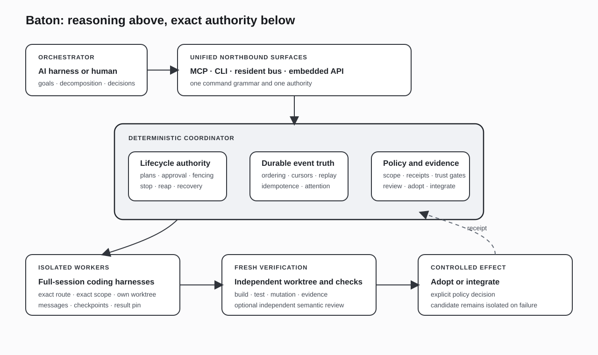

# Baton

**A deterministic control plane for probabilistic full-session coding agents.**

Baton is designed around a distinction that ordinary agent wrappers blur: launching a process is not the same as controlling a worker.

A full coding harness has its own model, tools, context management, source-control state, interaction protocol, and failure modes. An orchestrator must be able to assign exact work, observe real liveness, answer questions, steer a running turn, recover after interruption, re-derive the result, and close every resource it opened. Those guarantees cannot depend on another model following prose instructions.

Baton therefore puts a plain-code coordinator between an AI orchestrator and a fleet of full-session workers.



## Control-plane thesis

The orchestrator is allowed to reason. The coordinator is required to be exact.

| AI orchestrator | Deterministic coordinator |
|---|---|
| Chooses goals, decomposition, routes, and interventions. | Validates closed workflow schemas and exact scopes. |
| Interprets worker progress and questions. | Owns lifecycle state, fencing, ordering, and replay. |
| Decides whether to continue, redirect, review, or stop. | Delivers commands, records durable events, and confirms effects. |
| Evaluates semantic tradeoffs. | Re-runs declared verification in an independent environment. |
| Proposes adoption. | Applies explicit policy gates before source changes are adopted or integrated. |

This asymmetry is the central design, not an implementation detail.

## System architecture

### Northbound control surfaces

Baton exposes the same authority through several surfaces:

- **MCP stdio** for agent-native orchestration;
- **CLI** for human and scripted control;
- **resident authenticated command bus** for a standing local deployment;
- **embedded API** for direct integration and evidence drivers.

The CLI is a client of the resident authority rather than an independent controller. Surface-specific syntax can differ, but commands, lifecycle state, refusals, and effects must map to one control grammar.

### Run application

A run is the ordinary unit of controlled work. Its lifecycle includes:

```text
declare intent
  -> compile bounded plan
  -> approve
  -> launch exact worker route in isolated worktree
  -> observe / message / answer / steer
  -> collect immutable result
  -> verify in fresh worktree
  -> optional independent review
  -> explicit adopt or integrate
  -> close resources
```

Approval, execution, review, adoption, and integration are separate effects. A worker reaching “done” does not collapse them.

### Waves and workflows

A wave groups multiple workers under one durable identity. Each member has an exact route, scope, worktree, and result. The registry projects member state and attention without losing the underlying event history.

A declarative workflow can describe:

- members and routes;
- dependency or coordination pattern;
- steering policies;
- when decisions must be deferred to a human;
- required result content;
- harvest and verification rules.

The workflow interpreter drives the closed specification. The user does not need to write a bespoke process supervisor for every multi-agent pattern.

Illustrative shape:

```json
{
  "objective": "Audit and repair the client/server compatibility contract",
  "members": [
    {
      "id": "server-audit",
      "route": "reasoning-heavy",
      "scope": ["server/contracts", "server/tests"]
    },
    {
      "id": "client-audit",
      "route": "high-throughput",
      "scope": ["client/sync", "client/tests"]
    }
  ],
  "steering": {
    "approveAdvertisedPlan": true,
    "askOnDecision": true,
    "nudgeOnStall": true
  },
  "harvest": {
    "require": ["findings", "patch", "verification"]
  }
}
```

The example describes a contract, not a prompt transcript.

## Reliability kernel

### Durable event truth

Lifecycle truth is an append-oriented event record from which current views can be projected and replayed. A mutable status field alone cannot explain command races, retries, worker replacement, or a partially completed stop.

Durable cursors and idempotent command handling support at-least-once delivery without allowing duplicate semantic effects.

### Incarnation and version fencing

Every worker seat and resident controller has a specific incarnation. Commands addressed to stale identities are rejected. This prevents a delayed “stop” or “answer” from reaching a replacement worker that happens to occupy the same logical slot.

### Confirm-it-stopped

Stopping means more than sending a signal. Baton tracks process ownership, checks the relevant process forest, preserves recoverable state when possible, and confirms that the intended incarnation has actually terminated before releasing capacity.

### Liveness from evidence

A slow turn is not necessarily a stalled worker. The watchdog uses explicit liveness evidence and a bounded escalation ladder:

1. identify the missing progress signal;
2. request or nudge at a safe checkpoint;
3. claim or recover the turn where supported;
4. preserve state before reap;
5. close the exact owned resources.

A worker with an in-flight productive turn is structurally distinct from one with no admissible liveness evidence.

### Interaction lanes

Blocking questions and conversational messages have different semantics. A blocking interaction changes what the run is waiting on and must be answered exactly once. Ordinary messages can form bounded reply chains without falsifying the run’s attention state.

### Worktree and scope isolation

Each source-modifying worker receives an isolated git worktree and an explicit scope. Scope is a coordinator-side admission rule, not merely a sentence in the prompt. Result material is tied to immutable git objects so verification and review do not depend on the worker’s mutable directory.

## Trust model

### Worker completion is a claim

When a worker reports completion, Baton captures the candidate result and re-runs the declared checks in a fresh worktree at the candidate commit. This avoids trusting:

- uncommitted local state;
- a polluted dependency directory;
- tests modified only in the worker directory;
- a worker’s summary of commands it says it ran.

### Verification layers

The trust gate can combine:

- declared build, lint, and test commands;
- red-to-green evidence;
- coverage of changed behavior;
- mutation or adversarial probes;
- bounded evidence manifests;
- structural code representations;
- independent semantic review over an immutable range.

Not every workflow requires every layer. The policy is explicit, and the receipt states which layers ran.

### Adoption is not integration

`adopt` makes a verified result available to the orchestrator’s source state under policy. `integrate` performs the later composition step. Keeping them separate allows review, comparison, or rejection after verification without silently mutating the target branch.

## Collaboration and memory

Baton carries execution-scoped collaboration state:

- per-worker scratchpads;
- shared boards;
- context and briefing packs;
- task and workflow knowledge horizons;
- result pins;
- orchestration decisions;
- bounded shared cells or typed bindings.

Promotion to project-persistent knowledge is gated. Baton is not a replacement for Project Manager’s long-horizon evidence graph; its memory is optimized for coordinating and proving work in flight.

## Full-session workers

Baton targets harnesses, not bare completion APIs. A worker route describes what the harness can actually do:

- start or resume a session;
- receive mid-flight control;
- expose checkpoints or turns;
- answer interactions;
- operate in a worktree;
- report tool and lifecycle events;
- stop and clean up reliably.

Adapter capability cards distinguish native, emulated, and unsupported controls. The coordinator must not present an emulated behavior as a native guarantee.

## Failure model

| Failure | Required behavior |
|---|---|
| Worker exits before result | Record terminal reason, preserve recoverable state, release owned resources. |
| Command is retried | Deduplicate or replay the same semantic result. |
| Stale controller sends command | Reject by incarnation fence. |
| Worker asks a question | Surface explicit attention state; accept one authoritative answer. |
| One wave member fails | Preserve successful member results; redrive only eligible failed members. |
| Worker reports success but verification fails | Keep candidate isolated; do not adopt. |
| Verification environment fails | Distinguish infrastructure failure from candidate failure. |
| Orchestrator disconnects | Resident authority retains durable run state and supports reattachment. |
| Stop races with completion | Resolve from ordered event truth and close resources once. |

## Status and publication boundary

The core implementation includes the run lifecycle, multi-worker waves, declarative workflow interpretation, unified control surfaces, durable coordinator state, interaction and steering paths, isolated worktrees, liveness/recovery controls, fresh-worktree verification, and policy-separated review/adoption/integration.

The system remains under active development. Deeper nested orchestration, broader adapter parity, richer persistent knowledge, additional structural verification, and more prescriptive diagnostics are continuing work.

The implementation repository is private. This case study intentionally omits provider credentials, host configuration, private campaign logs, issue-number inventories, and low-level thresholds. It documents the architectural contracts that make the implementation meaningful.

## Relationship to the other systems

- Baton can run work that produces Project Manager findings and decisions, but Project Manager remains the durable evidence authority.
- Baton can consume HomeCloud-hosted capacity, but HomeCloud remains the compute and sandbox authority.
- Baton can modify a product repository such as Flip under an explicit workflow, but it does not own Flip’s product permissions or content model.
