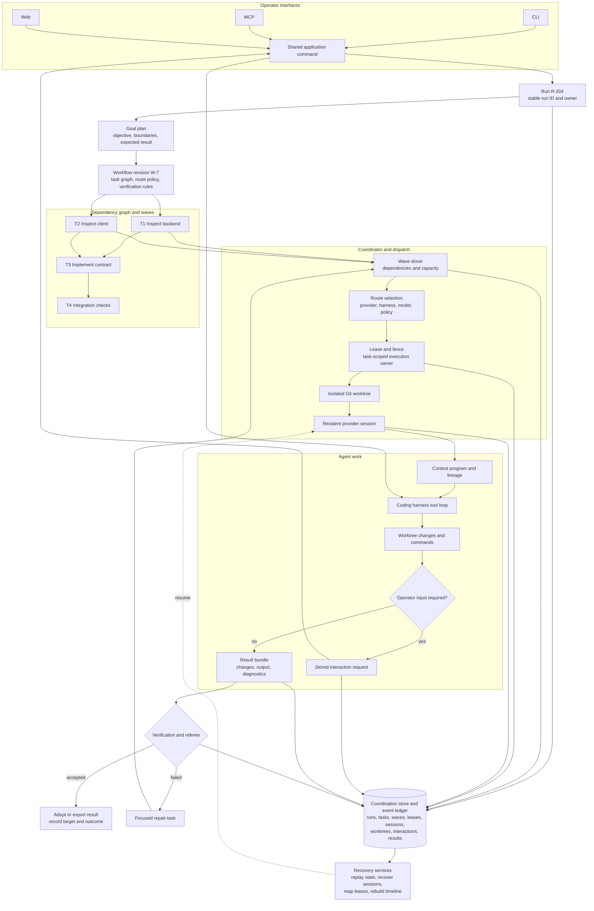

# Baton

Baton coordinates coding-agent work as durable runs. A run contains an approved goal, a workflow revision, task dependencies, execution waves, provider sessions, isolated worktrees, interaction requests, verification results, and adoption state.

[Source repository](https://github.com/Flip-Engineering/baton)

## Run lifecycle

The diagram follows one run from operator request through task execution, verification, and adoption.

1. An operator submits a goal through CLI, MCP, or web.
2. Application semantics validate the command and create a run.
3. A goal plan and workflow revision define tasks, dependencies, policies, and required results.
4. Ready tasks are grouped into waves according to dependency and capacity state.
5. The coordinator chooses a provider, harness, model, and execution route.
6. Baton grants a task-scoped lease, fence, and isolated Git worktree.
7. A resident agent session receives context, tools, messages, and interaction responses while it works.
8. Normalized events update the run timeline and coordination state.
9. Completed task output enters verification.
10. Accepted output is adopted into the target branch or exported as a result bundle.
11. Failed verification can create a repair task or return the task to execution.

The operator can reconnect through another interface and continue the same run because the run state does not live only in the initiating process.

## Run and workflow state

A run links the principal records required to explain its current status:

| Record | Stored purpose |
|---|---|
| Goal plan | Approved objective, boundaries, and expected result |
| Workflow revision | Versioned task graph and execution policy |
| Wave | A set of tasks that can run under current dependencies and capacity |
| Task | Unit of work, dependency state, route, lease, result, and verification status |
| Provider session | Resident coding harness process and provider conversation state |
| Worktree | Isolated repository workspace owned by a task |
| Interaction request | Question, approval, credential, or other input required from an operator |
| Event | Normalized state change used for timelines, replay, and diagnostics |
| Result and verification | Produced artifacts and the checks applied before adoption |
| Adoption record | How accepted work entered the target repository or export |

Workflow definitions are data. A workflow can be revised without replacing the complete application runtime. The interpreter applies task dependencies, policies, and stage transitions to the current run.

## Provider and harness routing

Baton supports several coding-agent providers and harness protocols. A route identifies the provider, harness, model, credential source, and runtime policy required for one task.

The coordinator checks route liveness, provider governance, available capacity, and task requirements before dispatch. Provider-specific streams are normalized into common task events so the operator surfaces can show one run model.

Resident sessions preserve the provider's normal coding harness. Baton coordinates the session around it; it does not reduce the provider to a single text completion call.

## Worktree ownership

Each executing task receives an isolated Git worktree and task-scoped authority. The lease and fence prevent an old or duplicated worker from continuing to write after ownership changes.

Worktree state is recorded with the task. Capacity management can limit the number of active worktrees, reclaim abandoned workspaces, and preserve a failed workspace for inspection or recovery.

Completed changes do not enter the target branch directly. They pass through result collection, verification, and adoption.

## Shared context and communication

Tasks can receive structured context through context programs and runtime calls. The context system records the data supplied to a worker, results returned by context operations, and lineage required to explain later task behavior.

Workers can exchange messages through stored communication surfaces. A task can publish a finding, request information from another task, or wait for operator input. These messages remain part of the run instead of being hidden in one provider transcript.

## Verification and adoption

A completed session produces a result bundle that can include changes, command output, diagnostics, and exported artifacts. Verification can run repository checks, task-specific criteria, and referee logic.

Verification is a run stage with stored results. A failed check can:

- Return the task to execution.
- Create a focused repair task.
- Request operator input.
- Preserve the result for inspection without adoption.

Accepted work moves through an adoption step that records the target and outcome. This separates agent completion from repository acceptance.

## Recovery and observability

The coordination store and event history record run transitions, leases, sessions, interactions, worktrees, and verification. Baton uses this data for:

- Rebuilding a run timeline.
- Replaying state after a process restart.
- Recovering provider sessions.
- Detecting stalled routes or workers.
- Reaping expired leases and abandoned worktrees.
- Compacting old event history without losing current state.
- Resuming a blocked task after operator input.
- Showing the same run state in CLI, MCP, and web surfaces.

Recovery continues the existing run and task identifiers. It does not create a second disconnected run to replace the failed process.

## Control interfaces

CLI, MCP, and web requests enter the same application command layer. Commands use shared validation and application semantics before they mutate coordination state.

This keeps start, pause, resume, cancel, interact, inspect, verify, adopt, and export operations consistent across interfaces. Interface-specific transport code does not implement a separate run lifecycle.

## Implementation references

| Workflow area | Source |
|---|---|
| Shared application behavior | [`impl/src/application-semantics.mjs`](https://github.com/Flip-Engineering/baton/blob/master/impl/src/application-semantics.mjs) |
| Coordinator and dispatch | [`impl/src/coordinator.mjs`](https://github.com/Flip-Engineering/baton/blob/master/impl/src/coordinator.mjs) |
| Durable coordination state | [`impl/src/coordination-store.mjs`](https://github.com/Flip-Engineering/baton/blob/master/impl/src/coordination-store.mjs) |
| Goal plans and workflow execution | [`impl/src/goal-plan.mjs`](https://github.com/Flip-Engineering/baton/blob/master/impl/src/goal-plan.mjs) and [`impl/src/workflow-interpreter.mjs`](https://github.com/Flip-Engineering/baton/blob/master/impl/src/workflow-interpreter.mjs) |
| Wave execution | [`impl/src/wave-driver.mjs`](https://github.com/Flip-Engineering/baton/blob/master/impl/src/wave-driver.mjs) |
| Provider routing | [`impl/src/router.mjs`](https://github.com/Flip-Engineering/baton/blob/master/impl/src/router.mjs) and [`impl/src/provider-governance.mjs`](https://github.com/Flip-Engineering/baton/blob/master/impl/src/provider-governance.mjs) |
| Worktree lifecycle | [`impl/src/worktree.mjs`](https://github.com/Flip-Engineering/baton/blob/master/impl/src/worktree.mjs) |
| Context runtime and lineage | [`impl/src/context-runtime.mjs`](https://github.com/Flip-Engineering/baton/blob/master/impl/src/context-runtime.mjs) and [`impl/src/context-lineage.mjs`](https://github.com/Flip-Engineering/baton/blob/master/impl/src/context-lineage.mjs) |
| Verification and result export | [`impl/src/referee.mjs`](https://github.com/Flip-Engineering/baton/blob/master/impl/src/referee.mjs) and [`impl/src/result-export.mjs`](https://github.com/Flip-Engineering/baton/blob/master/impl/src/result-export.mjs) |
| Session recovery | [`impl/src/session-recovery-supervisor.mjs`](https://github.com/Flip-Engineering/baton/blob/master/impl/src/session-recovery-supervisor.mjs) |
| MCP and web interfaces | [`impl/src/mcp-northbound.mjs`](https://github.com/Flip-Engineering/baton/blob/master/impl/src/mcp-northbound.mjs) and [`impl/src/web-northbound.mjs`](https://github.com/Flip-Engineering/baton/blob/master/impl/src/web-northbound.mjs) |

## Scope

Baton is an execution and coordination system for coding-agent fleets. The case study covers run state, provider sessions, worktrees, communication, verification, recovery, and operator interfaces. It does not describe the agents as independent authors with unrestricted repository authority.
