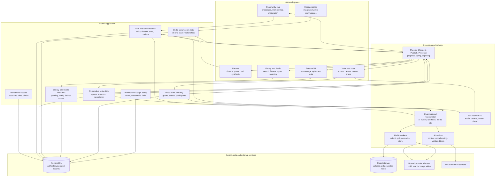

# Flip

Flip is a social and creative platform built around communities, real-time discussion, Personal AI, and media creation. Users can move between chat, forum threads, AI conversations, image and video commissions, a media library, an image editor, and voice or video rooms without leaving the same account and permission model.

[Open the production site](https://flip.engineering) · [Open the technical demo](https://flip.tech-demo.dev)

## Product workflows

### Community discussion and cited synthesis

Community chat and forum messages are normal user records with authors, membership rules, edits, and deletion state. AI curation reads only the messages available to the requesting user. A generated summary stores citations to the source message or post identifiers so the interface can show where each claim came from.

The AI output is stored separately from the source discussion. Editing or deleting a source message can trigger tracking and refresh work without changing the original authorship of the discussion.

[Community and forum details](docs/community-and-forum.md)

### Personal AI replies and tools

A user message can request a Personal AI reply. The application creates a separate reply record for that message and queues it for execution. The worker receives the message, conversation state, user-authorized context, model settings, and allowed tools. Tool calls are validated on the server before execution.

Replies are tracked per source message. Multiple pending replies do not share one ambiguous conversation-wide status. Reconciliation work finds queued or working replies that lost a worker and returns them to execution.

[Personal AI and tool details](docs/personal-ai-and-tools.md)

### Image and video commissions

A media request first becomes a stored commission and a visible pending library item. Provider work starts after that durable state exists. Image and video workers update the same commission through accepted, running, completed, failed, or cancelled states.

Completed assets enter the user's library with generation metadata and can open directly in Studio. Studio supports text, stickers, selection, transforms, layers, and mask-aware image editing. Edited results are saved as new assets instead of silently replacing the source.

[Media, Studio, and Library details](docs/media-studio-and-library.md)

### Voice and video rooms

Voice and video rooms use signed join grants and server-authorized room membership. Phoenix handles room state and signaling control. A self-hosted SFU handles audio, camera, and screen-share media. Signaling is sent only to the intended participant instead of being broadcast to every room member.

[Voice, clients, and operations details](docs/voice-clients-and-operations.md)

## Platform architecture

The application is an Elixir and Phoenix modular monolith backed by PostgreSQL. The same runtime owns identity, membership, chat, forums, Personal AI reply state, media commissions, library metadata, usage records, and voice-room authorization.

PostgreSQL is the authoritative store for durable product state. Oban runs background work such as AI replies, synthesis, media generation, reconciliation, and maintenance. Phoenix Channels, PubSub, and Presence carry transient room and progress events. Electric synchronization projects durable records to clients that need local read models and offline-capable behavior.

The web application and native clients share React and TypeScript interface code. Tauri packages desktop clients. Capacitor packages mobile clients. Client-side state can improve responsiveness, but the server remains responsible for permissions, provider credentials, billable work, media grants, and final job state.

## Personal AI to media flow

```mermaid
flowchart LR
    message["1. User message<br/>stored"] --> reply["2. Personal AI reply<br/>queued"]
    reply --> context["3. Context, route, tools<br/>working"]
    context --> authorize{"4. Media tool<br/>authorized?"}
    authorize -- no --> text["Complete text reply"]
    authorize -- yes --> commission["5. Commission and pending<br/>Library item accepted"]
    commission --> provider["6. Provider job<br/>running"]
    provider --> asset["7. File and metadata<br/>completed"]
    asset --> ready["8. Library item<br/>ready"]
    ready --> final["9. Original reply updated"]
    final --> studio["10. Reply, Library, or Studio"]

    provider -. transient failure .-> retry["Retry or defer same job"]
    retry -.-> provider
    provider -. terminal failure .-> failed["Reply and Library item<br/>failed"]
    reply -. worker restart .-> reconcile["Reconciliation scans<br/>queued and working records"]
    reconcile -.-> context
    commission -. cancellation .-> cancelled["Reply, commission, and projection<br/>cancelled"]
    asset -. missing projection .-> repair["Rebuild Library projection<br/>from stored commission and asset"]
    repair -.-> ready
```

This flow shows one user message becoming a Personal AI reply and, when requested, a durable image or video job. The pending reply and library item remain visible during provider work. Provider errors, worker restarts, and cancellation update stored state instead of leaving the request only in browser memory.

## Durable state

The principal stored records include:

| Record | Purpose |
|---|---|
| User, membership, role, block, and moderation records | Decide who can see and change community content |
| Chat messages, forum posts, edits, and deletion markers | Preserve authored discussion and source identity |
| Personal AI replies and queue state | Track one AI response for one source message |
| Synthesis records and citations | Connect generated summaries to source messages and posts |
| Media commissions and generation jobs | Track long-running image and video work |
| Library assets, folders, favorites, and generation metadata | Organize generated and uploaded media |
| Usage and credit records | Apply product policy around provider-backed work |
| Voice rooms, events, grants, and participant state | Authorize and operate live media sessions |

## Asynchronous work and recovery

Long-running work is accepted into stored state before a provider call starts. Jobs use stable identifiers so retries can continue the same request. Provider adapters classify transient and terminal failures. Circuit breakers prevent repeated calls to a failing provider. Reconciliation jobs scan for reply or media records that are still queued or working without an active worker.

A transient failure can return a job to a retry or deferred state. A terminal failure records the reason required for user-visible status and usage settlement. A process restart does not require the original browser session to remain open.

## Authorization

The server checks community membership, message visibility, tool permission, media ownership, and voice-room access. Personal AI tools receive a request-scoped capability set. Media actions are limited to the reply or asset that authorized them. Provider keys and integration settings are loaded and validated on the server; clients receive only the result and permitted metadata.

## Current implementation scope

The case study covers working product paths for:

- Community chat, forums, membership, and moderation.
- Personal AI replies with server-side tools and recovery.
- Community AI curation with source citations.
- Image and video commissions with durable job state.
- Searchable, foldered, and favorited media library views.
- Responsive image Studio workflows for desktop and mobile layouts.
- Self-hosted voice, camera, and screen-share rooms.
- Web, PWA, desktop, and mobile client surfaces.
- Local and hosted model routing with provider health controls.

The public diagrams omit production credentials, private messages, prompt and persona data, provider pricing rules, security thresholds, and host-specific deployment details.
