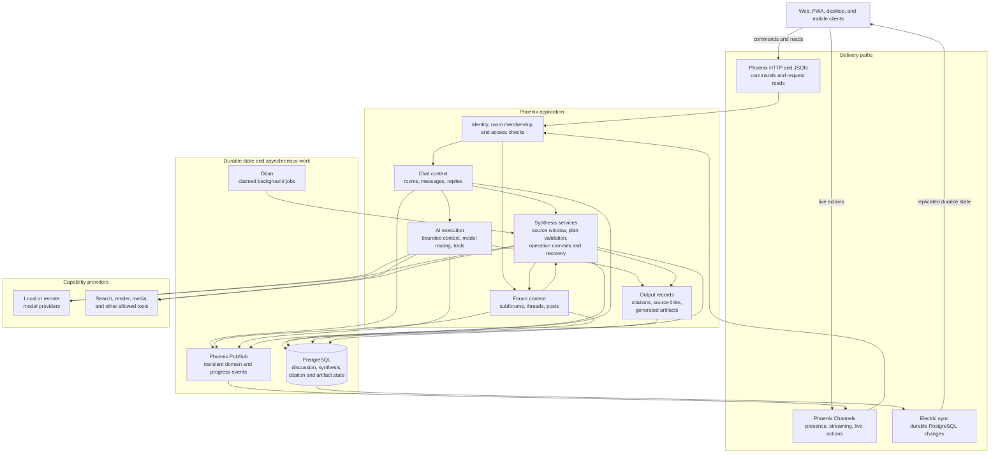
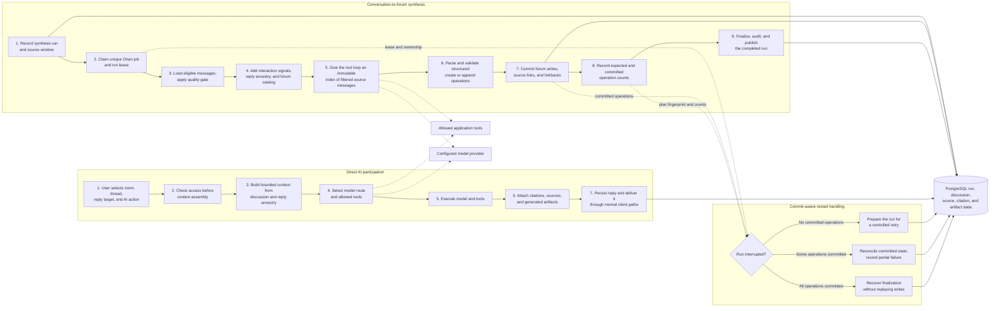

# Flip

[Source repository](https://github.com/wahargis/flip)

Flip is a hybrid real-time chat and forum application. A conversation can remain in a live room or be converted into durable forum material by a background synthesis pipeline. AI responses use the same application state as human discussion: room and thread access, reply ancestry, source messages, citations, generated artifacts, and persisted posts remain part of the product record.

The implementation is an Elixir/Phoenix backend with PostgreSQL and Oban, plus React and TypeScript clients. Electric provides durable client synchronization from PostgreSQL. Phoenix Channels and PubSub carry presence, streaming, and other transient events.

## Implemented product paths

- **Room chat:** messages, replies, presence, live events, and explicit AI participation.
- **Forum discussion:** subforums, threads, posts, and thread updates created by users or synthesis operations.
- **Conversation synthesis:** an Oban worker converts an eligible message window into validated thread-create or thread-append operations.
- **AI execution:** model selection, bounded context, tool calls, citations, and artifacts are handled inside the application rather than delegated to a separate chatbot UI.
- **Client delivery:** browser, desktop, and mobile clients combine HTTP commands, database synchronization, and real-time events.

## Runtime architecture

Commands and request-scoped reads enter through Phoenix HTTP endpoints or Channels. Phoenix contexts apply authorization and business rules before state is written to PostgreSQL. Electric streams durable row changes to clients. Channels and PubSub carry events that should not be stored as replicated application state, such as presence and incremental output.

Oban executes synthesis and other asynchronous work against the same database. Model and tool providers are behind internal service boundaries so provider-specific request formats do not become the application data model.

## Conversation-to-forum synthesis

The synthesis worker records a multi-step database operation and can recover from interruption between preparation, content commits, and finalization.

A synthesis run follows this sequence:

1. A room and message window are recorded in a synthesis-run row.
2. A unique Oban job claims the run. Completed, failed, or already-owned runs do not execute again.
3. The worker loads source messages, removes ineligible material, and applies a quality gate before spending a model call.
4. It computes interaction signals and loads parent excerpts needed to understand replies that fall outside the main window.
5. The prompt includes the current subforum and thread catalog. The tool loop receives an immutable index of the exact filtered source messages used to build the prompt.
6. The model returns a structured operation plan. Parsing and validation check the operation form and valid append targets.
7. The operation processor creates or appends forum content, records source relationships and linkbacks, and advances committed-operation counters.
8. The run is finalized, audited, and broadcast to connected clients.

The retry path is based on committed state:

- A run with no committed operations can be prepared for another attempt.
- A partially committed run is reconciled and marked as a partial failure rather than replayed without knowing which writes already occurred.
- A run with all operations committed but incomplete finalization can recover the finalization step.

Recovery uses the database run record, committed-operation count, and plan fingerprint.

## Direct AI participation

Direct AI replies use a shorter execution path than synthesis but share the same application services:

1. A user action identifies the room, thread, reply target, and requested AI capability.
2. Access is checked before context is assembled.
3. The application builds bounded context from the current discussion and reply ancestry.
4. A model route and allowed tools are selected.
5. Tool results, source references, and generated artifacts are attached to the response state.
6. The reply is persisted and delivered through normal client synchronization and real-time events.

AI replies are stored in the existing discussion structure and use the same synchronization and real-time delivery paths as human replies.

## State and failure handling

PostgreSQL is the canonical store for users, discussion state, synthesis runs, operation progress, citations, and artifacts. Oban provides durable job execution. The synthesis worker also applies application-level safeguards that are visible in the run record:

- unique execution by run identifier;
- explicit pending, running, completed, failed, and partial-failure states;
- run ownership and lease handling;
- a fixed source-message snapshot for model tools;
- committed and expected operation counts;
- recovery for incomplete finalization;
- audit events and PubSub notifications.

The portfolio does not claim throughput, latency, or deployment scale that is not measured in the public repository.

## Selected implementation paths

| Area | Source path |
|---|---|
| Synthesis job lifecycle and recovery | [`lib/flip/synthesis/synthesis_worker.ex`](https://github.com/wahargis/flip/blob/main/lib/flip/synthesis/synthesis_worker.ex) |
| Synthesis operation commits and reconciliation | [`lib/flip/synthesis/operation_processor.ex`](https://github.com/wahargis/flip/blob/main/lib/flip/synthesis/operation_processor.ex) |
| Model tool loop for synthesis | [`lib/flip/synthesis/tool_loop.ex`](https://github.com/wahargis/flip/blob/main/lib/flip/synthesis/tool_loop.ex) |
| Prompt construction and output parsing | [`lib/flip/synthesis/prompt.ex`](https://github.com/wahargis/flip/blob/main/lib/flip/synthesis/prompt.ex), [`lib/flip/synthesis/output_parser.ex`](https://github.com/wahargis/flip/blob/main/lib/flip/synthesis/output_parser.ex) |
| Synthesis run state | [`lib/flip/synthesis/synthesis_run.ex`](https://github.com/wahargis/flip/blob/main/lib/flip/synthesis/synthesis_run.ex) |
| Chat and forum application contexts | [`lib/flip/chat.ex`](https://github.com/wahargis/flip/blob/main/lib/flip/chat.ex), [`lib/flip/forum.ex`](https://github.com/wahargis/flip/blob/main/lib/flip/forum.ex) |

## Product views

The repository retains two captures of the public product and technical demonstration surfaces.

*Public Flip engineering site.*

*Technical demonstration surface.*

## Current scope

This case study follows the discussion, synthesis, and AI execution paths because they show the main product integration across clients, Phoenix, PostgreSQL, background jobs, providers, tools, and persisted output. The source repository contains additional application areas and remains the current implementation reference.
