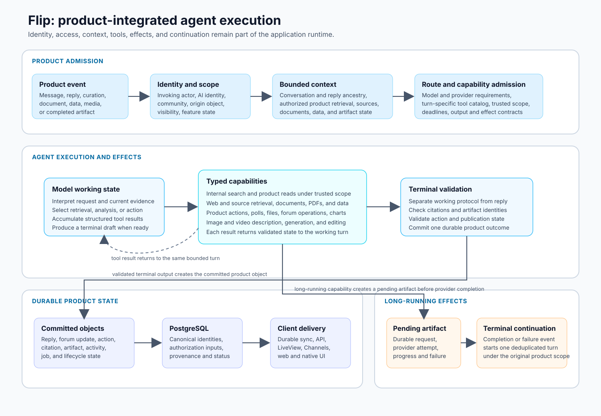

# Flip

Flip is a real-time community product with integrated AI participants. The application combines chat, forums, search, identity, membership, moderation-related controls, media, background workflows, and web and native clients. Its AI runtime supports conversation, internal and external research, document and data work, product actions, image and video operations, generated artifacts, and chat-to-forum curation.

The engineering problem is to run these agent capabilities inside the existing product model. An AI participant cannot receive all stored content, call every available service, or publish an effect because a model requested it. Each turn is tied to a product actor, an AI identity, an origin object, current access rules, a selected context, an admitted capability set, and durable records of the resulting activity.

## System scope

| Area | Current system |
|---|---|
| **Community product** | Accounts, communities, membership, chat rooms, messages, replies, reactions, polls, forums, search, notifications, media, settings, and administrative and moderation-related controls. |
| **AI participation** | Explicit AI identities; message and reply triggers; room-specific behavior; bounded context; local and hosted model routes; multi-turn tools; direct replies; structured product actions; activity and source records. |
| **Research and analysis** | Internal product retrieval, web search and direct source reading, document and PDF analysis, structured data work, charts, evidence assembly, citations, and source-aware terminal replies. |
| **Multimodal work** | Image and video description, generation and editing, asynchronous provider requests, durable artifacts, progress and failure state, and continuation after completion. |
| **Conversation curation** | Selection of source messages, topic and destination planning, validated forum creation or update, participant and source-message provenance, linkback, feedback, and recuration. |
| **Application runtime** | Elixir and Phoenix, PostgreSQL and Ecto, Oban workflows, LiveView and Channels, server-authoritative APIs, and durable synchronization for React-based desktop and mobile clients. |

## Product surfaces

<table>
<tr>
<td width="50%"></td>
<td width="50%"></td>
</tr>
<tr>
<td><strong>Community product</strong> Realtime conversation, forums, media, member interaction, and AI participation are presented in one product interface.</td>
<td><strong>Synthetic technical environment</strong> Non-production identities and data exercise agent, curation, authorization, artifact, failure, and client-state contracts.</td>
</tr>
</table>

## Execution architecture

The diagram follows one AI request through product admission, agent execution, durable effects, and client updates. It also shows the asynchronous continuation path used by media, documents, and other work that cannot finish inside one model turn.

## Direct AI turn

A direct reply follows a controlled application path:

1. **A product event starts the turn.** A member mentions or replies to an AI identity, uses an AI-enabled product surface, or receives a continuation from completed asynchronous work.
2. **The server resolves the operating scope.** The runtime identifies the invoking actor, AI identity, community, room or forum object, feature configuration, and current visibility. The model does not supply these values as trusted arguments.
3. **Context is assembled for this turn.** The runtime selects recent conversation, same-room reply ancestry, room briefing, linked artifacts, relevant product records, prior tool results, and other allowed context. Stored data that is outside the actor's scope is not eligible.
4. **A route and capability catalog are selected.** The route must satisfy the turn's modality, context, tool, latency, privacy, and provider requirements. The tool catalog is computed from the product surface, actor scope, feature configuration, and available services.
5. **The model and tool loop executes.** The model can compose directly, retrieve more context, read sources, analyze documents or data, request generated media, or call typed product capabilities. Tool results are validated and added to the turn state.
6. **Effects pass through application services.** Product mutations, citations, polls, files, generated artifacts, and other effects receive server-owned identities and lifecycle state. Provider output is not itself a committed product action.
7. **The terminal response is validated and stored.** The runtime separates working rounds from the user-visible reply, rejects incomplete protocol or invalid references, persists the reply and associated activity, and publishes the resulting product event.
8. **Clients converge on committed state.** Web and native clients receive durable records through their synchronization path and transient updates through realtime channels.

This path allows model behavior to vary without moving identity, authorization, effect ownership, or persistence into the provider conversation.

## Admission, identity, and authorization

Flip has human accounts, product roles, room and forum visibility, and explicit AI identities. The AI identity determines attribution and configured behavior. The invoking actor determines which product state is eligible for the turn and which actions can be requested.

Authorization is applied before protected retrieval and again when a read or effect occurs. This matters because a model may attempt to broaden a search, follow a link into a different community, or construct a product action whose target is outside the original scope. Trusted actor, community, and origin identifiers are carried by the runtime rather than accepted from model-generated tool arguments.

Cross-domain provenance also affects access. A forum item derived from restricted chat cannot become readable only because its destination forum has broader default visibility. The source relationship remains part of the authorization decision.

## Context and retrieval

The runtime uses several context sources with different operating rules:

- **Conversation context** includes a bounded recent window, same-room reply ancestry, direct references, and configured room information.
- **Internal retrieval** searches product-native content under current actor and community scope and returns stable product references.
- **External research** separates discovery from direct source reading. Search results identify candidate sources; page or document tools retrieve the evidence used by the final answer.
- **Document and PDF work** creates a durable relationship between the uploaded or referenced document, extracted or selected passages, the AI activity, and the resulting answer or artifact.
- **Structured data work** uses typed requests and results for data access, analysis, tables, and charts instead of asking the model to invent a data product in prose.
- **Artifact context** lets a later turn inspect the state and result of an image, video, file, poll, chart, or other product object without replaying the original provider exchange.

Context is selected before model execution and remains subject to a working budget. The configured model's advertised context size does not remove the need to rank, compact, and reserve space for tool schemas and the final response.

## Route and provider control

Different Flip workloads require different model behavior. Low-latency conversation, evidence-heavy research, structured curation, document interpretation, image understanding, and media generation do not share one useful route profile.

The product-owned request envelope includes selected context, AI identity and instructions, admitted tools, output requirements, deadlines, and terminal behavior. Provider adapters translate that request to local or hosted model services and normalize streams, tool calls, completion state, usage, and failures. A route change therefore does not grant new product access or change how replies and effects are stored.

Fallback remains constrained by the original request. A replacement route must preserve privacy requirements, modality, tool support, working context, and the ability to complete the existing evidence and artifact state. The system should fail the AI capability visibly rather than route protected content through an incompatible provider.

## Tools and effects

Flip's tool system is part of the application layer. It includes read-only retrieval, analysis, product-native commands, and asynchronous provider-backed work. The runtime distinguishes these categories because their authorization, timeout, retry, and persistence requirements differ.

A read tool can return scoped product records or external evidence. An analysis tool can create structured results from selected data. An effectful tool can request a product mutation, but the mutation still passes through domain validation and receives a durable product identity. A long-running tool can create a pending artifact or job and return control before the provider finishes.

The tool loop records enough state to answer operational questions after the model context has ended:

- which capability was admitted and called;
- which trusted scope was applied;
- whether the call was read-only or effectful;
- which durable result or artifact was created;
- whether the operation completed, failed, timed out, or remained pending;
- which citations or artifacts were used by the final reply;
- whether a later continuation was scheduled.

Reader-facing source information is separated from the more detailed administrative activity record. Users can inspect relevant evidence and failure state without receiving provider credentials, hidden arguments, or internal diagnostics.

## Asynchronous continuation and multimodal work

Image, video, document, and other provider-backed operations can outlive the model turn that requested them. Flip represents these operations as durable jobs and artifacts with explicit states such as pending, active, completed, failed, or cancelled.

A completed operation can produce one deduplicated continuation event. That continuation resolves the original product context, loads the completed artifact, and starts a new bounded turn. It does not depend on the original process or provider stream remaining alive. Failures remain attached to the artifact and can be shown to the user without fabricating a completed result.

This design is also used for staged media workflows in which one result becomes input to a later step. Each stage has an identity, provider or model route, inputs, status, and stored result. The application can resume from the last completed stage and avoid repeating an effect that already committed.

## Chat-to-forum curation

Flip maintains separate semantics for direct AI authorship and curation of human conversation.

A direct AI reply is new content attributed to the AI identity. Curation selects and reorganizes existing participant messages into durable forum structure. The curation workflow can use a model to propose topics, destinations, ordering, or limited bridge text, but the application preserves the original authors and message references and validates the resulting plan before publication.

The workflow includes source selection, a durable run, destination resolution, forum creation or update, source-message and participant relationships, linkback to the conversation, feedback, and bounded recuration. Partial failure is represented explicitly. For example, a forum update can remain committed even when a later linkback step fails, allowing the failed stage to be repaired without duplicating the forum content.

## Realtime and client state

Flip has server-rendered web surfaces and a React and TypeScript client used for desktop and mobile packaging. The clients share product state but use different delivery mechanisms for different classes of data:

| State | Authority and delivery |
|---|---|
| **Durable product state** | PostgreSQL is canonical. Server commands authorize and commit changes; clients receive authorized durable projections. |
| **Durable asynchronous state** | PostgreSQL and Oban own jobs, runs, artifacts, retries, and terminal outcomes. Clients render lifecycle state. |
| **Ephemeral realtime state** | Phoenix Channels and PubSub carry typing, presence, and transient progress that does not require replay. |
| **Local interaction state** | Clients own drafts, open views, and optimistic placeholders until the server accepts or rejects a command. |

Optimistic clients reconcile against canonical object and transaction identities. A sync event can arrive before or after the command response without creating a duplicate. Permission changes require cached data and controls to be removed or rebuilt from the currently authorized projection.

## Failure and recovery

| Failure | System behavior |
|---|---|
| Duplicate product trigger | Stable request identities and job uniqueness prevent duplicate visible effects. |
| Worker or application process interruption | Durable run, job, activity, and artifact state identifies incomplete work and supports retry or repair. |
| Provider or route failure | The turn can use a policy-compatible route, preserve completed tool evidence, or fail visibly without corrupting ordinary chat or forum state. |
| Tool timeout or invalid result | The tool outcome is recorded separately from the final reply; effectful work is not assumed complete. |
| Invalid citation or artifact reference | Terminal validation rejects or removes references that do not correspond to stored results. |
| Authorization change | Access is rechecked when content is retrieved or acted upon; an old link or client cache does not preserve authority. |
| Asynchronous completion after restart | Durable artifact and continuation state allows the product workflow to resume without the original process. |
| Client disconnect or reordered delivery | Clients reconnect from durable state and deduplicate by canonical identity. |
| Partial curation failure | Completed stages remain recorded; repair targets the failed stage instead of recreating successful work. |

## Technical documentation

| Page | Content |
|---|---|
| **[Executive overview](docs/00-executive-overview.md)** | System scope, major execution paths, and the relationship between the product and agent runtime. |
| **[Product and agent use cases](docs/01-product-and-problem.md)** | Product roles, AI workloads, user-visible state, and system requirements. |
| **[System architecture](docs/02-system-architecture.md)** | Phoenix application boundaries, PostgreSQL authority, asynchronous work, clients, providers, and failure containment. |
| **[Agent runtime](docs/03-agent-runtime.md)** | Admission, context, tools, working rounds, terminal response, persistence, continuation, and recovery. |
| **[Retrieval, evidence, and tools](docs/04-retrieval-search-and-tools.md)** | Internal and external retrieval, trusted scope, citations, typed tools, effects, and security controls. |
| **[Curation and provenance](docs/05-synthesis-and-provenance.md)** | Direct AI authorship, conversation curation, source relationships, correction, and publication. |
| **[Data, realtime, and clients](docs/06-data-realtime-and-clients.md)** | Durable, asynchronous, ephemeral, and local state across web and native clients. |
| **[Model routing and inference](docs/07-model-routing-and-inference.md)** | Route requirements, provider adapters, local and hosted inference, fallback, and evaluation. |
| **[Synthetic technical environment](docs/08-production-and-demo-topology.md)** | Public technical scenarios that exercise product contracts without product data or authority. |
| **[Testing, evaluation, and operations](docs/09-evaluation-testing-and-operations.md)** | Deterministic invariants, model-route evaluation, end-to-end convergence, security tests, and telemetry. |
| **[Architecture decisions](docs/10-architecture-decisions.md)** | Major system choices, costs, rejected alternatives, and conditions for revision. |
| **[Status and limitations](docs/11-roadmap-and-known-limitations.md)** | Implemented scope, current engineering pressure, known limitations, and next work. |

## Source availability and scope

Flip's implementation repository is private. This portfolio contains the public system description, architecture diagrams, decision records, and synthetic scenarios. It does not link to private source paths or expose product data, credentials, host configuration, provider keys, prompt and persona state, or administrative authority.

The documentation distinguishes current system behavior from further engineering work. It does not claim usage scale, route quality, or production guarantees without corresponding measurements.

[Back to the portfolio](../README.md)
