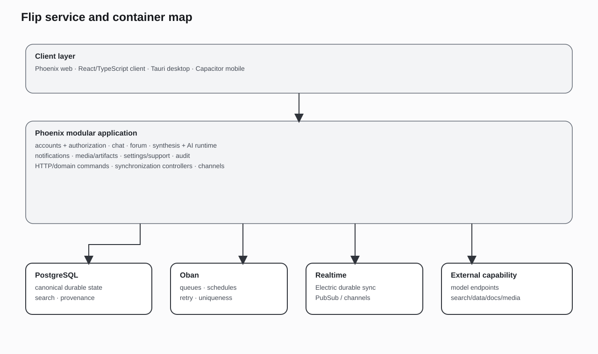
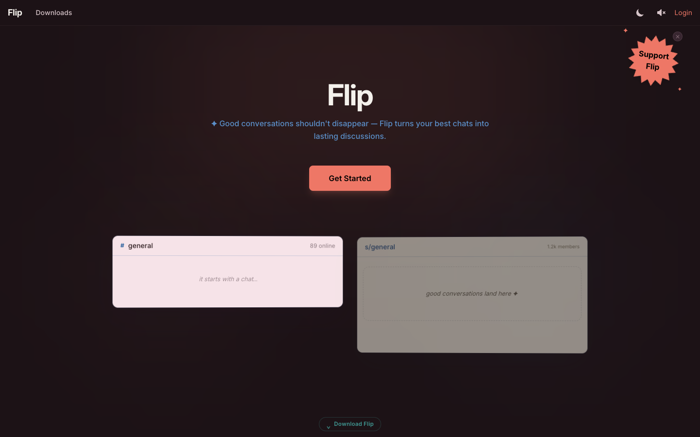
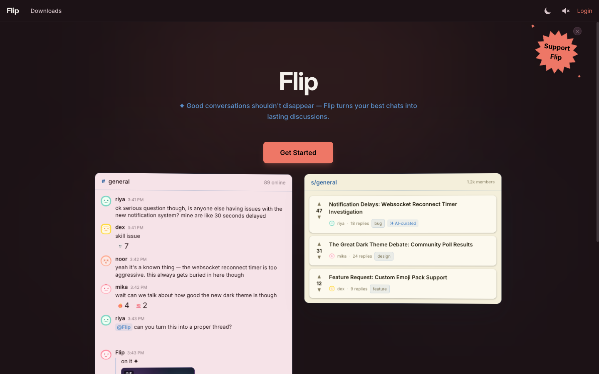

# Flip — Technical Overview

**A real-time community platform that turns live conversation into durable, attributable knowledge and supports AI participants as governed product actors.**

Flip combines chat, forums, background curation, direct AI participation, retrieval, structured data, generated artifacts, and web/native clients in one product model. Its central engineering problem is not “add a chatbot.” It is how to let humans and AI work inside the same social system without losing authorship, permissions, provenance, or product reliability.

## Product thesis

Chat and forums solve opposite parts of the same problem:

- chat is immediate, contextual, and socially fluid, but important knowledge disappears into the stream;
- forums are durable, searchable, and structured, but they do not capture the full path by which a group reached a conclusion.

Flip keeps both. A conversation can remain live in chat while selected material becomes a durable forum artifact linked back to its source. AI can assist that process, participate directly in a room, research external information, create cited artifacts, and invoke product actions—but only through server-defined capability and authorization boundaries.

## Two distinct AI paths

The architecture separates two behaviors that are often incorrectly described as one “agent.”

| Path | Purpose | Authorship rule | Result |
|---|---|---|---|
| **Conversation curation** | Identify topic-coherent material in chat and organize it into durable forum structure. | Preserves user-authored words and source-message identity; AI adds bounded structural context rather than silently rewriting participants. | Forum thread/replies with source links, curation metadata, and feedback/recuration state. |
| **AI participation** | Let an explicit AI identity answer, research, create artifacts, react, or take an allowed product action. | AI-authored output is visibly attributed to the AI participant and persisted through the same product state model as other content. | Chat reply, forum reply, citation ledger, chart, document/image/video artifact, poll, or other permitted effect. |

Curation protects human authorship; direct participation makes AI authorship explicit.

## Capability model

### Human collaboration

- real-time rooms, message threads, reactions, pins, typing, presence, read state, uploads, GIFs, and search;
- threaded forums organized by community and topic, with voting, bookmarks, tags, nested discussion, and multiple sort modes;
- notifications, identity, membership, settings, moderation, and audit surfaces;
- shared source records across chat, forum, synthesis, and artifacts.

### Conversation-to-knowledge synthesis

- scheduled or requested room crawling;
- topic grouping and forum placement;
- source-message and participant preservation;
- deduplication, merge, linkback, and recuration;
- structured participant feedback and bounded retry/manual-review behavior;
- durable provenance from generated forum structure back to the source conversation.

### Governed AI participant runtime

- explicit trigger detection and deduplicated background execution;
- room/community/persona/model configuration;
- bounded iterative tool use and controlled terminal composition;
- isolated tool dispatch and honest failure envelopes;
- typed lifecycle/telemetry and durable response state;
- continuation and recovery paths for long-running artifact workflows;
- separate capability catalogs for chat, forum, curation, personal, enrichment, and specialized contexts.

### Retrieval, research, and evidence

- external search, webpage reading, historical snapshots, and source comparison;
- internal chat/forum retrieval constrained to the invoking actor and community;
- document and PDF reading;
- quote-backed citations and reader-facing source records;
- structured market, economic, policy, environmental, conflict, R&D, and supply-chain data where configured;
- chart and rich-data rendering;
- research-session state for multi-step investigation.

### Artifact and media workflows

- persisted structured artifacts rather than embedding every result in prose;
- chart and rich-data artifacts;
- document and image understanding;
- image generation/editing;
- video generation/editing and chained clip workflows;
- media search and verification surfaces;
- polls and product-native interactive artifacts.

### Clients and synchronization

- Phoenix web experience and real-time channels;
- React/TypeScript client architecture;
- Electric-backed synchronization for durable data;
- native desktop packaging and system integrations;
- mobile packaging from the shared client codebase;
- explicit distinction between durable synchronized state and ephemeral presence/typing state.

## Architectural shape

| Layer | Responsibilities |
|---|---|
| **Clients** | Web/native presentation, optimistic interaction, durable sync, ephemeral channels, local caching, notifications. |
| **Product contexts** | Accounts, authorization, chat, forum, synthesis, notifications, media/artifacts, settings, billing/support, audit. |
| **AI runtime** | Triggering, context assembly, model routing, tool catalogs, isolated dispatch, citations, terminal composition, recovery. |
| **Asynchronous work** | Synthesis, linkback, recuration, AI replies, artifact jobs, maintenance, scheduled enrichment. |
| **Data** | PostgreSQL transactional state, search indexes, source/provenance relationships, job state, synchronization shapes. |
| **External capability** | Provider-compatible model endpoints, web/data/document/media services, optional self-hosted inference. |

Flip is a single Phoenix application with explicit domain contexts rather than a distributed microservice collection. PostgreSQL and Oban provide transactional and asynchronous coordination; Phoenix PubSub/channels and Electric provide different real-time paths for different state classes.

## Key invariants

1. **Human words are not silently rewritten during curation.**
2. **AI-authored content is explicitly attributed.**
3. **Internal retrieval is constrained by the invoking actor and origin community and fails closed without scope.**
4. **Tool availability is computed server-side from the current surface, actor, community, feature configuration, and provider availability.**
5. **Tools return structured, model-visible failures rather than crashing the reply worker or inviting fabrication.**
6. **Durable artifacts and citations have identities independent of model prose.**
7. **Background jobs are idempotent or uniqueness-constrained where duplicate user-visible effects would be harmful.**
8. **The server remains authoritative for permissions and durable writes; client optimism is reconciled with committed state.**
9. **Provider failure can degrade an AI capability without corrupting the core chat/forum product.**
10. **The portfolio explanation remains readable without duplicating the complete source tree or exposing deployment secrets.**

## Product references

- Product: <https://flip.engineering>
- Synthetic technical environment: <https://flip.tech-demo.dev>

<figure>
  
  <figcaption>Flip product surface: live conversation and durable community structure.</figcaption>
</figure>

<figure>
  
  <figcaption>Separate synthetic environment used to exercise public architecture scenarios.</figcaption>
</figure>

The architecture documentation stands independently of endpoint availability and does not rely on production data or credentials.

## Documentation by question

| Question | Page |
|---|---|
| What is the product and why are chat, forum, curation, and AI participation combined? | [00 — Executive Overview](docs/00-executive-overview.md), [01 — Product and Problem](docs/01-product-and-problem.md) |
| What are the components, domain boundaries, data stores, and main flows? | [02 — System Architecture](docs/02-system-architecture.md) |
| How is an AI turn triggered, bounded, executed, recovered, and persisted? | [03 — Agent Runtime](docs/03-agent-runtime.md) |
| What can the AI retrieve or do, and how are tools authorized and evidenced? | [04 — Retrieval, Search, and Tools](docs/04-retrieval-search-and-tools.md) |
| How does chat become durable forum knowledge without erasing authorship? | [05 — Synthesis and Provenance](docs/05-synthesis-and-provenance.md) |
| How do PostgreSQL, Electric, channels, web, desktop, and mobile divide responsibility? | [06 — Data, Realtime, and Clients](docs/06-data-realtime-and-clients.md) |
| How are model/provider choices separated from product semantics? | [07 — Model Routing and Inference](docs/07-model-routing-and-inference.md) |
| What differs between product and synthetic technical deployments? | [08 — Deployment Topology](docs/08-production-and-demo-topology.md) |
| How are claims tested and failures made inspectable? | [09 — Quality, Evaluation, and Operations](docs/09-evaluation-testing-and-operations.md) |
| Why were the central architectural choices made? | [10 — Architecture Decisions](docs/10-architecture-decisions.md) |
| What is implemented, constrained, or still evolving? | [11 — Status and Limitations](docs/11-roadmap-and-known-limitations.md) |

Rendered diagrams are indexed in [diagrams/README.md](diagrams/README.md). Public architectural decisions are summarized in [adr/README.md](adr/README.md). A capability-oriented walkthrough is in [demo/README.md](demo/README.md).

## Source and portfolio boundary

The canonical implementation is available in the public [Flip repository](https://github.com/wahargis/flip). This portfolio case study does not mirror the entire source tree; it selects the product semantics, architecture, lifecycles, decisions, and limitations needed for review. Production data, credentials, private deployment state, prompt/persona configuration, abuse thresholds, and host-specific secrets remain outside the portfolio.
