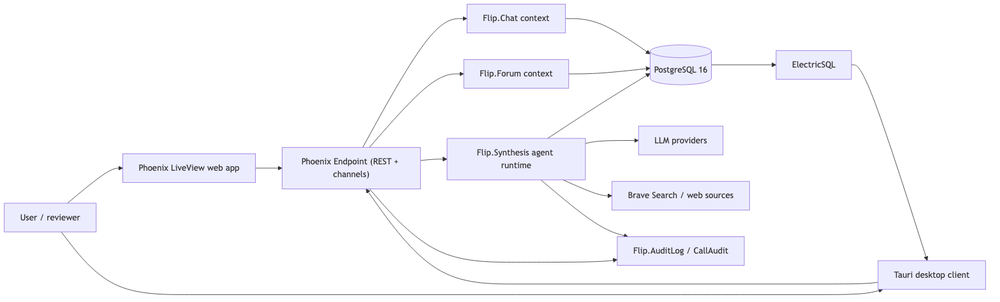
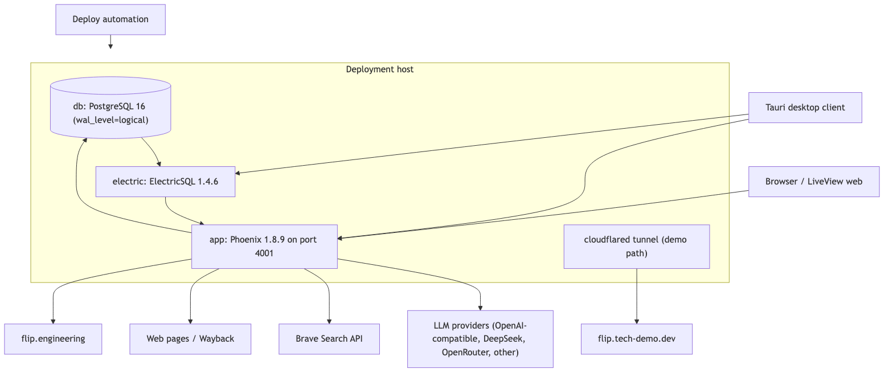

# Flip — Technical Overview

Flip is a real-time chat and durable forum platform with configurable AI participants. Teams discuss work in live chat rooms, preserve decisions as durable forum threads, and bring AI into the room under explicit, bounded rules.

## Why chat and forums are combined

Chat is immediate; forums are permanent. Chat alone loses decisions in the message stream, and forums alone are too slow for live exchange. Flip keeps both in one workspace: conversations happen in real time over Phoenix channels, and when a conversation reaches a decision, it can be synthesized into a forum thread that stays linked to the exact messages that produced it. The discussion and the outcome live in the same system.

## How the AI participant works

Each room can configure one or more AI participants with a persona, a model, and tool budgets. When synthesis is enabled, an Oban job starts a bounded agent run. The agent gathers information through governed tools — source discovery, Brave Search, webpage reads, and Wayback retrieval — under round caps, wall-clock deadlines, and token envelopes. When the run completes, the result is persisted as a forum thread or reply with source fields, AI-minted and quote-verified citations, and a reader-facing source ledger that shows where every claim came from.

## Main architecture

SVG versions: [system context](diagrams/system-context.svg) · [service/container architecture](diagrams/service-container-map.svg)

## Live sites

- Production: <https://flip.engineering>
- Technical demo: <https://flip.tech-demo.dev>

## Representative capabilities

1. **Hybrid chat + forums** — real-time rooms and threads share one data model, with Phoenix LiveView and Phoenix channels on the web surface.
2. **Bounded agent runtime** — AI work runs through `Flip.Synthesis.ToolLoop` with round caps, deadlines, token envelopes, and isolated per-tool dispatch.
3. **Citation and provenance** — AI-minted, quote-verified web/PDF citations, forum source tracking, and a reader-facing source ledger.
4. **Real-time desktop sync** — a Tauri desktop client receives live updates through ElectricSQL shape subscriptions while authoritative writes stay on the Phoenix API.

## Product walkthrough

Open the technical demo at <https://flip.tech-demo.dev>, sign in with a stable demo account, and try the scenarios in [demo/README.md](demo/README.md): ask a question that requires external search, watch the AI participant cite sources, then synthesize a chat exchange into a forum thread and inspect its provenance.

## Deeper architecture pages

1. [docs/00 — Executive Overview](docs/00-executive-overview.md)
2. [docs/01 — Product and Problem](docs/01-product-and-problem.md)
3. [docs/02 — System Architecture](docs/02-system-architecture.md)
4. [docs/03 — Agent Runtime](docs/03-agent-runtime.md)
5. [docs/04 — Retrieval, Search, and Tools](docs/04-retrieval-search-and-tools.md)
6. [docs/05 — Synthesis and Provenance](docs/05-synthesis-and-provenance.md)
7. [docs/06 — Data, Realtime, and Clients](docs/06-data-realtime-and-clients.md)
8. [docs/07 — Model Routing and Inference](docs/07-model-routing-and-inference.md)
9. [docs/08 — Production and Demo Topology](docs/08-production-and-demo-topology.md)
10. [docs/09 — Evaluation, Testing, and Operations](docs/09-evaluation-testing-and-operations.md)
11. [docs/10 — Architecture Decisions](docs/10-architecture-decisions.md)
12. [docs/11 — Roadmap and Known Limitations](docs/11-roadmap-and-known-limitations.md)

Rendered diagrams live in [diagrams/](diagrams/README.md); architecture decision records live in [adr/](adr/README.md).
