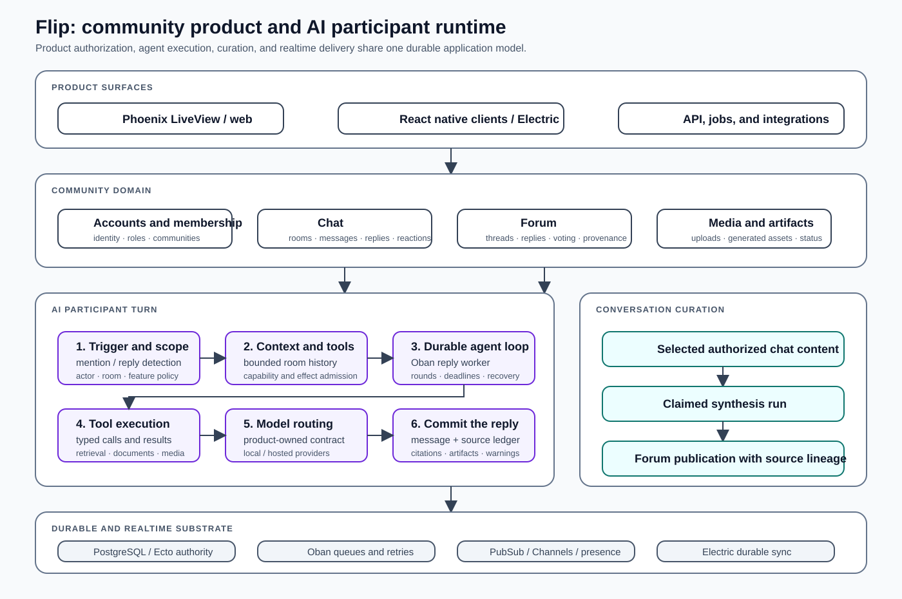

# Flip

**A real-time community platform with a first-class AI participant runtime and a deliberate path from live conversation to durable forum knowledge.**

<table>
<tr>
<td width="50%"></td>
<td width="50%"></td>
</tr>
<tr>
<td align="center"><strong>Product surface</strong></td>
<td align="center"><strong>Synthetic technical environment</strong></td>
</tr>
</table>

## Product and system

Flip joins live chat, threaded forums, media, search, and explicit AI participation in one community product. Chat remains optimized for immediate social interaction. Forum content remains optimized for durable reading and discussion. A separate synthesis lifecycle moves selected conversation between those modes without silently converting every message into a generated summary or global memory record.

AI participation is implemented as product behavior rather than an unrestricted assistant endpoint. A visible mention or reply creates the turn. The application determines the actor, room, eligible context, available capabilities, permitted effects, inference route, persistence contract, and audience of the result. Generated replies, citations, tool results, images, video, and other artifacts become ordinary product objects with lifecycle and provenance rather than opaque text emitted by a provider call.



## AI participant runtime

A conversational AI turn crosses the same domain and reliability boundaries as the rest of the application.

1. **Trigger detection and admission.** A mention of Flip, a reply to an AI message, or another explicit product action is detected. Feature policy, actor access, room state, and duplicate-work conditions are checked before an asynchronous turn is admitted.
2. **Context construction.** The runtime builds a bounded view of the current room, recent conversation, and same-room reply ancestry. Platform messages and ineligible content are excluded. The fact that the database stores content does not make that content available to the model.
3. **Capability construction.** Tools are selected from the current product surface, room policy, actor scope, provider capability, and effect authority. Retrieval, document work, media generation, polls, games, and other operations are admitted through typed product tools rather than a universal shell exposed to every turn.
4. **Durable execution.** `Flip.Synthesis.AiReplyWorker` runs the multi-round model and tool loop as an Oban job. Rounds, deadlines, retries, provider failures, terminal composition, and long-running continuation are handled as workflow state instead of being hidden inside an HTTP request.
5. **Evidence and artifacts.** Model activity, tool calls, arguments safe for audit, results, citations, and generated artifacts are stored separately. A reader-facing source ledger can disclose useful execution evidence without exposing administrative traces, credentials, provider internals, or private tool data.
6. **Message publication.** The final reply is committed as a visible AI-authored chat message linked to the triggering interaction. Web and native clients receive durable state through the same synchronization model used by human-authored content.
7. **Asynchronous continuation.** Image, video, and other long-running jobs keep durable identities and terminal records. Their completion can enqueue a bounded continuation turn or update an existing artifact instead of requiring the original model request to remain open.

This runtime is the main agent-engineering surface in Flip. The model contributes planning, language, and tool selection; the product retains control of identity, context, schemas, effects, durable state, and failure behavior.

## Conversation-to-forum synthesis

The curation path is distinct from direct AI authorship.

```text
Authorized room content
        |
        v
Claimed synthesis run
        |
        v
Topic and source selection
        |
        v
Forum thread and source relationships
        |
        v
Review, feedback, correction, or re-curation
```

A synthesis run has its own identity and state. Selected source messages, participants, room origin, destination forum, and resulting thread remain connected. Publication therefore retains enough information to answer where the content came from, which human messages it represents, and which source audience restrictions still apply.

This separation matters because curation and authorship have different product semantics. Curation organizes an existing human conversation into durable form. An AI participant reply is newly authored content. The database, UI, moderation behavior, and provenance model should not present those as the same operation.

## Data and authorization model

| State boundary | Responsibility |
|---|---|
| **Accounts, communities, and memberships** | Identity, roles, server membership, moderation authority, and actor resolution. |
| **Chat** | Rooms, messages, reply ancestry, reactions, polls, presence-related references, and explicit AI triggers. |
| **Forum** | Subforums, threads, replies, voting, tags, bookmarks, publication state, and synthesized-origin relationships. |
| **Synthesis** | Durable run identity, claim state, retries, source selection, destination, result, feedback, and recovery. |
| **AI activity** | Provider and model execution metadata, tool-call records, source ledger, terminal status, and operational diagnostics. |
| **Artifacts and media** | Typed generated outputs, pending/completed/failed state, continuation identity, previews, and durable attachment to conversation. |
| **Capabilities** | Deployment and client feature negotiation for authentication, sync, uploads, push, deep links, reactions, and AI operations. |

Authorization is resolved through the product domains rather than delegated to the model. A synthesized forum thread derived from restricted chat cannot become more public merely because its destination forum normally has broader visibility. AI tools likewise operate through actor-aware application functions instead of bypassing domain rules with direct database access.

## Real-time and native-client consistency

Flip uses different delivery mechanisms for different classes of state:

- **PostgreSQL and Ecto** hold authoritative community, workflow, AI, and artifact state.
- **Oban** carries durable work whose progress must survive request completion or process interruption.
- **Electric synchronization** projects durable tables to React-based desktop and mobile clients and supports local optimistic state with transaction reconciliation.
- **Phoenix Channels and PubSub** carry ephemeral presence, typing, and immediate coordination signals that do not belong in the durable event history.
- **LiveView and API surfaces** call the same domain functions and authorization rules rather than maintaining separate product semantics.

This split avoids treating every real-time concern as either a database row or an untracked socket event. A client can reconnect and reconstruct durable state while transient signals expire naturally.

## Inference and tool policy

Flip owns the inference contract presented to product features. The contract covers message shape, streaming and tool semantics, model selection, token and deadline policy, provider-specific request adaptation, retry classification, usage recording, and terminal-output validation.

Model routing can use hosted or local OpenAI-compatible endpoints without allowing a provider change to redefine the product. A route is evaluated by the behavior required for the surface: tool calling, context length, structured output, latency, media support, or recovery characteristics. Provider errors remain operational events; they do not change community authorization or silently discard the durable turn.

Tool execution follows the same rule. Tools are product capabilities with schemas, authorization, timeouts, result contracts, and auditable effects. Retrieval can search authorized internal state, external sources, or documents, but evidence is persisted in a form that can be cited or inspected after the model context is gone.

## Reliability and recovery

| Failure mode | System behavior |
|---|---|
| **Duplicate trigger or retry** | Durable job identity and Oban uniqueness prevent multiple in-flight turns from publishing duplicate results for one request. |
| **Provider timeout or transient failure** | Retry policy distinguishes transient provider faults from terminal credential or account rejection; bounded recovery turns compose an honest final response when possible. |
| **Tool failure** | Tool-call state records the error independently of the reply. The model can correct a malformed call, continue with available evidence, or disclose that a requested operation did not complete. |
| **Round or deadline exhaustion** | The runtime enters a dedicated finish mode that forces terminal composition from gathered context instead of returning a generic timeout string or leaking internal protocol text. |
| **Long-running media work** | Image and video jobs persist outside the original turn and deliver through unique continuation records when they reach terminal state. |
| **Worker interruption** | Oban retry state, AI activity records, orphan detection, and recovery jobs preserve the difference between unfinished work, a posted terminal disclosure, and successful completion. |
| **Authorization change** | Reads and effects are revalidated against current actor and source access rather than trusting an old client view or previously generated link. |
| **Client disconnect** | Durable content is reconstructed from synchronized state; ephemeral presence and typing do not need replay. |

## Selected implementation evidence

Flip's implementation repository is private. The paths below identify the load-bearing code that the public architecture documents describe.

| Private source path | Implemented responsibility |
|---|---|
| `lib/flip/synthesis/ai_reply_detector.ex` | Explicit trigger detection, actor and room validation, recent-message context, reply ancestry, and room briefing selection. |
| `lib/flip/synthesis/ai_reply_worker.ex` | Durable multi-round agent loop, tool execution, terminal composition, retries, provider recovery, artifact continuation, and message publication. |
| `lib/flip/synthesis/action_authority.ex` | Effect-level admission for model-proposed actions. |
| `lib/flip/synthesis/tools/` | Typed product tools, retrieval operations, document handling, media operations, and result normalization. |
| `lib/flip/llm/activity.ex` and `lib/flip/llm/activities.ex` | Durable model-execution lifecycle and activity queries. |
| `lib/flip/llm/tool_call.ex` and `lib/flip/llm/tool_call_audit.ex` | Tool-call persistence and audit state. |
| `lib/flip/llm/source_ledger.ex` | Reader-safe projection of citations, tool use, warnings, and generation evidence. |
| `lib/flip/synthesis.ex` | Synthesis creation, claim, completion, retry, and recovery transactions. |
| `lib/flip/authz.ex` | Actor-aware authorization across community domains and source-derived restrictions. |
| `lib/flip/capabilities.ex` and `lib/flip/sync.ex` | Deployment capability negotiation and durable client synchronization contracts. |

## Technical documentation

| Document | Contents |
|---|---|
| **[Product and domain model](docs/00-product-and-domain.md)** | Community problem, user-facing system, principal entities, and product invariants. |
| **[System and data architecture](docs/01-system-and-data-architecture.md)** | Phoenix boundaries, PostgreSQL authority, workflows, authorization, realtime state, and persistence. |
| **[AI participant runtime](docs/02-ai-participant-runtime.md)** | Turn admission, context, tools, model routing, evidence, terminal composition, continuation, and recovery. |
| **[Retrieval, tools, and artifacts](docs/03-retrieval-tools-and-artifacts.md)** | Internal and external retrieval, capability schemas, citations, typed artifacts, and effect handling. |
| **[Clients and deployment](docs/04-clients-and-deployment.md)** | Web/native convergence, Electric and Channels, provider boundaries, production and synthetic environments. |
| **[Testing, operations, and current status](docs/05-testing-operations-and-status.md)** | Deterministic tests, route evaluation, telemetry, operations, implemented scope, and current limitations. |

Architecture decisions are recorded in **[the ADR index](adr/README.md)**. The **[synthetic environment](demo/README.md)** documents the public technical surface without production data or administrative authority.

## Current boundaries

- AI invocation is explicit; Flip is not designed as an invisible observer of every room.
- Live room context is deliberately narrower than all data stored by the application.
- Conversation curation and AI-authored participation remain separate workflows and provenance types.
- Hosted and local model routes are interchangeable only where they satisfy the same product contract.
- The public portfolio exposes architecture and selected implementation evidence, not private code, production data, credentials, prompts, or security-sensitive configuration.

[← Back to portfolio](../README.md) · [Live product](https://flip.engineering) · [Synthetic technical environment](https://flip.tech-demo.dev)
