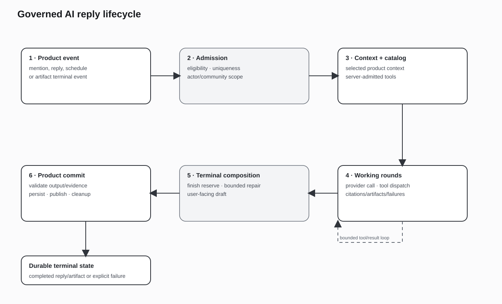

# 03 — Agent Runtime

Flip's AI work runs in a bounded agent runtime rather than in unbounded model loops. Three layers of control shape every run: `Flip.Synthesis.ToolLoop`, `Flip.Synthesis.IsolatedDispatch`, and `Flip.Synthesis.AiReplyWorker`.

`ToolLoop` implements a two-phase tool loop. The gather phase lets the model call read/analysis tools; the terminal phase requires a plan submission. The loop enforces a round cap (default 6 rounds, configurable per room), a wall-clock deadline (default 480,000 ms) checked between rounds, and an input-token envelope that ensures history plus reserved terminal output still fits the model context. When a cap is hit, the loop enters a finish mode that forces the terminal submission and marks a finish-timeout as non-retryable so side-effectful tools are not replayed by Oban retries.

`IsolatedDispatch` runs each tool call under `Task.Supervisor.async_nolink` with a per-tool timeout. This isolates crashes and timeouts so a linked-child raise inside a tool cannot kill the worker. The advertised-tool allowlist in `ToolLoop` is a second barrier: only tool names actually advertised to the model in that turn can reach dispatch, independent of the larger tool catalog.

`AiReplyWorker` adds worker-level bounds: a default deadline of 300 seconds, round caps, backoff, and Oban Lifeline rescue after 5,400 seconds. The application configuration carries the Oban engine, queues, Pruner, and Lifeline settings.

The runtime is supervised: the reply worker's tool-dispatch supervisor is started before Oban so queued jobs can always dispatch safely. Synthesis hooks are registered with the application, and Oban queues are feature-gated.

The practical result is that AI participants can use tools, but every run has a ceiling on rounds, time, tokens, and tool execution, and a single bad tool cannot take down the worker.

