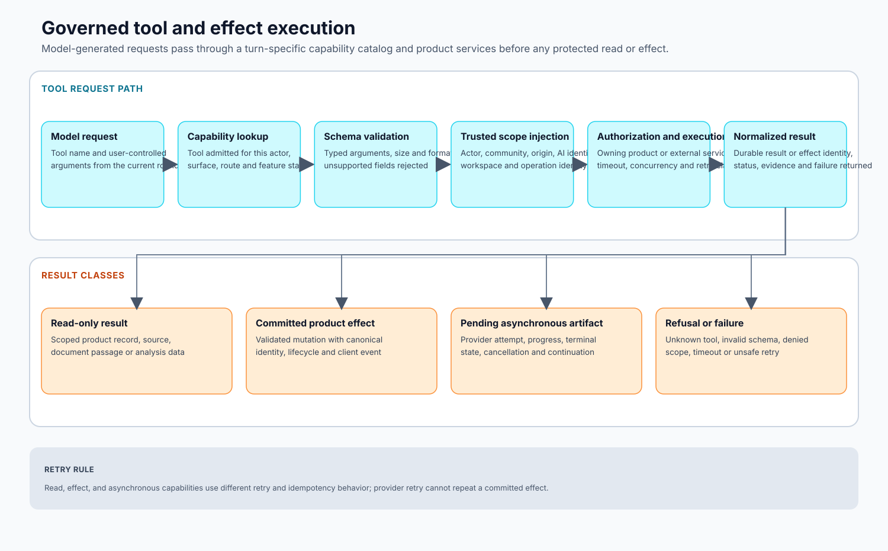

# 03 — AI Participant Runtime

## A turn is a product transaction, not a chatbot call

Flip’s AI runtime turns a product event into one attributed, durable product outcome. The outcome may be a reply, a citation-bearing research answer, a poll, an artifact request, or a continuation after asynchronous media work. In every case, the runtime must preserve the invoking actor, community, permissions, causal event, evidence, and terminal state.


The runtime is easiest to understand as three phases: **admission**, **working**, and **commit**.

## 1. Admission: establish what this turn means

A mention, reply, curation request, scheduled event, reaction, or artifact completion can be a trigger. The trigger layer determines whether the event is eligible, which AI identity and surface apply, and whether an equivalent durable job already exists.

The resulting job carries stable product identifiers rather than treating the prompt text as the run’s identity. This gives retries and continuations a causal anchor and prevents one user action from producing several replies.

### Scope is derived from product state

Before a model is called, the server derives the trusted envelope:

```text
invoking actor
origin community / room / forum
AI participant identity
surface and feature configuration
parent message / thread / artifact identity
```

This scope is captured by child tool tasks. It is never reconstructed from model arguments. An internal-search call with no valid origin scope returns no records rather than widening into global retrieval.

### Context is selected, not dumped

The runtime assembles only the context needed for the current product role: the triggering message and relevant reply chain, bounded recent conversation, forum context, persona/community guidance, prior draft or continuation state, and already minted evidence or artifacts.

A large model context window is a capacity ceiling, not permission to ingest an entire community. Visibility, relevance, and product relationships determine inclusion.

### Capabilities are computed for the turn

The server constructs the tool schemas after it knows the surface and scope. A general chat participant may receive internal and external research, document, data, artifact, and product-action tools. A curation worker receives a narrower read/analysis surface and a terminal plan contract. A specialized lane can replace the catalog entirely.

The model therefore chooses among capabilities the product has already admitted; it cannot discover a generic database or shell escape simply by asking for one.

## 2. Working phase: reason, retrieve, and act under control

The model route receives the selected messages and admitted schemas. It may answer directly or request tools. Each tool call is validated and run through an isolated dispatch path with a timeout and trusted scope.



### Tool failures remain inside the turn

A tool can raise, exit, time out, or return a malformed value. The dispatcher converts that failure into a structured, model-visible result that says no result was obtained. It does not silently kill the reply worker, masquerade as an empty success, leak a stack trace to the user, or instruct the model to fabricate from memory.

This distinction matters because the model may still have enough evidence to answer honestly. A broken webpage reader should not automatically erase successful internal retrieval or an already minted citation.

### Read and effect calls have different retry semantics

A search or comparison can often be repeated safely. A product action, provider charge, or artifact creation cannot. Effectful tools therefore commit through domain services and return durable identities or receipts. The model receives a representation of the effect; it never writes product tables directly.

### Bounds converge on a terminal behavior

Round limits, deadlines, tool-specific timeouts, output limits, concurrency admission, and a reserved finish window constrain the turn. Their purpose is not to terminate useful work arbitrarily. When the working budget ends, the runtime moves into a controlled terminal phase using the evidence already gathered.

A deployment can tune these bounds by surface. The stable contract is that timeout behavior remains explicit and does not emit a misleading canned answer that pretends unfinished work succeeded.

## 3. Commit phase: produce something the product can publish

Tool use and user-visible composition are different channels. A model can finish a working round with tool intent, protocol markup, or an incomplete draft. Flip therefore reserves a terminal composition step that asks for the actual reply through a provider-compatible drafting contract.

Before persistence, the runtime checks for invalid terminal output: blank content, leaked tool/provider syntax, hidden templates, invalid citation or artifact identities, structurally unsafe rendering, or a refusal that can be repaired from already available safe context.

One bounded model-authored recovery can rewrite the draft. If repair is exhausted, the product records an honest terminal failure or disclosure rather than retrying indefinitely.

### Persistence establishes the outcome

The product commits:

- the explicit AI identity and content type;
- the parent/trigger relationship;
- citation and artifact associations;
- the causal job or request identity;
- the terminal state needed for retry and audit.

Only after that transaction succeeds does Flip publish the durable change to synchronized clients. A worker return value alone never creates a visible reply.

## Continuation is a new turn, not a resurrected process

Image, video, document, and other provider-backed workflows may finish after the initiating model turn. Their terminal event creates one deduplicated continuation with durable identifiers. The new turn receives the artifact state and decides how to report or continue inside the original product context.

This design avoids keeping an AI process alive while waiting for external work and gives pending, completed, failed, and partially completed artifacts honest product states.

## Concurrency and attention

Different mechanisms protect different resources:

- Oban controls durable worker throughput;
- community-level admission prevents one community from monopolizing reply capacity;
- route policy protects model/provider capacity;
- media queues isolate long-running modality work;
- database uniqueness prevents duplicate visible effects.

A queued job and a blocked model/tool step are distinguishable. The product can tell whether work is waiting for capacity, waiting for a provider, or terminally failed.

## Failure model

| Failure boundary | Required product behavior |
|---|---|
| Ineligible or duplicate trigger | Produce no second effect. |
| Missing authorization scope | Return no protected data and do not widen access. |
| Provider request/timeout failure | Apply bounded compatibility or retry policy; preserve gathered evidence. |
| Tool crash or timeout | Return an honest result into the turn. |
| Invalid evidence reference | Repair or remove the unsupported claim before publication. |
| Invalid terminal output | Run bounded composition repair. |
| Transaction failure | Publish no phantom reply. |
| Asynchronous artifact failure | Preserve failed artifact state and, where useful, create one honest continuation. |

## What remains model judgment

The model decides how to interpret the request, which admitted tool is useful, how to formulate retrieval, whether available evidence is sufficient, and how to compose the answer or proposed product action.

## What remains product authority

Code owns identity, authorization, context selection, catalog membership, provider credentials, execution isolation, timeouts, durable effect schemas, job uniqueness, evidence identity, output validation, persistence, notification, and terminal failure semantics.

That division is the runtime’s core architecture. It lets the AI behave as a capable participant without becoming an alternative authority over the product.