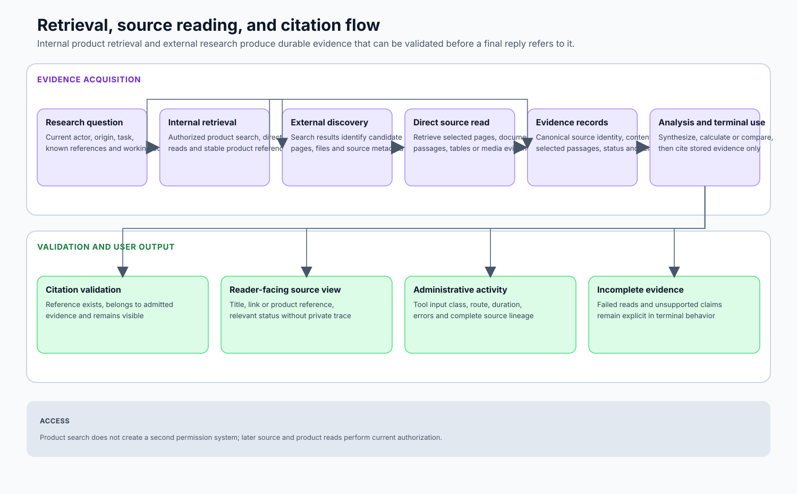

# 04 — Retrieval, Search, and Tools

## Tool architecture

Flip exposes a context-dependent capability plane. “The AI has tools” is not a useful architectural statement unless the system also defines:

- who may invoke them;
- which surface admits them;
- what data scope they receive;
- how their arguments are validated;
- where they execute;
- how results and failures are represented;
- which calls create durable effects;
- how sources become citations;
- how retries avoid duplicate effects.



## Capability families

### External web evidence

- search;
- webpage extraction;
- historical snapshots;
- source comparison;
- current-news discovery where configured.

Search discovers candidates. Reading retrieves actual source content. Comparison exposes agreement, disagreement, date, and source-quality differences. The runtime should not cite a search snippet as if it were the underlying page.

### Internal product retrieval

- authorized chat search;
- authorized forum search;
- product-content lookup;
- neighboring thread/message context;
- media and artifact search.

These tools operate under the origin actor/community scope. They can return direct product identifiers and links, preserving internal provenance without exposing unreadable rooms or other communities.

### Document and academic retrieval

- document/PDF loading;
- page or section selection;
- quote extraction;
- academic/reference metadata where configured;
- citation minting.

Documents require bounded extraction and stable source identities. A large PDF is not automatically copied into the model context.

### Structured data

Implemented capability domains include:

- market quotes and time series;
- economic indicators;
- commodity/trade flows;
- news pulse;
- R&D landscape;
- conflict events;
- policy tracking;
- governance/data sources;
- environmental events;
- series comparison and transformation.

Structured tools return typed records suitable for tables/charts and source ledgers. They should not be flattened into prose before the model has a chance to reason over values, units, dates, and missing data.

### Analysis and rendering

- chart rendering;
- rich-data artifacts;
- comparisons and transformations;
- research-session state;
- artifact inspection.

The result can include a persisted artifact intent alongside model-visible text. The artifact identity is owned by the product, not invented by the model.

### Media and multimodal tools

- image and video description;
- image generation/editing;
- video generation/editing;
- chained video workflows;
- media search;
- media verification.

These tools often have asynchronous lifecycle, provider receipts, and continuation behavior distinct from text retrieval.

### Product-native actions

- draft or publish a poll through the appropriate product workflow;
- revise the user-facing AI draft;
- selected platform actions admitted for the current actor/surface;
- specialized game actions.

An action tool calls a domain service. It does not grant the model arbitrary database mutation.

## Catalog computation

A simplified decision:

```text
all registered capabilities
  -> feature/provider availability
  -> surface-specific inclusion or replacement
  -> actor/community authorization
  -> object-context requirements
  -> deployment policy
  -> tool schemas sent to model
```

### Surface examples

| Surface | Typical catalog |
|---|---|
| **Chat AI reply** | External/internal retrieval, documents, structured data, artifacts/media, permitted product actions, final draft. |
| **Forum AI reply** | Similar, but chat-only or poll capabilities may be excluded. |
| **Personal AI** | Internal retrieval constrained to personal context; community forum search may be excluded. |
| **Forum enrichment** | Read-oriented web/source comparison only. |
| **Conversation curation** | Bounded read/analysis/render tools, source-post reader, forum placement helper, terminal plan submission. |
| **Specialized game turn** | Game action plus final drafting; ordinary research/media tools removed. |

A replacement catalog prevents a narrow workflow from accidentally inheriting every general tool.

## Authorization propagation

Internal retrieval demonstrates the required pattern:

```text
reply worker derives:
  {origin community, invoking actor, tool-call identity}
          |
          v
closure captures trusted scope
          |
          v
child tool task
          |
          v
domain query applies membership/visibility predicates
```

The model’s JSON arguments cannot choose a different community or actor. If trusted scope is absent, the tool returns no records and a warning that tells the model not to fabricate.

## Dispatch isolation

Tool calls run outside the reply worker’s main process. The execution wrapper catches:

- ordinary exceptions;
- process exits;
- throws;
- timeouts;
- malformed return values.

The normalized failure result says that the tool returned no result and instructs the model to continue honestly. A tool failure should not:

- kill the entire AI reply silently;
- be converted into an empty success;
- cause automatic unbounded retry;
- encourage answering from unsupported memory;
- leak stack traces to the user.

## Read tools versus effect tools

| Tool class | Result contract |
|---|---|
| **Pure/read** | Structured data or text plus source identity and warnings. |
| **Derived/read** | Comparison, transformation, extracted quote, or rendered preview with input provenance. |
| **Durable artifact** | Model-visible result plus persisted artifact intent/identity. |
| **Product action** | Authorized domain command plus durable effect/receipt. |
| **Asynchronous provider action** | Durable request, pending state, later terminal event, optional continuation. |
| **Terminal drafting** | Replaces or commits the candidate user-facing answer. |

This classification informs retries. Retrying a read is generally safer than repeating a product action or provider charge.

## Evidence and citations

### Citation lifecycle

1. Search or source discovery returns candidate locations.
2. A reader tool fetches bounded source content.
3. The model or tool selects a supporting passage.
4. The server stores source metadata and an exact quote or passage fingerprint.
5. A citation identity is returned to the model.
6. The model embeds the identity near the supported claim.
7. Final validation ensures referenced citation identities exist and are visible.
8. The UI renders a reader-facing source ledger.

This separates source evidence from provider-specific citation syntax.

### Quote verification

A citation should represent content actually retrieved from the source. Verification can include normalized substring matching, passage boundaries, source hash/fingerprint, and document-page identity. The goal is not to prove the claim true; it is to prove that the cited source contains the represented support.

### Source quality

The architecture permits source classification and comparison without hiding disagreement. A tool result can carry:

- source type and publisher;
- publication/update date;
- primary versus secondary status;
- extraction warnings;
- access limitations;
- disagreement with other sources;
- missing fields.

The final model remains responsible for interpretation, but the evidence envelope reduces silent source substitution.

## Retrieval strategy

Flip uses fit-for-purpose retrieval rather than declaring one universal RAG pipeline:

- PostgreSQL full-text search for product content;
- relational joins for source and neighboring context;
- external search plus direct reading for current web evidence;
- document-specific extraction for PDFs/files;
- typed APIs for structured data;
- optional semantic/vector retrieval where it improves recall;
- conversation context selected by social/product relationships.

Vector similarity is one retrieval signal, not the product’s memory model.

## Tool-result budgets

Tool output can exceed the useful model context. The runtime can:

- cap result counts;
- paginate;
- summarize with source-preserving structure;
- return next-request suggestions;
- store full artifact/data out of band;
- include a compact model view plus durable reference;
- truncate only at valid record boundaries;
- reserve context for terminal composition.

Budgeting must not remove the evidence identity needed to cite or reopen a result.

## Security and abuse considerations

- External URLs are validated against network and scheme policy.
- Retrieved content is untrusted data, not system instruction.
- HTML and document extraction are size/time bounded.
- Internal search applies server-side authorization.
- Effectful actions require domain authorization and idempotency.
- Generated media is handled through provider and product policy.
- Tool names and schemas are server-defined.
- Secrets never enter model-visible tool results.
- Audit records distinguish actor input, model choice, tool execution, and durable effect.

## Failure semantics

The model receives enough structured information to say what failed without inventing a result. User-facing language remains natural; internal exception text remains operational evidence. This is more reliable than hiding failures behind a generic “no results” response.
