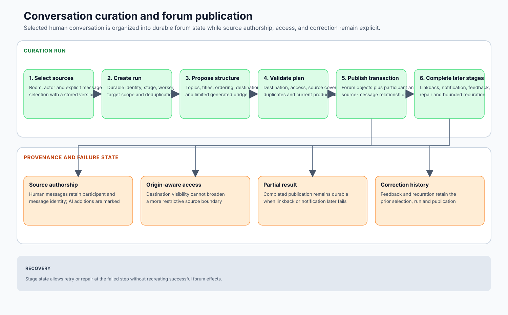

# 05 — Curation, Authorship, and Provenance

## Flip uses models in two roles with different integrity rules

The most important distinction in Flip is not between “chat AI” and “forum AI.” It is between **restructuring human-authored conversation** and **creating new AI-authored content**.

- **Conversation curation** organizes existing discussion into durable forum structure while preserving who said what.
- **AI participation** creates a new reply or artifact under an explicit AI identity and supports its claims with evidence.

A generic “synthesis” label hides that distinction and makes it easy to turn a model into an invisible co-author of community history.

## Conversation curation changes structure, not authorship

A curation run begins with an eligible source set: messages, participant identities, reply relationships, room policy, and existing forum/linkback state. The model can help identify coherent topics, propose a destination, order source material, and add bounded bridge context.

The resulting plan is not applied blindly. Code checks that every referenced message belongs to the eligible set, the destination exists and is allowed, the plan does not duplicate an already represented topic, and the proposed effect preserves source identity.

After validation, the product can create a new forum thread, append to an existing discussion, merge related source groups, or defer ambiguous placement. The transaction records the forum objects and their source-message relationships. Linkback occurs as a separate durable job so a failed room notification does not erase an already committed forum artifact.

### Why the data model matters

A prompt instruction such as “do not rewrite the users” is insufficient. The durable model must keep distinct identities for:

- participant-authored source text;
- the forum object that presents or links it;
- short AI-generated structural context;
- the curation run and destination decision;
- later participant feedback and recuration.

That schema lets the UI render authorship honestly and lets a correction trace back to the material it changes.

## AI participation creates new attributed content

An AI participant is allowed to interpret, paraphrase, and compose because the result is visibly its own. The reply is persisted under an explicit AI identity, linked to the triggering message or thread, and associated with any citations, source records, artifacts, or product actions used to produce it.

Integrity therefore comes from a different contract:

| Curation | AI participation |
|---|---|
| Preserve human source identity and wording. | Make AI authorship explicit. |
| Organize existing discussion into durable structure. | Create a new answer, analysis, or artifact. |
| Source-message relationships are primary provenance. | Citation, artifact, trigger, and action records are primary provenance. |
| Structural bridge text must remain bounded and distinguishable. | Original composition is expected but must remain evidence-aware and authorized. |

These paths can meet in the same forum or room without collapsing their semantics.

## Provenance is layered because readers ask different questions

### Conversation provenance

A reader of a curated forum thread should be able to determine which chat messages produced it, who authored them, how they related in the original exchange, and whether the durable representation omitted or reordered material.

### Curation provenance

The product must know which run selected the material, which destination and merge decision applied, whether linkback completed, and what feedback caused a later recuration. This explains how the structure evolved without presenting internal model deliberation as the record.

### Evidence provenance

An AI-authored claim may rely on an external page, a document passage, typed data, or authorized internal content. The durable citation records the source identity and selected support; the reply refers to that identity near the claim.

### Artifact and action provenance

A chart, image, video, poll, or platform action has its own request and effect lifecycle. Provenance links the initiating user/event, AI participant, tool call, source inputs, provider or domain result, terminal state, and conversation attachment.

These are related but not interchangeable. A source-message link proves derivation from a conversation; a citation supports an AI claim; an artifact dependency explains how an output was produced.

## A representative curation scenario

A room debates a product decision across several interleaved replies. The curation workflow identifies one coherent decision thread and proposes appending it to an existing forum topic.

Before applying the plan, Flip checks that the selected messages are visible and eligible, that their authors remain attached, and that the target thread is correct. The transaction adds the durable structure and source links. A later participant flags that one reply was taken out of context; that feedback creates a bounded recuration path rather than silently overwriting history.

The final forum artifact can be searched and extended while the reader can still navigate to the original exchange and see which text came from participants versus the curator.

## Deduplication is part of knowledge quality

Automatically creating a new thread for every interesting exchange would replace chat entropy with forum entropy. The curation layer can therefore recommend creation, append, merge, skip, link, or defer.

The model contributes semantic judgment; code validates object identities and applies the effect transactionally. Ambiguity can remain explicit rather than being forced into a confident placement.

## Correction and recuration

Participant feedback is not merely a model-quality score. It is product input that can identify missing context, incorrect grouping, poor destination, duplicated content, or inappropriate structural text.

Recuration is bounded and causally linked to the prior result. When automated attempts are exhausted, the state moves to human review rather than allowing an infinite rewrite loop. Earlier source and decision relationships remain inspectable.

## Privacy, visibility, and deletion

Provenance creates obligations as well as trust. If a source message becomes inaccessible, is redacted, or is removed under account/community policy, a derived forum view cannot continue exposing the private text merely because a foreign key still exists.

The implementation therefore needs explicit behavior for visibility changes, deletion/redaction, account removal, artifact retention, citation caching, synchronization tombstones, and audit access. Those policies are deployment-specific, but the architecture must make them enforceable.

## Failure behavior

- An invalid topic plan is repaired or rejected before a forum effect.
- A missing source relationship prevents unattributed copied text.
- A failed forum transaction produces no phantom linkback.
- A failed linkback preserves the forum result and retries independently.
- Conflicting feedback remains a review state rather than an invisible overwrite.
- An invalid citation causes the AI claim to be repaired or removed.
- A failed asynchronous artifact remains a durable failed artifact and can trigger one honest continuation.

## Why this is the product distinction

Many systems keep only a generated summary. Flip keeps the live conversation, the durable structure, the AI-authored contributions, and the relationships among them. The aim is not to make the model sound like the community; it is to make community knowledge durable without erasing how it was produced.