# 06 — Data, Realtime, and Client Convergence

## The client problem is one state, not one codebase

Flip has a Phoenix web experience and a React/TypeScript client used for native desktop and mobile packaging. The architectural problem is not reproducing screens across frameworks. It is ensuring that every client observes and changes one authoritative product state while remaining responsive under latency, reconnect, background execution, and permission changes.



## Four state classes

| State class | Examples | Authority and delivery |
|---|---|---|
| **Durable product state** | messages, threads, votes, memberships, citations, artifacts, settings | PostgreSQL is canonical; clients receive authorized projections. |
| **Durable asynchronous state** | AI jobs, curation runs, pending media, linkback, retries | Oban/PostgreSQL own lifecycle; clients observe the resulting records and progress. |
| **Ephemeral realtime state** | typing, presence, transient progress | Phoenix channels/PubSub; loss during disconnect is acceptable. |
| **Local interaction state** | drafts, open panels, optimistic placeholders | Client-owned until an authoritative command succeeds. |

Every client feature should identify its state class explicitly. Most duplicate-message, stale-permission, and reconnect defects begin when durable, ephemeral, and local state are mixed implicitly.

## Commands and synchronization have different jobs

A user mutation is an explicit server command. The server authenticates the actor, applies domain authorization and validation, commits a transaction, and returns the canonical result or identity.

Electric then synchronizes the durable records a client is authorized to observe. Phoenix channels carry the state that is valuable immediately but does not need replay.

```text
client intent
  -> HTTP / domain command
  -> authorization + transaction
  -> canonical identity
  -> Electric durable projection

presence / typing / transient progress
  <-> Phoenix channel
```

Electric is not arbitrary database access. Shape authorization determines the minimum product records a client may synchronize. A client cache cannot widen membership or visibility.

## Optimism must converge on transaction identity

A responsive client can render a pending message before the round trip completes:

1. The client creates a local placeholder with a client command identity.
2. The server accepts or rejects the command under product rules.
3. On success, the response returns the canonical object and transaction relationship.
4. The synchronized record arrives, possibly before or after the HTTP response.
5. The client merges the placeholder with canonical state rather than adding a duplicate.

Correctness is convergence under either ordering. A rejected command rolls back visibly; reconnect does not replay a command that already committed; a client-generated identifier never overrides server ownership.

## Web and native clients are projections over the same domains

Phoenix LiveView can use server contexts directly and is well suited to real-time web, administrative, and operational surfaces. The React client carries shared application state, synchronization, optimistic behavior, and native platform adapters.

Tauri and Capacitor add window, tray, notification, deep-link, secure-storage, mobile lifecycle, and distribution capabilities. They do not create a second authorization model or a client-owned database.

The client architecture should place product transitions in shared data/application modules rather than hiding them inside one screen or native wrapper. Platform-specific code should handle platform behavior, not redefine chat, forum, or AI lifecycle.

## Offline behavior is command-specific

“Offline-capable” is not a single property:

- previously synchronized content can be read from an authorized cache with a stale indicator;
- drafts can remain local;
- an idempotent message command may be queued with visible pending state;
- AI research or media work requires server/provider capacity and can only be queued or rejected honestly;
- membership and moderation changes normally require an online authoritative result;
- presence and typing simply stop while offline.

Flip does not claim universal offline-first writes because many cross-user conflicts and permission changes require server knowledge. Offline mutation should be added per command only after idempotency, ordering, and conflict semantics are explicit.

## Permissions must flow into cached state

A synchronized record is still governed by current authorization. Membership or visibility changes can invalidate data and affordances already present on a device. The client needs a revocation/rebuild path rather than assuming that anything once cached remains readable forever.

This is especially important for internal AI retrieval and curated source links: a native cache must not become an alternate route to content the actor can no longer access.

## Notifications and artifacts separate record from delivery

A notification is a durable product record; push, PubSub, or native notification is a delivery attempt. Duplicate delivery must not create duplicate notification state.

Likewise, a large artifact is represented by durable metadata, ownership, lifecycle, and an authorized storage/provider reference. Realtime paths distribute status and identity, not the entire media object. Clients render pending, completed, failed, or unavailable state explicitly.

## Search across clients

Canonical search remains server-side because authorization, full-text indexes, source relationships, and stable ordering live there. A client can search its synchronized subset for responsiveness, but local results cannot reveal content outside authorized shapes or substitute for server-wide discovery.

## Failure and recovery

| Failure | Required client behavior |
|---|---|
| Mutation rejected | Roll back the optimistic item and show the domain error. |
| Sync disconnect | Reconnect from durable shape/cursor state. |
| Channel disconnect | Restore ephemeral subscriptions without replaying typing/presence history. |
| Duplicate or reordered events | Deduplicate by canonical identity and converge. |
| Cache corruption or schema change | Rebuild from an authorized server projection. |
| Permission revoked | Remove inaccessible data and affordances under policy. |
| Artifact still pending or failed | Render its durable lifecycle rather than a broken attachment. |
| Endpoint unavailable | Preserve local UI/drafts and present explicit connectivity state. |

## Architectural consequence

The server remains the authority, but the client is not a passive renderer. It owns responsive interaction, local drafts, optimistic projection, and platform integration. The architecture succeeds when those responsibilities produce immediacy without creating a second version of product truth.