# 07 — Model Routing and Inference

Model access is routed, not hardcoded, so deployments and rooms can choose models within a configured boundary while keeping credentials encrypted and activity auditable.

## Provider routing

The inference layer speaks a standard model API and supports reasoning modes from multiple providers. Provider credentials are stored encrypted, and settings select the active provider without code changes. Room-level AI configuration can select a model within the configured provider boundary. A settings migration path supports moving between providers.

## Deterministic routing for media generation

Media generation uses a deterministic router: the same request and configuration always map to the same provider path. Provider capability descriptions let the router choose based on configured capabilities rather than ad hoc logic.

## Audit and reliability

Inference activity is recorded for operational visibility. The client installs a circuit-breaker pattern so repeated transport or server errors open the circuit instead of accumulating retries.

## Boundary

Prompt assembly and persona rendering are product internals; this overview covers routing and control mechanisms only.
