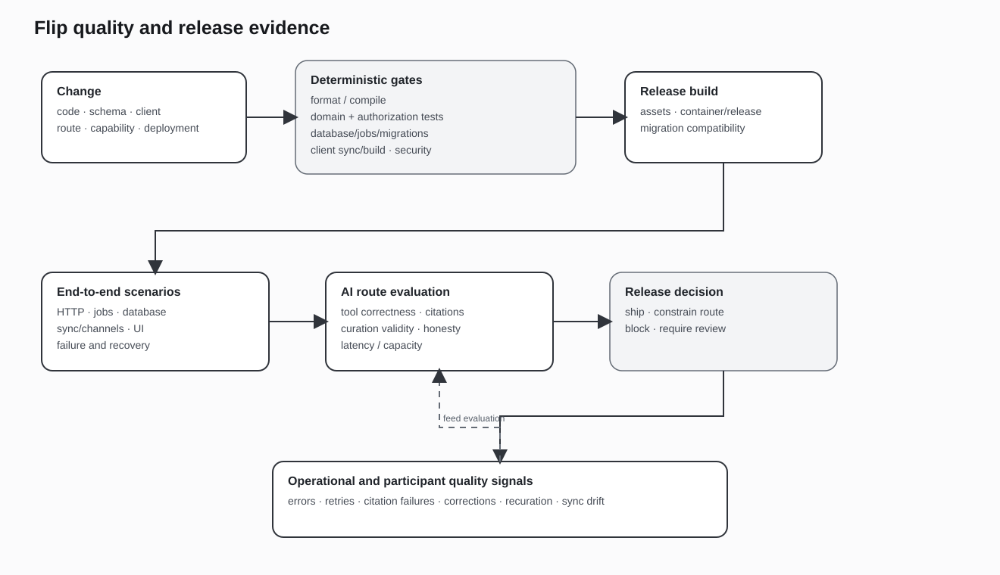

# Testing, evaluation, and operations

Flip requires deterministic product testing, model-route evaluation, client-convergence testing, failure injection, and operational inspection. Model quality is one part of the system and is evaluated separately from identity, authorization, persistence, effects, and recovery.

## Deterministic product tests

### Identity and authorization

Tests verify:

- account and membership requirements for product surfaces;
- AI identity availability and attribution;
- room and forum visibility;
- trusted actor and origin injection into tools;
- current authorization on direct reads, search, retrieval, and effects;
- origin-aware access for curation-derived content;
- removal of revoked content from client projections.

These tests do not require a live model.

### Agent runtime

Runtime tests cover:

- duplicate trigger and continuation admission;
- bounded conversation and reply-ancestry context;
- turn-specific route and tool admission;
- tool schema and trusted-scope handling;
- working rounds, terminal output, and protocol repair;
- citation and artifact validation;
- activity and source records;
- cancellation, retry classification, and terminal failure.

Provider fixtures supply deterministic streams and tool-call patterns.

### Product effects

Effect tests verify:

- domain validation and target authorization;
- stable operation identities;
- no duplicate visible effect after retry;
- committed object and activity relationships;
- partial failure and repair;
- current client-visible lifecycle state.

### Background workflows

Tests exercise:

- request and job insertion boundaries;
- claim, stale ownership, retry, and terminal state;
- provider polling or callback duplication;
- asynchronous completion after worker or application restart;
- one deduplicated continuation;
- cancellation and late terminal events;
- cleanup without deleting referenced artifacts.

### Curation

Curation tests cover source selection, plan validation, destination resolution, forum mutation, participant and message provenance, source-aware access, linkback, feedback, recuration, duplicate request, and partial stage failure.

## Client and end-to-end tests

Client tests cover web and native paths through:

- authenticated commands and structured refusal;
- optimistic object reconciliation;
- response, durable sync, and realtime events arriving in different orders;
- duplicate delivery and reconnect;
- client capability and schema mismatch;
- background completion while offline;
- permission revocation and local-data removal;
- AI, artifact, and curation lifecycle rendering.

End-to-end scenarios use synthetic identities and data. They verify the resulting database, event, and client state rather than relying only on screenshots.

## Model-route evaluation

Evaluation sets are organized by workload.

### Conversation

Measures include relevance, instruction and product-policy compliance, use of current conversation, refusal behavior, tool selection, latency, and response length.

### Research and evidence

Measures include search and source selection, direct-read use, document grounding, citation correctness, handling of incomplete evidence, unsupported claims, and terminal source references.

### Structured planning and curation

Measures include schema validity, source-message coverage, destination validity, topic organization, duplicate handling, and preservation of authorship constraints.

### Documents and data

Measures include selected-passage accuracy, extraction failure handling, calculation and transformation correctness, chart or table validity, and stable artifact references.

### Multimodal work

Measures include image or video understanding, request validity, asynchronous provider handling, progress and terminal state, continuation, and artifact quality where human or automated evaluation is available.

Route evaluation records model, provider, configuration, test-set version, date, and metrics so results can be compared after a route change.

## Security testing

Security tests include:

- cross-community and cross-room retrieval attempts;
- model attempts to override trusted scope;
- prompt or source content that requests hidden tool access;
- invalid internal URLs and callback targets;
- file and artifact visibility changes;
- secret-shaped content in tool arguments and exported traces;
- duplicate and replayed effect requests;
- stale client sessions and revoked membership;
- synthetic-environment attempts to reach product resources.

Tool output and external source content are treated as untrusted input to later model rounds and user-visible rendering.

## Failure injection

The system is tested under:

- provider timeout, disconnect, refusal, malformed output, and quota;
- tool timeout, invalid result, and partial effect;
- worker crash before and after durable state changes;
- duplicate jobs, callbacks, and terminal events;
- database transaction rollback;
- object storage or media-provider failure;
- realtime disconnect and reordered delivery;
- unavailable local inference or optional connector;
- stale curation plan and changed source visibility.

Failure injection checks final durable state, retry and repair behavior, user-visible status, and absence of duplicate effects.

## Operational records

Operations require structured records for:

- activity and job lifecycle;
- route and provider attempt;
- latency, usage, and cost where available;
- tool duration, result identity, and failure class;
- queue time and retry count;
- artifact progress and terminal status;
- continuation and deduplication state;
- client synchronization and delivery failures;
- curation stage and partial result;
- current endpoint and optional-service health.

Reader-facing source or tool status is derived from these records but excludes credentials, internal arguments, and private errors.

## Release checks

A change to agent, tool, curation, provider, or client behavior should pass the relevant checks:

1. schema and migration validation;
2. product-domain and authorization tests;
3. runtime and tool fixture tests;
4. job and recovery tests;
5. web and native-client convergence tests;
6. security and synthetic-boundary tests;
7. route evaluation for affected workloads;
8. diagram and documentation updates when public contracts change.

Documentation and evaluation versions should identify implemented behavior accurately. Planned work and experimental routes remain labeled as such.

## Limits of evaluation

Automated tests cannot establish all product usefulness or source quality. Human review remains necessary for conversation, curation, media quality, and ambiguous research tasks. Live provider behavior can also change without source changes.

The operating model therefore combines deterministic application invariants, repeatable model evaluations, live health and telemetry, synthetic failure cases, and product-specific human review.

[Previous: Product and synthetic environment boundary](08-production-and-demo-topology.md) · [Next: Architecture decisions](10-architecture-decisions.md)
