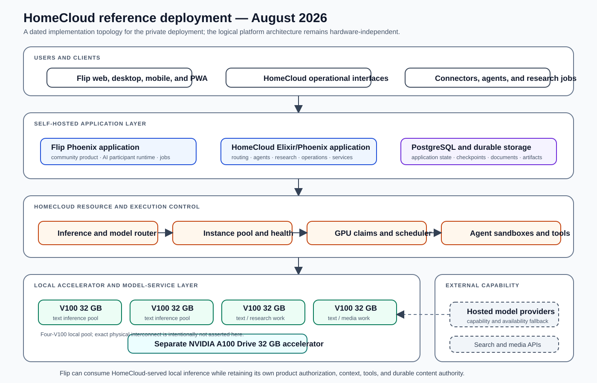

# HomeCloud

**A local-first AI operations platform that turns finite heterogeneous compute into supervised inference, recoverable agent execution, research, and application services.**

HomeCloud treats local AI as an operating-system problem rather than a model-server installation problem. Applications need more than an endpoint: they need model and backend policy, healthy capacity, request priority, accelerator ownership, process lifecycle, tool isolation, durable execution state, failure recovery, and a common application surface over local and remote capability.

The platform is implemented as a supervised Elixir application. Interactive products, connectors, agents, research programs, document workflows, browser automation, OCR, and media generation use the same routing, resource, execution, persistence, and telemetry substrate instead of starting independent model processes and competing for hardware informally.

## Logical platform architecture

The logical architecture is independent of one host or accelerator generation. It defines how application requests enter supervised runtime services, how inference and GPU capacity are admitted, how agents receive context and isolated tools, and how results and checkpoints become durable state.

## Reference deployment — August 2026

The active private deployment provides a concrete implementation of that architecture:

- **four NVIDIA V100 32 GB accelerators** form the principal local inference and research pool;
- a **separate NVIDIA A100 Drive 32 GB accelerator** provides additional heterogeneous capacity;
- model services are health-monitored and exposed through HomeCloud's routing and instance-pool contracts;
- GPU claims and workload scheduling coordinate interactive inference, research, OCR, image, video, and other accelerator-bound work;
- containerized agent workspaces execute tools against durable project state;
- PostgreSQL and durable file storage hold application objects, checkpoints, documents, and artifacts;
- hosted model, search, and media providers remain available as explicit capability routes;
- **Flip is hosted as an application workload and can consume HomeCloud-served local inference while retaining its own community authorization, context, tools, and content authority.**

The diagram does not assert a physical interconnect topology that is not part of the public evidence. It records the deployed accelerator inventory and system roles without turning one hardware arrangement into the definition of HomeCloud.

## Request lifecycle

A request moves through the system as an operational transaction.

### 1. Classify and admit the workload

The originating surface identifies the workload type, priority, requested capability, model profile, and execution mode. Interactive user work, research programs, and background maintenance do not enter the same undifferentiated queue.

Admission uses current runtime state: configured backends, healthy instances, available slots, GPU claims, workload locks, and service readiness. Callers do not declare arbitrary parallelism that the infrastructure cannot support.

### 2. Resolve the inference route

The inference layer selects a local or remote path based on the required capability and current operating policy. Local model profiles retain their model, quantization, context, topology, and service requirements. Remote providers remain valid routes where their latency, context, tool, or availability characteristics are appropriate.

Higher-level agent and product code uses a stable inference contract. Backend-specific request shapes, health checks, slot semantics, and process behavior remain inside adapters and routing services.

### 3. Check out capacity

The instance pool exposes model servers through checkout and check-in semantics. It tracks healthy instances, available slots, request priority, model affinity, checkout ownership, restart state, draining state, and stable behavior when the pool itself is unavailable.

Batch execution derives concurrency from the number of usable slots. With one healthy slot, work is sequential; additional healthy capacity permits controlled parallelism without every caller implementing its own queue or retry policy.

### 4. Acquire accelerator authority

Model and media services share finite GPUs. HomeCloud represents ownership through claims, queues, locks, demand, and scheduler state. A model is not considered safely replaceable merely because its log is quiet.

The workload scheduler evaluates pending work, active services, idle counters, cooldowns, benchmark locks, spare slot capacity, and configured baseline services before spooling or stopping a heavyweight service. Interactive baselines can remain protected while research, OCR, translation, image, or video workloads use genuinely available capacity.

### 5. Prepare an execution environment

Agent work receives a durable workspace and a containerized sandbox with the required toolchains. The execution engine owns creation, startup, cleanup, and failure reporting. File operations are validated against the mounted workspace; generated workspaces can use quota-controlled durable storage; CPU and memory reservations yield under pressure without preventing use of otherwise idle host capacity.

### 6. Run the agent loop

The execution engine supports autonomous, interactive, and plan-only modes. It assembles context, selects a profile, discovers permitted tools, routes inference, parses and dispatches tool calls, streams phase changes, and records task lifecycle.

Loop controls track repeated actions, repeated outputs, score regression, and stalled improvement. Context and execution complexity can change how much work is allocated without allowing a model to control infrastructure capacity directly.

### 7. Checkpoint semantic state

Long-running work persists more than a log. Phase-aware checkpoints can include:

- message history;
- plan and DAG state;
- context and file-tracking state;
- loop-detection history;
- engine counters and phase marker;
- execution events required for replay or analysis.

A restarted task can resume from the freshest valid phase instead of starting at turn zero or asking a new model session to reconstruct state from printed output.

### 8. Persist the result and release resources

Results return to typed application state. They can become research records, documents, notifications, connector deliveries, media artifacts, or visible product output. Instance checkouts, GPU claims, containers, worktrees, and model-service state are reconciled so subsequent work sees accurate capacity.

## Inference and resource control

### Model profiles and routing

HomeCloud separates the requested capability from the concrete backend serving it. A profile can describe a local text model, an alternate local runtime, a hosted provider, an OCR model, or a media workload. The router evaluates suitability and availability before assigning the request.

This supports local-first operation without assuming local-only execution. Privacy-sensitive or high-volume work can remain on owned hardware; exceptional context, capability, or availability requirements can use a remote route through the same application contract.

### Instance pool

`HomeCloud.Intelligence.InstancePool` manages local inference processes as capacity-bearing resources. It provides:

- priority-aware checkout and cancellation;
- affinity to preserve prompt-cache locality;
- per-instance and multi-slot capacity;
- health checks and restart accounting;
- stable pool-down responses rather than propagating process exits;
- draining and reactive unhealthy reporting;
- status projections for operations and routing.

The pool converts model processes into application capacity that can be inspected, queued, and released.

### GPU workload scheduler

`HomeCloud.Infrastructure.GpuWorkloadScheduler` coordinates service lifecycle against queued work. It can ensure a requested service is running, detect idle lower-priority services, apply cooldowns to prevent thrashing, protect benchmark locks, return displaced hardware to a baseline, and report unavailable services.

This layer prevents application features, research scripts, and media tools from independently deciding that the same accelerator may be reconfigured.

## Agent engineering

### Execution engine as the common runtime

The execution engine is shared by autonomous jobs and interactive sessions. Both paths use the same context, routing, tool, loop, sandbox, lifecycle, and telemetry machinery. Product features therefore do not gain a second, weaker agent implementation merely because one request streams to a UI and another runs in the background.

The runtime exposes explicit phases such as reasoning, tool dispatch, tool execution, synthesis, and validation retry. Callbacks can drive the UI while the underlying task retains durable status.

### Tool discovery and execution

Tools are selected by execution profile and can be discovered incrementally rather than sending the entire registry on every turn. The registry covers application operations, files, shell and Git work, testing, web and browser research, memory and graph operations, documents, multimodal generation, and specialized research tools.

The important boundary is not the number of tools. It is that tool schemas, execution, path authority, result normalization, telemetry, and retry behavior are owned by the runtime rather than improvised inside each prompt.

### Context and memory

Context construction combines task state, project state, retrieval, discovered tools, tracked files, token budget, and execution history. Memory and knowledge-graph services can preserve facts, patterns, and relationships across tasks, while compaction prevents long-running sessions from treating the entire transcript as equally important.

### Research and verified evaluation

Research and optimization programs run as managed workloads. They can schedule trials, use lower-priority inference, persist results, and evaluate generated code or kernels through deterministic compilation, tests, correctness checks, or hardware measurement where appropriate.

Research is therefore connected to the same capacity, sandbox, context, telemetry, and checkpoint system as interactive agents. It does not become a separate set of scripts with hidden resource use and incompatible result state.

## Supervised application services

The runtime supports several product domains:

- document storage, indexing, retrieval, and editing;
- browser automation and web research;
- connectors and messaging;
- model installation and service configuration;
- OCR and document extraction;
- image, video, speech, music, and other media workflows;
- research, evaluation, and optimization programs;
- health, infrastructure, and operations views.

These services establish the operational purpose of HomeCloud. The platform exists so multiple applications can reuse one model, resource, agent, and persistence system rather than each embedding a fragile provider-specific stack.

## Reliability and recovery

| Failure mode | HomeCloud behavior |
|---|---|
| **Model process unavailable** | Routing and pool status expose unavailable capacity; callers receive stable errors or alternate routes instead of crashing on a missing GenServer. |
| **Checkout timeout** | Pending requests are cancelled from the priority queue so a slot is not later assigned to a caller that already abandoned the request. |
| **Unhealthy instance** | Health counters, reactive reports, draining state, restart limits, and cooldowns remove the instance from normal availability. |
| **GPU contention** | Claims, locks, demand, idle checks, and the workload scheduler serialize incompatible service ownership. |
| **Agent setup failure** | Lifecycle telemetry is emitted before setup, task status records the failure, and exceptional cleanup handles containers and mounted storage. |
| **Repeated or regressing agent loop** | Action repetition, output repetition, score regression, and plateau detection trigger warnings, reflection, retry, or termination policy. |
| **Process interruption** | Phase-aware checkpoints preserve the execution state required to resume. |
| **Tool path escape** | Sandboxed file operations validate paths against the mounted workspace. |
| **Background starvation of interactive work** | Priority-aware queues and protected baseline services keep user work visible to capacity control. |
| **Deployment variance** | Optional services are configuration-driven and supervised; absent capability is reported rather than assumed. |

## Selected implementation evidence

HomeCloud's implementation repository is private. These paths identify the code responsible for the public architecture.

| Private source path | Implemented responsibility |
|---|---|
| `lib/home_cloud/application.ex` | OTP supervision tree for persistence, model capacity, GPU control, agent execution, research, connectors, media, health, and the Phoenix endpoint. |
| `lib/home_cloud/intelligence/inference_router.ex` and `model_router.ex` | Capability and backend selection across local and remote inference. |
| `lib/home_cloud/intelligence/instance_pool.ex` | Priority checkout, affinity, health, multi-slot capacity, restart, draining, and stable pool-down contracts. |
| `lib/home_cloud/infrastructure/gpu_workload_scheduler.ex` | Queue-aware model-service lifecycle, idle and cooldown policy, benchmark locks, and baseline return. |
| `lib/home_cloud/infrastructure/gpu_claim_registry.ex` | Persistent accelerator claims and ownership coordination. |
| `lib/home_cloud/intelligence/execution_engine.ex` | Autonomous, interactive, and plan-only agent modes; context, tools, model routing, loop safety, sandbox ownership, streaming, and lifecycle. |
| `lib/home_cloud/intelligence/execution_engine/checkpointer.ex` | Phase-aware persistence and restoration of history, plan, context, loop, event, and engine state. |
| `lib/home_cloud/intelligence/agent_sandbox.ex` | Containerized workspaces, durable storage, soft resource controls, tool execution, and path validation. |
| `lib/home_cloud/intelligence/context_engine.ex` | Token budgeting, context construction, file tracking, retrieval, and compaction. |
| `lib/home_cloud/intelligence/tool_registry.ex` | Typed runtime tool registry and profile-aware tool selection. |

## Current boundaries

- The public topology documents the four-V100 pool and separate A100 Drive accelerator but omits private hostnames, network layout, credentials, and security-sensitive service configuration.
- HomeCloud is a self-hosted AI application and operations platform, not a general replacement for Kubernetes or a public multi-tenant cloud.
- A private reference deployment demonstrates the system; it does not constrain the logical architecture to one accelerator model or host layout.
- Local-first operation does not require every workload to remain local when a hosted route is more appropriate for capability or availability.

[← Back to portfolio](../README.md)
