# HomeCloud

**Self-hosted model serving, agent orchestration, and GPU-accelerated research on four NVIDIA V100 GPUs.**

HomeCloud is an Elixir/Phoenix system built on the Ash Framework that unifies local large-language-model inference, multi-turn autonomous agent execution, sandboxed tool use, retrieval-augmented memory, and checkpointed recovery into a single self-hosted platform. It runs on one server with four NVIDIA Tesla V100-SXM2-32GB GPUs and provides production local inference with no per-query API cost.

---

## Table of Contents

- [Hardware Topology](#hardware-topology)
- [Architecture](#architecture)
- [Deployment Topology](#deployment-topology)
- [Model Serving and Routing](#model-serving-and-routing)
- [GPU Scheduling](#gpu-scheduling)
- [Sandboxed Agent Execution](#sandboxed-agent-execution)
- [RAG, Memory, and Checkpoints](#rag-memory-and-checkpoints)
- [Production Runtime](#production-runtime)
- [Research Lab](#research-lab)
- [Roadmap](#roadmap)
- [Quick Start](#quick-start)
- [Repository Layout](#repository-layout)
- [Documentation](#documentation)
- [License](#license)

---

## Hardware Topology

HomeCloud runs on four NVIDIA Tesla V100-SXM2-32GB GPUs across two carrier boards. Each GPU has 32 GB of HBM2, 5120 CUDA cores, and 640 Tensor cores.

| GPU | Board | Role | NVLink |
|-----|-------|------|--------|
| GPU 0 | IBM board | Primary inference (with GPU 1) | NVLink pair with GPU 1 |
| GPU 1 | Reference board | Primary inference (with GPU 0) | NVLink pair with GPU 0 |
| GPU 2 | IBM board | Research inference slot | Independent compute slot |
| GPU 3 | Reference board | Secondary/on-demand inference slot | Independent compute slot |

**Design notes:**

- **GPU identification uses VBIOS signatures, not PCI bus addresses.** PCI addresses can change between reboots; stable VBIOS-based discovery is what makes systemd GPU pinning reliable.
- **The GPU 0 + GPU 1 NVLink pair** is reserved for the primary user-facing model and supports tensor-parallel serving.
- **GPU 2 and GPU 3 operate as independent compute slots** for research and on-demand secondary workloads, so research activity cannot displace production inference.

---

## Architecture

HomeCloud is organized into four layers: presentation, orchestration, intelligence, and infrastructure. Each agent session, research trial, and inference request runs in its own Erlang process, and local inference servers are supervised by systemd outside the application process tree.


### Presentation layer

- **Phoenix LiveView** interfaces for chat, research, Vault, Forge, Cinema, Bazaar, memory, knowledge graph, and infrastructure monitoring.
- **Agent REST API** for external task dispatch and status tracking.
- **WebSocket streaming** for interactive agent sessions.
- **MCP endpoint** (`GET /api/v1/mcp/sse`, `POST /api/v1/mcp/messages`) for Model Context Protocol clients.

### Orchestration layer

- **ExecutionEngine** — unified execution for autonomous tasks, interactive chat, and plan-only mode.
- **AgentLoopPatterns** — loop detection, stop-hook reflection, and elastic turn budgets that extend only when forward progress is detected.
- **ContextEngine** — token budgeting, retrieval assembly, and automatic context compaction.
- **ContextManager** — coordinates retrieval across fact memory, skill patterns, and the knowledge graph.

### Intelligence layer

- **ModelRouter + InferenceRouter** — provider selection, round-robin routing across local instances, and failover to remote providers.
- **InstancePool** — adopt-only management of systemd-supervised llama-server instances with health monitoring and checkout semantics.
- **ToolRegistry + DynamicToolRegistry** — built-in tools plus runtime tool synthesis.
- **AgentSandbox** — Docker-isolated tool execution with resource limits.
- **Research optimization modules** — TTT-Discover verified-reward search and CUDA kernel optimization (research lab only).

### Infrastructure layer

- **PostgreSQL + pgvector** — system of record for Ash resources, memory, knowledge graph, and vector embeddings.
- **Supervised inference units** — systemd-managed llama-server instances on ports 8081/8082/8083.
- **GpuMonitor, GpuClaimRegistry, GpuWorkloadScheduler** — GPU health, ownership, and lifecycle coordination.
- **Hardware module** — VBIOS-based GPU discovery and health reporting.

## Deployment Topology

The deployment below shows how production and research services map onto the four GPUs.



---

## Model Serving and Routing

Local models are served by systemd-supervised `llama-server` processes, not launched by the Phoenix application. Each service pins its GPU by UUID and runs a pre-flight GPU health check before starting.

| Service | Port | GPUs | Purpose |
|---------|------|------|---------|
| `homecloud-llama-primary` | 8081 | GPU 0 + GPU 1 (NVLink pair) | User-facing primary model |
| `homecloud-llama-research` | 8082 | GPU 2 | Research model slot |
| `homecloud-llama-secondary` | 8083 | GPU 3 | Secondary/on-demand model slot |

### InstancePool

The `InstancePool` GenServer manages connections to local inference servers in **adopt-only mode**: it discovers instances by port, monitors their health, and routes traffic, but it never launches or kills server processes. This separation means an application restart cannot orphan GPU-bound inference processes.

Key behaviors:

- **Health monitoring** — every 10 seconds against `/health`; unhealthy instances are removed from rotation and re-added when they recover.
- **Round-robin routing** — `get_next_endpoint/0` cycles through healthy instances.
- **Checkout/checkin semantics** — exclusive-access workloads can check out a slot for deterministic timing, then check it back in.
- **Multi-slot checkouts** — each instance can support concurrent checkouts up to a configured slot count.

### ModelRouter and InferenceRouter

- `ModelRouter` selects between local and remote providers (`:local`, `:openrouter`, `:openai`, `:anthropic`, `:google`), with automatic fallback to remote providers when local inference is unavailable.
- `InferenceRouter` wraps the checkout → pin → generate → checkin cycle so concurrent requests each acquire their own slot. With multiple GPUs, requests execute in parallel; when slots are busy, the pool queues them by priority.
- Provider adapters live in `lib/home_cloud/intelligence/adapters/` and include llama.cpp, Ollama, and remote OpenAI-compatible APIs.

---

## GPU Scheduling

GPU access is coordinated across three layers so production inference, research trials, and background work can share four GPUs without stepping on each other.

### Priority checkout

`InstancePool.checkout_with_priority/2` supports three priority levels:

| Priority | Intended workload |
|----------|-------------------|
| `:user` | Interactive user requests and production traffic |
| `:research` | Research program trials |
| `:background` | Background maintenance and batch work |

### Allocation and claims

- **GpuAllocator** — pure allocation logic that finds free GPUs, honors GPU affinity preferences, and allocates NVLink-connected pairs first for tensor-parallel requests.
- **GpuClaimRegistry** — persistent, PostgreSQL-backed claims with owners, purposes, expirations, and conflict detection. The primary inference unit holds an automatic claim on GPUs 0 and 1 whenever it is active.
- **`hc-gpu-lock`** — filesystem flock used by systemd units to serialize GPU access at process launch.

### Workload scheduler

**GpuWorkloadScheduler** observes active work queues and swaps idle secondary models for needed ones. The primary service is never evicted; research and on-demand slots are cycled with a cooldown to prevent thrashing.

### Monitoring

**GpuMonitor** polls GPU presence and driver binding through sysfs and dmesg rather than through `nvidia-smi`, which keeps health polling free of NVLink side effects. Service-level availability is tracked through the same health endpoints used by InstancePool.

---

## Sandboxed Agent Execution

Agent tool execution runs in isolated Docker containers managed by `AgentSandbox`.

- **Per-task containers** — each sandbox runs in its own container with Python, Node, Go, and Rust toolchains pre-installed.
- **Volume-mounted workspaces** — the host reads and writes workspace files while commands execute inside the container.
- **Durable workspaces** — auto-generated workspaces live under the configured sandbox root so they survive restarts; pre-cloned project workspaces can be attached directly.
- **Resource limits** — CPU shares, memory reservations, and per-workspace disk quotas keep agent workloads from crowding inference.
- **Shell safety** — shell execution uses a command blocklist and a wrapper that closes inherited file descriptors, preventing child processes from holding the Phoenix listening socket.
- **Process isolation** — each agent session is an Erlang process; a crashed session or tool timeout cannot affect the chat interface or other sessions.

---

## RAG, Memory, and Checkpoints

### Retrieval-augmented generation

The Vault module scans and chunks documents, generates pgvector embeddings through `EmbeddingService`, and serves semantic search through `RagService` and `UnifiedSearch`. Agent context assembly pulls from the Vault, memory stores, and the knowledge graph within a configurable token budget.

### Memory hierarchy

| Store | Purpose | Storage |
|-------|---------|---------|
| `TaskMemory` | Per-task working memory across turns | PostgreSQL |
| `KnowledgeFact` | Learned facts with confidence scores | PostgreSQL |
| `SkillPattern` | Reusable tool-use patterns | PostgreSQL |
| `KnowledgeGraph` | Entity/relationship graph | PostgreSQL + pgvector |

`ContextManager` coordinates retrieval through specialized sub-modules: `FactLearner` for fact extraction, `GraphNavigator` for graph traversal, `MemoryRetriever` for embedding search, and `SkillMatcher` for pattern matching.

### Context management

`ContextEngine` assembles context within a configurable token budget and triggers automatic compaction at 80% capacity. Compaction preserves recent context and critical messages while summarizing older turns, keeping long-running sessions within budget.

### Checkpoints and recovery

- **PostgreSQL checkpoints** — `Checkpointer` writes per-turn snapshots of message history, state variables, loop state, and engine state. Long-running tasks resume from the last checkpoint instead of restarting from turn zero.
- **Git checkpoints** — `GitCheckpoint` creates lightweight git commits before edit and verify steps in DAG execution, enabling scoped rollback of only the files a failed step touched.
- **Speculative branches** — execution can branch from a checkpoint and discard the branch without disturbing other work.

---

## Production Runtime

The production runtime is the always-on subset of HomeCloud:

- **`homecloud-phoenix`** — the HomeCloud Phoenix application and agent API.
- **`homecloud-llama-primary`** — the primary user-facing model on the GPU 0 + GPU 1 NVLink pair, port 8081.
- **PostgreSQL + pgvector** — durable state, memory, knowledge graph, and embeddings.
- **GpuMonitor and GpuClaimRegistry** — health polling and GPU ownership.
- **Docker sandbox daemon** — isolated tool execution for agent tasks.

Production services use clean systemd lifecycles, stable GPU UUID pinning, and pre-flight health checks. The primary inference slot is never evicted by the workload scheduler.

## Research Lab

Research workloads run beside production, not inside it. They use the research and secondary inference slots and are scheduled below user traffic.

The research lab includes:

- **TTT-Discover** — test-time optimization with PUCT tree search and verified rewards (compilation and test execution instead of LLM-as-judge scoring).
- **CUDA kernel optimization** — a multi-stage evaluation pipeline that scores kernels against cuBLAS and cudaMemcpy baselines with compilation, correctness, and hardware profiling checks.
- **Evaluation harness** — task corpora, pass@1 evaluation, metrics collection, and verifier executors.
- **ResearchRunner** — long-running research projects that checkpoint progress and persist results to PostgreSQL.

Research models run on the GPU 2 slot by default; secondary capacity on GPU 3 is started on demand and returned when idle.

## Roadmap

HomeCloud is under active development. Current directions:

- Expand the Python multimodal inference service for image, speech, and music generation alongside the existing generation tools.
- Add more messaging connectors beyond Telegram.
- Extend automated model lifecycle management across all four GPU slots.
- Continue quantization and tensor-parallel experiments to run larger local models within the existing 32 GB-per-GPU footprint.

## Quick Start

Requirements are enforced through a unified `mise` configuration:

- Elixir 1.19.4-otp-26 and Erlang/OTP 26.2.1
- Node.js LTS for asset compilation
- PostgreSQL 16 with the pgvector extension
- CUDA 12.0 for GPU-accelerated work

```bash
# Install dependencies and prepare the database
mise exec -- mix setup

# Start the Phoenix server
mise exec -- mix phx.server
```

See [CONTRIBUTING.md](CONTRIBUTING.md) for the full build protocol and development workflow.

## Repository Layout

```text
lib/home_cloud/
├── intelligence/          # ExecutionEngine, InstancePool, routing, tools, memory, sandbox
├── infrastructure/        # GPU monitoring, scheduling, claims, hardware discovery
├── vault/                 # Document scanning, RAG, unified search
├── security/              # Credential sanitization and authenticated API pipeline
├── connectors/            # Messaging bridges (Telegram and friends)
├── mcp/                   # Model Context Protocol server
├── multimedia/            # Media generation pipeline
└── bazaar/                # Local model lifecycle management

config/systemd/            # Supervised llama-server and platform unit files
docs/                      # Architecture, deployment, and user guides
priv/sandbox/              # Sandbox image and in-container tool executor
```

## Documentation

- [Documentation index](docs/index.md)
- [System architecture overview](docs/architecture/system-overview.md)
- [GPU operations guide](docs/deployment/gpu-operations.md)
- [User guide overview](docs/user-guide/overview.md)
- [Contributing guide](CONTRIBUTING.md)

Architecture and deployment diagram sources: [`assets/diagrams/architecture.mmd`](assets/diagrams/architecture.mmd) and [`assets/diagrams/deployment.mmd`](assets/diagrams/deployment.mmd).

---

## License

This project is proprietary software. All rights reserved.

## Integration Tooling (homecloud-tools)

HomeCloud ships with a supporting integration toolkit for terminal-based agent workflows. The `hc-dispatch` SSH command dispatcher starts, tails, and manages long-running HomeCloud services over SSH. The Go-based `homecloud-collab-mcp` service provides a stdio MCP collaboration layer with durable JSON state, append-only event logs, file locking, task deduplication and leases, heartbeats, and teammate nudges for multi-agent work. Claude Code and Gemini CLI packaging distribute the toolkit as agent commands. This tooling is part of HomeCloud's operating surface, not a standalone product.
