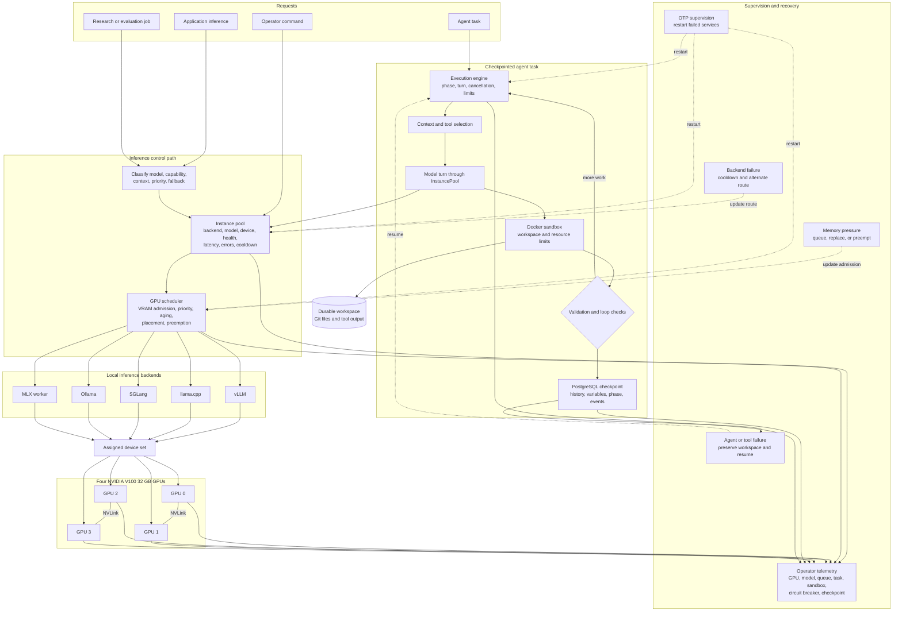

# HomeCloud

HomeCloud is a self-hosted AI runtime for local inference, agent execution, research workloads, and application services. The deployment described here uses four NVIDIA V100 32 GB GPUs with NVLink connectivity in a private server.

## Request and execution flow

The diagram shows two related paths:

- A normal inference request is routed to a healthy model instance that fits the requested capability and available GPU memory.
- A longer agent task uses the same inference pool but adds context management, isolated tools, validation, checkpoints, and recovery.

The scheduler and agent runtime are application services. They are not shell scripts that assume one model process will always remain available.

## Supervised application

HomeCloud runs as an Elixir and OTP application. The supervision tree starts and monitors:

- PostgreSQL access and Phoenix PubSub.
- HTTP client pools and circuit-breaker registries.
- GPU managers and VRAM telemetry.
- The GPU workload scheduler.
- Dynamic supervisors for model instances, agent tasks, and sandboxes.
- Inference backend supervisors.
- The model instance pool.
- Secrets and credential services.
- Automatic scheduling and background maintenance.
- The agent execution orchestrator.
- The Phoenix endpoint and operator interfaces.

A failed child process can restart under its supervisor. Durable model, job, checkpoint, and workspace records allow the replacement process to recover application state.

## Model instance pool

The instance pool tracks available model endpoints across vLLM, llama.cpp, SGLang, Ollama, MLX, and other configured backends. It records health, recent errors, performance, loaded model, device assignment, and route cooldown state.

For a request, the pool filters instances by model and capability, removes unhealthy or cooled-down routes, and selects a candidate using current performance and load. It can start or stop model instances when policy and hardware capacity allow it.

A backend failure does not require every client to know a new endpoint. The pool can route later work to another healthy instance.

## GPU workload scheduler

The scheduler owns admission to limited GPU memory. Each workload carries priority, requested memory, backend, model, and execution state. The scheduler:

- Checks available VRAM before dispatch.
- Queues work that cannot fit.
- Increases waiting priority through aging.
- Supports preemption where the workload and backend allow it.
- Tracks assigned devices and running workloads.
- Publishes telemetry for queue, memory, start, completion, and failure events.
- Coordinates concurrent inference and agent workloads.

For the four-V100 node, this permits separate model tiers and longer tasks to share the same hardware without allowing every process to allocate memory independently.

## Agent execution engine

The agent execution engine runs multi-turn work over the inference pool. A task can include:

- A goal and current phase.
- Conversation and task context.
- Dynamic tool selection.
- Tool calls and asynchronous results.
- Loop and repetition detection.
- Validation requirements.
- Feedback from earlier turns.
- Checkpoint and cancellation state.

The engine alternates between model inference, tool execution, result validation, and state updates. It can stop on completion, validation failure, cancellation, resource limits, or a configured turn boundary.

## Sandboxes and tools

Agent tools run in Docker sandboxes with durable workspace directories. A sandbox can provide:

- CPU and memory limits.
- Disk quotas.
- A Git repository.
- Validated workspace paths.
- A tool executor.
- Process cleanup and task cancellation.
- A workspace that can be inspected after failure.

The model does not receive unrestricted host filesystem access. Tool requests cross the execution service, which validates the target workspace and operation.

## Checkpoints and recovery

The checkpointer writes per-turn state to PostgreSQL. A checkpoint can include:

- Conversation history.
- Task variables.
- Loop detection state.
- Engine state.
- Event history.
- Current phase.
- Tool results and validation state required for resume.

If an execution process stops, a replacement process can load the latest checkpoint and durable workspace. The event and phase data also support inspection of where the task stopped.

## Failure handling

HomeCloud handles common failure paths explicitly:

| Failure | Stored response |
|---|---|
| Backend health check fails | Put the route into cooldown and select another eligible instance |
| Requested model does not fit available VRAM | Queue, change placement, or use an allowed lower-resource route |
| Running workload exceeds policy | Preempt or cancel through the scheduler |
| Agent process stops | Restart under supervision and resume from a checkpoint |
| Tool exceeds sandbox limits | Terminate the tool process and return a structured failure |
| Provider or local endpoint repeatedly fails | Open the circuit breaker and stop immediate redispatch |
| Workspace task fails | Preserve the workspace and checkpoint for repair or inspection |

## Operator and application use

HomeCloud supplies local models to private applications and development tools. It also supports direct research and evaluation workloads. Operator views use scheduler, instance, GPU, and task telemetry instead of inferring health from a single process log.

The case study does not expose hostnames, private network routes, credentials, model access tokens, or production data.
