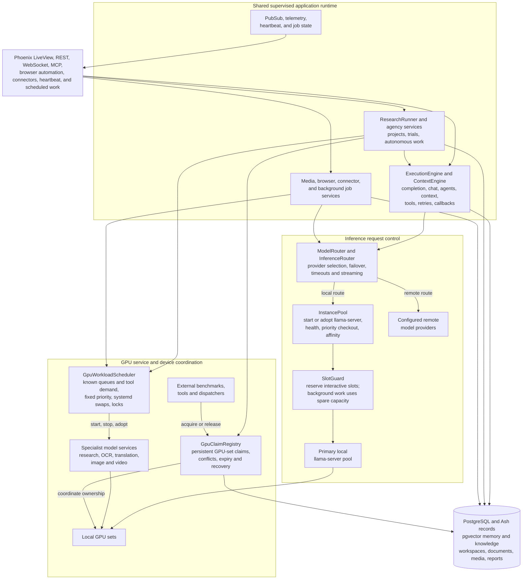
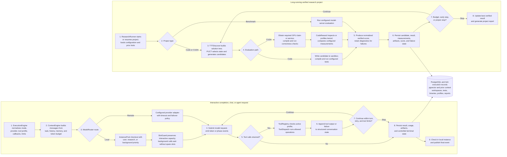

# HomeCloud

HomeCloud is a self-hosted AI application platform built with Elixir, Phoenix, and Ash. It provides one supervised runtime for local and remote model access, interactive chat, autonomous agents, tools, context and memory, long-running research, media workflows, browser automation, connectors, and scheduled operations.

The canonical source repository is private. This case study describes selected implemented paths without publishing credentials, private configuration, deployment data, or complete source.

## Platform architecture

Phoenix LiveView, REST, WebSocket, MCP, connectors, and scheduled services enter shared application modules instead of running separate inference and automation stacks. `ExecutionEngine` provides the common completion, chat, and agent loop. Research, agency, media, and connector services reuse model routing, tools, persistence, PubSub, and supervised process infrastructure.

The runtime implements four separate controls:

1. Request execution controls model calls, tool calls, callbacks, retries, and final state.
2. Local inference controls instance health, checkout, priority, and prompt-cache affinity.
3. GPU service control loads and unloads specialist model services according to known work queues and capacity.
4. Persistent GPU claims coordinate model services, research jobs, benchmarks, and external dispatchers that may run outside the Phoenix process.

## Model routing and local inference

`ModelRouter` is the central entry point for local and remote generation. It resolves provider and model configuration, applies request timeouts, supports streaming, classifies failures, and can attempt a configured failover chain.

Local text inference uses `InstancePool` and `InferenceRouter`:

- `InstancePool` starts or adopts configured `llama-server` instances, checks health, and restarts unhealthy managed instances.
- Callers check out an instance and check it back in after the request. Checkout queues distinguish user, research, and background work.
- Multi-slot instances can serve more than one caller. Checkout state identifies the assigned instance and slot.
- Affinity hints can prefer an instance that already holds useful prompt-cache state.
- A remote-only deployment can start without a local model pool.

`SlotGuard` protects interactive use of a parallel local server. It reads the server's `/slots` state and reserves capacity for user requests. Research and background calls proceed only when the server has spare slots beyond that reservation.

## GPU service and claim control

HomeCloud uses two additional controls for work that is broader than a single local inference checkout.

### Specialist model lifecycle

`GpuWorkloadScheduler` manages the lifecycle of configured specialist services such as research, OCR, translation, image, and video models. It polls known work queues and tool demand, detects active systemd services, and applies a fixed workload priority order.

The scheduler can:

- keep the primary user-facing model loaded;
- load a required specialist service on demand;
- stop an idle, lower-priority service before loading another service;
- wait for GPU memory to become available before starting the replacement;
- return a GPU to its configured baseline service after temporary work completes;
- apply idle thresholds, swap cooldowns, unavailable-service state, and benchmark locks; and
- publish status and swap history for operational views.

Its scope is model-process placement and lifecycle. Request scheduling remains in the request, instance, and slot controls.

### Persistent GPU claims

`GpuClaimRegistry` stores time-bounded claims against explicit GPU sets. A claim records an owner, purpose, claim type, exclusivity, start time, and expiry. Overlapping claims conflict when either claim is exclusive.

The registry coordinates work across the application and external processes. It also adopts the active primary inference service as a claim, expires stale claims, persists claim state for crash recovery, and publishes acquire, release, and expiry events through PubSub.

`InstancePool`, `SlotGuard`, `GpuWorkloadScheduler`, and `GpuClaimRegistry` control different parts of local compute. They use separate state and control paths because they manage different resources and process boundaries.

## Agent execution

`ExecutionEngine` provides the common request loop for completion, chat, and autonomous work.

A normal agent request follows this path:

1. Normalize the mode, provider options, tool profile, callbacks, and execution limits.
2. Build structured messages with `ContextEngine`, including retrieved memory, task state, conversation history, and the available token budget.
3. Select a local or remote route. Local requests obtain an eligible instance and slot; remote requests use the configured adapter.
4. Submit the model request and emit token or phase events when streaming is enabled.
5. Parse returned tool calls and check them against the active tool profile.
6. Dispatch each allowed call through the static or dynamic tool registry.
7. Append tool output or failure information to conversation state and continue within turn, retry, and tool-call limits.
8. Persist the result, usage, artifacts, and terminal state, then check in any local instance.

Tool failures remain part of the execution record, so a later model turn can respond to the failure. The engine does not require every tool call to succeed before it can produce a controlled terminal result.

`ToolRegistry` provides model-visible schemas and profile-based access to file, shell, Git, test, browser, web research, media, memory, session, code-analysis, and sub-agent operations. Dynamic extensions are loaded into a separate ETS-backed registry during application startup.

## Research and verified optimization

`ResearchRunner` manages long-running research projects as a supervised process. It starts, pauses, resumes, and stops projects; restores active projects after restart; limits concurrent trials; adapts the delay between trials; records score trajectories and strategy history; publishes progress; and produces reports.

The runner selects an execution path from the project type:

- code optimization uses `TTTDiscover` with compiled and tested candidates;
- CUDA kernel optimization uses the CUDA execution and reward path; and
- inference benchmarking evaluates model-server configurations.

`TTTDiscover` maintains a tree-structured solution buffer and uses PUCT-based state selection to balance exploration and exploitation. Candidate solutions are generated by a model, but code rewards come from compilation and test execution rather than model judgment. Higher-reward prior candidates are included in later context, generation temperature and exploration pressure change with the remaining budget, and the search stops after a configured period without improvement. The current implementation uses in-context adaptation; it does not claim to update model weights.

For CUDA projects, `CudaReward` and the CUDA orchestration path can compile a candidate, run correctness checks, inspect or profile the binary, compare measured behavior with the task configuration, and return a normalized result with diagnostics. Failed compilation and failed correctness checks remain explicit low-scoring trials instead of being removed from the research record.

Each trial stores the candidate, execution result, measurements, score, failure state, and relevant artifacts. The next search step can therefore use verified prior results rather than only a generated summary of the work.

## Supervision, persistence, and external services

The OTP supervision tree starts repositories, PubSub, HTTP clients, model and media registries, tool registries, local inference services, GPU controls, research and agency runners, browser services, connectors, heartbeat services, and maintenance processes as separate children. A failed worker can terminate or restart without terminating unrelated application services.

PostgreSQL and Ash store application, execution, research, claim, asset, and connector records. pgvector supports configured memory and knowledge retrieval. Phoenix PubSub carries execution, research, connector, and infrastructure events. Files, code workspaces, documents, and generated media remain outside relational records where appropriate.

Some model services are separate operating-system processes. The application checks, adopts, starts, stops, and monitors those services through explicit interfaces rather than assuming that every GPU process belongs to the Phoenix supervisor.

## Selected implementation paths

| Implemented area | Source path |
|---|---|
| Application supervision and startup wiring | `lib/home_cloud/application.ex` |
| Completion, chat, and agent execution | `lib/home_cloud/intelligence/execution_engine.ex` |
| Local and remote model routing | `lib/home_cloud/intelligence/model_router.ex` |
| Local `llama-server` process pool and checkout | `lib/home_cloud/intelligence/instance_pool.ex` |
| Context assembly, budgeting, refresh, and compaction | `lib/home_cloud/intelligence/context_engine.ex` |
| Tool schemas, profiles, and dispatch registration | `lib/home_cloud/intelligence/tool_registry.ex` |
| Interactive slot reservation | `lib/home_cloud/infrastructure/slot_guard.ex` |
| Specialist model service lifecycle | `lib/home_cloud/infrastructure/gpu_workload_scheduler.ex` |
| Persistent cross-process GPU claims | `lib/home_cloud/infrastructure/gpu_claim_registry.ex` |
| Long-running research project control | `lib/home_cloud/intelligence/optimization/research_runner.ex` |
| PUCT search and verified code rewards | `lib/home_cloud/intelligence/optimization/ttt_discover.ex` |
| CUDA compilation, correctness, profiling, and reward | `lib/home_cloud/intelligence/optimization/cuda_reward.ex` |

## Current boundaries

- The source repository is private, so this portfolio does not expose complete implementation or deployment configuration.
- Local inference and specialist model availability depend on configured model files, services, GPU topology, and health checks.
- GPU priorities and service mappings are explicit deployment policy, not a general-purpose cluster scheduler.
- The research system can verify only the properties represented by its compiler, tests, profiler, measurements, and task configuration.
- This case study does not claim throughput, latency, model quality, or research improvement without a published measurement record.
