# HomeCloud

**A self-hosted AI runtime and LLMOps platform for supervised local inference, GPU-aware scheduling, sandboxed agents, durable context, and research workloads.**

HomeCloud operates on a four-GPU local server built around NVIDIA V100 32 GB accelerators. The hardware is important, but it is not the architecture. The architecture is the control system around the hardware: model endpoints are supervised, inference capacity is represented as schedulable slots, agent executions own sandboxes and checkpoints, and research workloads run below user-facing traffic.



## Platform thesis

Local inference becomes a platform only when the surrounding system can answer:

- Which model instances are healthy?
- Which request may use which slot, at what priority?
- How is prompt-cache or model-profile affinity preserved?
- What happens when an inference process wedges or disappears?
- Where do tool calls execute?
- How does a long run survive context pressure or a process restart?
- Which state is task-local, reusable memory, or durable evidence?
- How are experiments prevented from destabilizing user-facing inference?

HomeCloud addresses those questions with Elixir/OTP supervision, a Phoenix application layer, PostgreSQL/pgvector persistence, local model services, GPU scheduling, Docker-backed execution sandboxes, and explicit platform/research boundaries.

## Architecture layers

| Layer | Responsibilities |
|---|---|
| **Experience and API** | Phoenix views for chat, research, memory, infrastructure, and model operations; HTTP/streaming interfaces; MCP and connector surfaces. |
| **Agent orchestration** | Autonomous, interactive, and plan-only execution; phase streaming; tool loops; validation repair; DAG execution; cancellation; checkpoints; recovery. |
| **Inference and tools** | Model routing, local instance pool, priority and affinity checkout, dynamic tool registry, document/research tools, browser and media services. |
| **Memory and context** | Document retrieval, embeddings, task memory, learned facts, skills, knowledge graph, token budgeting, compaction, and context refresh. |
| **Infrastructure** | OTP supervision, PostgreSQL/pgvector, GPU health and claims, workload scheduling, model endpoint monitoring, sandbox lifecycle, telemetry, maintenance. |
| **Research workloads** | Program search, code and CUDA evaluation, trial scheduling, verifier executors, and lower-priority autonomous research. |

## Operating platform core

### Supervised model endpoints

HomeCloud treats model servers as platform services with explicit health and lifecycle boundaries. The application can adopt externally supervised local endpoints rather than assuming a Phoenix process should own GPU process creation.

This separation matters on long-running GPU systems:

- an application restart should not orphan or duplicate model servers;
- a failed endpoint should be marked unhealthy without globally blocking healthy GPUs;
- model swaps should support drain behavior rather than dropping in-flight work;
- health and throughput state should remain inspectable independent of an agent session.

### Instance pool

The instance pool represents inference capacity with checkout/checkin semantics similar to a database connection pool. Each instance carries identity, endpoint, health, model profile, context size, GPU placement, and one or more checkout slots.

Supported scheduling concepts include:

- **priority:** interactive user work before research and background work;
- **affinity:** prefer a prior instance for prompt-cache locality;
- **profile matching:** route work to a model/configuration that satisfies the request;
- **drain:** stop new assignments while allowing current requests to finish;
- **health-aware availability:** exclude unhealthy instances without treating the entire machine as failed;
- **caller monitoring:** reclaim capacity when a checkout owner disappears.

### Inference router

The router owns the checkout → pin endpoint → generate → checkin cycle.

```text
request
  -> determine provider and priority
  -> acquire matching slot
  -> pin the selected endpoint into request options
  -> stream or generate
  -> record throughput/health evidence
  -> return the slot in an after/finally path
```

Concurrency is derived from live slot capacity. Agent code does not hardcode “four GPUs means four tasks”; an instance may expose different parallel slots, and a remote provider has a different concurrency contract.

A failed checkout returns a structured capacity error. The router does not silently bypass the pool and create unaccounted GPU contention.

### GPU workload scheduling

Inference, media, research, and background tools can compete for the same accelerators. The infrastructure layer therefore separates:

- durable GPU claims;
- model and modality demand;
- interactive, research, and background priorities;
- workload queues;
- exclusion locks for incompatible concurrency;
- maintenance and reaping.

The scheduler protects user-facing capacity while allowing idle hardware to serve research work.

## Agent execution

### Unified execution engine

The execution engine supports three modes over shared control and tool infrastructure:

| Mode | Behavior |
|---|---|
| **Autonomous** | Runs a persisted task through planning, tools, validation, and completion. |
| **Interactive** | Streams reasoning phases, tokens, tool events, repair attempts, and completion to a UI callback. |
| **Plan-only** | Produces a bounded plan without entering an autonomous tool loop. |

The engine emits typed lifecycle events rather than relying on a prose log. Interactive phases distinguish reasoning, tool dispatch, tool execution, synthesis, and validation repair.

### Owned sandboxes

A source-modifying autonomous run receives an owned execution sandbox. HomeCloud derives the workspace from project state, starts a persistent executor where available, and guarantees cleanup on completion, cancellation, or failure.

The sandbox boundary provides:

- filesystem and process isolation;
- controlled pre-setup;
- scoped project workspace;
- captured tool output;
- rollback and checkpoint integration;
- reduced risk that one run disturbs the Phoenix application or another run.

### Loop safety and repair

Long tool loops are monitored for repeated actions, repeated model output, score regression, and plateaus. Validation failures can be returned to the model for a bounded repair attempt. Stop-hook reflection can extend useful work while still imposing an upper control boundary.

These mechanisms reduce two opposing failure modes: terminating productive work too early and allowing a stalled loop to consume capacity indefinitely.

### Checkpoints and recovery

Execution state, logs, task flags, file changes, and checkpoints are persisted or buffered under an explicit lifecycle. A resumed run can recover useful context without pretending that an interrupted process is still alive. Cleanup and recovery are designed together so a leaked container is not the price of retaining state.

## Context and memory

HomeCloud assembles context from several layers with different retention semantics:

| Layer | Purpose |
|---|---|
| **Conversation/history** | Recent interaction needed for the current turn. |
| **Task memory** | Working state that persists across turns in one task. |
| **Document retrieval** | Chunked and embedded source material selected for the request. |
| **Knowledge facts** | Distilled statements with confidence and provenance. |
| **Skill patterns** | Reusable tool or solution patterns learned from successful work. |
| **Knowledge graph** | Entity and relationship context spanning documents and tasks. |

The context engine budgets tokens, refreshes retrieval as the task evolves, preserves coherent user/assistant pairs, and compacts older history before overflow. Compaction is a controlled transformation with protected recent and critical state, not arbitrary truncation.

## Tools and modalities

The runtime supports a broad tool plane rather than treating “agent” as a shell command:

- sandboxed files, shell, git, and tests;
- document loading, search, browser, and academic research;
- memory and knowledge-graph operations;
- sub-agent dispatch;
- data inspection and artifact handling;
- image, video, audio, and media workflows where configured;
- CUDA compilation and execution for research workloads;
- dynamically registered tools with server-side admission.

Tool availability is deployment- and context-dependent. A registered tool is not automatically exposed to every task.

## Research workloads: separate from the platform contract

HomeCloud also hosts experimental and research-oriented workloads. These are substantial consumers of the platform, but they are not presented as universal production guarantees.

| Research area | What it exercises | Maturity boundary |
|---|---|---|
| **Program search / test-time discovery** | Multi-trial planning, candidate generation, tree search, persisted trials, verifier rewards. | Research workload; algorithms and reward design continue to evolve. |
| **Code evaluation** | Compilation, tests, execution, comparison against baselines. | Deterministic evaluator components are useful; benchmark claims require a dated corpus and methodology. |
| **CUDA optimization** | `nvcc` compilation, correctness checks, binary/resource inspection, profiling, roofline/baseline comparison. | Hardware-specific research pipeline, not a general guarantee of automatic optimization. |
| **Autonomous research programs** | Long-running goals, trial scheduling, literature/retrieval tools, memory, checkpoints. | Exercises the runtime under long horizons; autonomy remains bounded by scheduler and tool policy. |
| **Dynamic tool synthesis** | Runtime compilation and registration of new Elixir tool modules. | High-power capability requiring strong configuration and trust boundaries. |

The public case study does not claim scientific novelty merely because these modules exist. Their value is demonstrated through reproducible tasks, deterministic checks, and explicit limitations.

## Four-V100 deployment

The current deployment provides 128 GB of aggregate GPU memory across four V100 32 GB accelerators. Model placement depends on quantization, tensor-parallel support, context requirements, and whether a workload benefits from NVLink or independent replicas.

The platform is designed to represent the resulting topology rather than assuming one fixed allocation. Typical modes include:

- one larger model distributed across multiple GPUs;
- several independent model endpoints for routing and concurrency;
- reserved user-facing capacity plus lower-priority research capacity;
- temporary modality-specific workers.

Hardware inventory can change without changing the product, memory, or agent state models.

## Relationship to Flip

HomeCloud can supply local inference for Flip through a provider-compatible endpoint. The boundary is explicit:

- Flip owns users, communities, permissions, tool scope, synthesis, provenance, and response persistence.
- HomeCloud owns local model capacity, endpoint health, routing, and GPU scheduling.
- A local endpoint failure should degrade an AI capability without corrupting Flip’s social product state.

## Status

| State | Capability |
|---|---|
| **Operating platform core** | OTP supervision; Phoenix/PostgreSQL application; local instance pooling and health; slot-aware routing; priority/affinity/profile checkout; GPU claims and scheduling; sandboxed execution; autonomous/interactive/plan-only engine; tool registry; RAG/memory/context compaction; checkpoints; telemetry and maintenance. |
| **Active expansion** | Broader modality scheduling, model-profile automation, stronger cross-run evaluation records, and tighter operational interfaces. |
| **Research / experimental** | Test-time program discovery, autonomous research strategies, CUDA optimization search, dynamic tool synthesis, and advanced evaluator combinations. |

## Deliberate limitations

- Local serving economics do not remove power, cooling, hardware-failure, and operator costs.
- V100-class hardware constrains datatype and kernel support relative to newer accelerators.
- A large context window does not eliminate retrieval quality or compaction error.
- Sandboxes reduce blast radius but do not make arbitrary generated code safe by definition.
- Experimental reward functions can be gamed unless verification remains deterministic and task-specific.
- The broad source repository contains host- and research-specific implementation; this public page is an architecture case study rather than a turnkey appliance promise.
