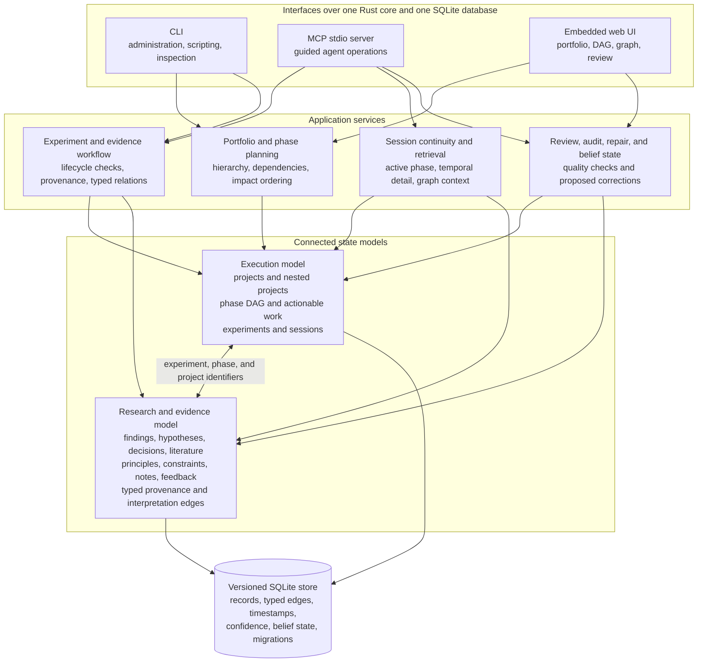

# Project Manager

[Source repository](https://github.com/wahargis/project-manager)

Project Manager (`pm`) is a local-first research operations system. It manages projects that continue across many sessions, experiments, decisions, and changes in direction. The system stores executable work, evidence, and research context in one versioned SQLite database and exposes the same core through a Rust CLI, an MCP server, and an embedded browser dashboard.

The current package is pre-1.0. The database, CLI, MCP server, dashboard, phase dependency engine, typed relation graph, session operations, retrieval, review, audit, and repair functions are implemented.

## Operating model

Project Manager uses two connected structures.

The **execution structure** contains projects, nested projects, phases, phase dependencies, experiments, and sessions. `DagEngine` computes topological order, removes blocked or completed phases, and sorts the remaining actionable work by impact.

The **research structure** is a typed relation graph. It connects experiments to findings and connects those findings to hypotheses, decisions, literature, principles, constraints, research notes, and feedback. Relationships include provenance and interpretation such as `ProducedBy`, `Informed`, `Supports`, `Contradicts`, `DerivedFrom`, `TestedBy`, `BranchesFrom`, and `ConvergesInto`.

These structures are separate because phase dependency and evidence provenance answer different questions. They are connected through experiment and phase identifiers so execution planning can use the current research record.

## Research execution and continuity

```mermaid
flowchart LR
    subgraph select["Session and work selection"]
        a1["Start or resume session"] --> a2["Assemble active phase,<br/>recent changes, experiments,<br/>pending work, and warnings"]
        a2 --> a3{"Actionable phase available?"}
        a3 -->|"No"| a4["Return blockers or completed state"]
        a3 -->|"Yes"| a5["Select highest-impact phase<br/>whose dependencies are complete"]
    end

    subgraph execute["Experiment execution"]
        b1["Create or continue experiment"] --> b2["Link follow-on work to an upstream<br/>experiment, finding, or decision"]
        b2 --> b3["Perform research or engineering work<br/>outside the project database"]
        b3 --> b4["Record pass, fail, inconclusive,<br/>or pending outcome"]
        b4 --> b5["Create finding and link it<br/>to the producing experiment"]
    end

    subgraph interpret["Evidence interpretation"]
        c1["Inspect contradiction candidates"] --> c2["Explicitly create support,<br/>contradiction, informed, or derived edges"]
        c2 --> c3["Update hypothesis, decision,<br/>literature, principle, or constraint"]
        c3 --> c4["Recompute confidence or belief state<br/>from explicit stored relationships"]
    end

    subgraph complete["Completion, review, and handoff"]
        d1{"Phase completion requested?"}
        d1 -->|"Pending work remains"| d2["Return outstanding experiments,<br/>findings, and required updates"]
        d1 -->|"Ready"| d3["Run review and graph audit"]
        d3 --> d4["End session with summary,<br/>active focus, and temporal detail"]
    end

    a5 --> b1
    b5 --> c1
    c4 --> d1
    d2 --> b1
    d4 -. "next session" .-> a1

    advisory["Text analysis proposes candidates;<br/>explicit stored edges change belief state"]
    advisory -.-> c1
```

A normal project cycle uses the following state transitions:

1. **Start or resume a session.** The session operation selects the active or highest-impact actionable phase and assembles a bounded working context.
2. **Select work.** The DAG excludes complete and deprioritized phases and any phase whose dependencies are incomplete. Remaining phases are ordered by impact.
3. **Create or continue an experiment.** The guided MCP workflow requires follow-on experiments to identify an upstream experiment, finding, or decision. The lower-level CLI remains available for administration and scripting.
4. **Record the outcome.** Experiments can pass, fail, remain inconclusive, or stay pending. A finding can be created with the completion operation and linked to the experiment that produced it.
5. **Interpret the result.** Findings can support or contradict hypotheses, inform decisions, derive principles, or change the status of literature and constraints.
6. **Review conflicts.** Text analysis can suggest possible contradictions, but it does not assert them. An explicit `Contradicts` relationship is required before confidence-update logic changes confidence or belief status.
7. **Close or redirect work.** The MCP completion path blocks phase completion while pending experiments remain. Branch and convergence relationships retain investigations that split or combine.
8. **Review and hand off.** Operational review, graph audit, repair proposals, temporal deltas, and session summaries prepare the next session without reconstructing history from chat text.

Failed and inconclusive experiments remain in the record. They contribute to stagnation detection and can motivate new work.

## Stored state

| State group | Main records | Use |
|---|---|---|
| Portfolio | Project, alias, parent project, lifecycle | Active portfolio and project hierarchy |
| Execution | Phase, dependency, impact, experiment, result | Actionable work and completion state |
| Evidence | Finding, hypothesis, decision, literature, research | Research results and interpretation |
| Guidance | Principle, constraint, feedback | Durable rules, limits, and corrections |
| Continuity | Session, active experiment, timestamps, summaries | Context recovery and handoff |
| Relations | Typed directed edges | Provenance, support, contradiction, dependency, branch, and convergence |

Confidence and belief fields are attached to records that can change after new evidence. Explicit support and contradiction edges pass through explicit confidence-update logic. Candidate detection remains advisory.

## Interfaces

### CLI

The CLI provides broad local administration and scripting. It covers project and phase management, experiments, findings, graph operations, search, review, audit, repair, session handoff, and dashboard startup. Direct CLI writes are intentionally lower level than the guided MCP workflow.

### MCP server

The stdio MCP server is the main agent-facing interface. It uses structured input and output and adds workflow checks around writes. Examples include required evidence for decisions, required provenance for principles, phase completion checks, guarded hypothesis and literature transitions, session state, and automatic typed relationships.

### Browser dashboard

The embedded dashboard provides portfolio and project inspection. It displays the project hierarchy, phase dependencies, graph relationships, search results, node details, status controls, and cross-project priority data. It reads the same SQLite store as the CLI and MCP server.

## Retrieval, review, and repair

Retrieval is local and does not require an embedding service. Text matches are combined with graph connectivity, evidence weight, and recency. Different operations return different scopes:

- ranked text matches;
- a topic brief grouped by record type;
- one-hop or bounded multi-hop graph neighborhoods;
- a phase-centered session context;
- changes since a timestamp or prior session.

Review is split into three operations:

- **Operational review** reports experiment state, stagnation, active phases, contradictions, hypothesis and literature status, old unresolved records, expired constraints, and branch state.
- **Graph audit** scores structural properties such as causal-chain completeness, hypothesis coverage, literature use, edge density, temporal order, and cross-project references.
- **Repair proposals** identify unsupported decisions, disconnected records, cross-project causal links, and dangling branches. Repairs are proposed rather than silently applied.

## Selected implementation paths

| Area | Source path |
|---|---|
| Phase dependency and impact ordering | [`src/dag/mod.rs`](https://github.com/wahargis/project-manager/blob/main/src/dag/mod.rs) |
| Typed records and relations | [`src/store/mod.rs`](https://github.com/wahargis/project-manager/blob/main/src/store/mod.rs) |
| SQLite implementation and migrations | [`src/store/sqlite.rs`](https://github.com/wahargis/project-manager/blob/main/src/store/sqlite.rs) |
| Bounded graph traversal and phase subgraphs | [`src/kg/traversal.rs`](https://github.com/wahargis/project-manager/blob/main/src/kg/traversal.rs) |
| Guided MCP record operations | [`src/mcp/nodes.rs`](https://github.com/wahargis/project-manager/blob/main/src/mcp/nodes.rs) |
| Review and audit operations | [`src/mcp/review.rs`](https://github.com/wahargis/project-manager/blob/main/src/mcp/review.rs) |
| Dashboard server and data views | [`src/mcp/dashboard.rs`](https://github.com/wahargis/project-manager/blob/main/src/mcp/dashboard.rs) |
| Contradiction candidates and confidence handling | [`src/analysis/contradictions.rs`](https://github.com/wahargis/project-manager/blob/main/src/analysis/contradictions.rs), [`src/analysis/confidence.rs`](https://github.com/wahargis/project-manager/blob/main/src/analysis/confidence.rs) |

## Current boundaries

- The package is pre-1.0, so commands, tools, and schemas can still change.
- SQLite is intended for a local operator or agent runtime, not concurrent multi-user service access.
- Retrieval is lexical and graph-aware rather than embedding-based.
- The process can prepare contradiction candidates and an external-classifier prompt, but it does not silently assert semantic contradictions.
- MCP transport is stdio.
- The embedded dashboard is an operational local UI. It is not a hardened public service and does not provide application authentication.
