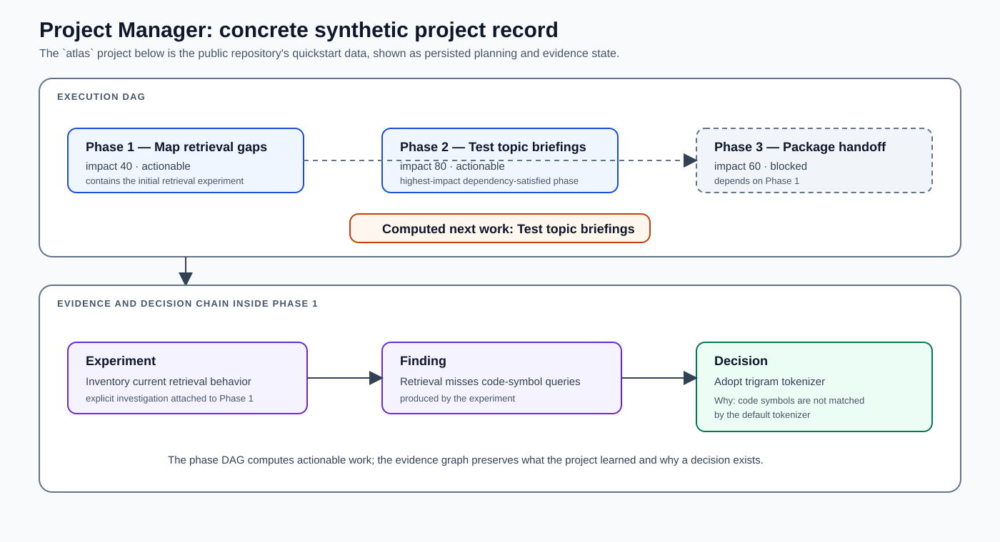

# Project Manager

**A local-first research operations system for planning, experiments, evidence, decisions, review, and continuity across long-running human and agent work.**

Project Manager manages projects that outlive a task list, chat session, model context, or original plan. It stores the operational objects that explain both what work exists and why the project changed: projects, subprojects, phases, experiments, findings, hypotheses, decisions, literature, constraints, principles, research, feedback, and sessions.

The knowledge graph is the shared state model beneath those workflows, not the complete product. Project Manager also computes actionable work from a dependency graph, assembles context for a new session, validates important state transitions, reviews causal and structural integrity, and exposes the same application through a Rust CLI, an MCP server, and an embedded web dashboard.


## Concrete project record

The public quickstart creates a synthetic project named `atlas`. The diagram below shows the actual example objects and the result computed from them.



```bash
pm --db /tmp/atlas.db project activate atlas --alias at
pm --db /tmp/atlas.db phase atlas add "Map retrieval gaps" --impact 40
pm --db /tmp/atlas.db phase atlas add "Test topic briefings" --impact 80
pm --db /tmp/atlas.db phase atlas add "Package handoff" --impact 60 --depends 1
pm --db /tmp/atlas.db experiment add atlas 1 "Inventory current retrieval behavior"
pm --db /tmp/atlas.db finding add atlas 1 "Retrieval misses code-symbol queries"
pm --db /tmp/atlas.db decision add atlas 1 "Adopt trigram tokenizer" \
  --why "Code symbols are not matched by the default tokenizer"
```

The record demonstrates the two forms of control that the system keeps separate:

- the phase DAG leaves `Package handoff` blocked on Phase 1 and selects the dependency-satisfied Phase 2 as the highest-impact next work;
- the evidence chain preserves the experiment, resulting finding, selected decision, and decision rationale inside Phase 1.

The same stored state can be inspected through `pm next`, the MCP context and review operations, or the web dashboard. The interface changes; the project record and scheduling semantics do not.

## Operating model

A project moves through a recurring execution and learning loop:

```text
orient -> select actionable work -> run experiment -> record finding
   ^                                                   |
   |                                                   v
handoff <- review and repair <- revise hypothesis or decision
```

### 1. Orient the session

A session starts from stored project state rather than conversational recollection. Project Manager selects an active or high-impact actionable phase, collects pending and recent work, assembles a bounded phase-centered subgraph, and returns the relevant experiments, findings, hypotheses, decisions, literature, constraints, and next actions.

Temporal operations can also report what changed since a prior timestamp or session. This separates stable project history from the delta a returning person or agent needs immediately.

### 2. Select dependency-satisfied work

Phases are executable containers with impact, dependencies, status, goals, success criteria, and completion timestamps. The DAG engine performs topological ordering, rejects cycles, filters out blocked or resolved phases, and ranks the remaining actionable work by impact.

This selection remains deterministic. A model does not decide that a prerequisite is complete or silently reorder the plan. Agents can use the result, but the explanation comes from persisted phase state and dependency edges.

### 3. Investigate through explicit experiments

Work inside a phase is represented as experiments rather than undifferentiated tasks. Experiments carry status and outcomes such as pass, fail, or inconclusive. Failed and inconclusive work remains part of the evidence record instead of being erased because it did not support the current plan.

The guided MCP workflow requires later experiments to identify the finding, decision, or earlier experiment that motivated them. Fan-out from one experiment can be represented as a branch; convergence of several findings into one decision remains visible as a merge in the project history.

### 4. Record evidence and revise interpretation

Findings attach to the experiments that produced them. They can support or contradict hypotheses, inform decisions, establish principles, validate constraints, or change the status of literature. Decisions retain both the selected action and its rationale.

Hypotheses and literature have guarded lifecycles. Testing, confirmation, refutation, integration, or dead-end status cannot be advanced arbitrarily through the agent-facing interface; the operation must identify the evidence or work that justifies the transition.

### 5. Review project integrity

Project Manager provides separate operational and structural views:

- **Project review** reports outcomes, pending work, stagnation, phase priority, contradictions, hypothesis and literature state, unresolved branches, expired constraints, aged nodes, and belief state.
- **Graph audit** scores causal completeness, hypothesis coverage, literature use, edge density, temporal coherence, and cross-project references.
- **Orphan repair** identifies specific missing relationships or scope errors and returns targeted repair proposals rather than silently rewriting history.

These surfaces make the project record inspectable by a person or an agent before the state is used to drive further work.

### 6. End with a durable handoff

Sessions retain start and end times, an active experiment, and a summary. The next session can retrieve the active working set, recent changes, unresolved work, and project warnings without replaying the prior chat or reading every document in the repository.

## Domain model

| Object | Operational role |
|---|---|
| **Project / subproject** | Portfolio hierarchy, lifecycle, aliases, and cross-project priority. |
| **Phase** | Dependency-aware unit of execution with impact, goals, success criteria, and status. |
| **Experiment** | Explicit investigation with status, outcome, and upstream motivation. |
| **Finding** | Evidence produced by work, including support, contradiction, correction, and numeric observations. |
| **Hypothesis** | Testable proposition with prediction, evaluation criteria, confidence, belief state, and evidence lifecycle. |
| **Decision** | Chosen action and rationale connected to informing experiments or findings. |
| **Literature** | Source record with reading, testing, citation, integration, or dead-end state. |
| **Principle / constraint** | Durable project guidance, scope, severity, rationale, confidence, and optional expiry. |
| **Research / feedback** | Longer investigations and explicit corrections or confirmations. |
| **Session** | Working interval, active experiment, temporal delta, summary, and handoff. |
| **Typed relationship** | Support, contradiction, derivation, testing, dependency, supersession, branching, convergence, and provenance. |

The store retains human-readable content on each object while preserving relationships as queryable data. A later session can ask which findings informed a decision, which experiments test a hypothesis, which constraint was active when work ran, or which branch remains unresolved without inferring those relationships from prose.

## Agent engineering

Project Manager is designed to supply durable control and context to agents without making prompt history the system of record.

### Structured mutation surface

The MCP interface is stricter than raw CRUD. Guided operations enforce causal upstream requirements, phase-completion gates, hypothesis and literature transitions, typed-edge compatibility, project scope, and automatic relationship creation. Invalid state changes return structured errors and the missing condition rather than accepting an incoherent project history.

### Context assembly instead of transcript replay

Session context is selected from the active phase and its bounded graph neighborhood. Search combines lexical relevance, graph connectivity, evidence weight, and recency. Topic briefs group results by type and include neighboring relationships; temporal queries return changes rather than a repeated full dump.

This produces working context with explicit semantics. An agent receives a finding as a finding, a superseded decision as superseded, and a constraint with its expiry rather than a set of text chunks that must be reclassified on every turn.

### Deterministic execution beside advisory analysis

The execution DAG and epistemic analysis are adjacent but separate:

- dependency completion and impact determine which phase is actionable;
- contradiction retrieval suggests candidate conflicts;
- explicit `Contradicts` relationships change authoritative graph state;
- confidence and belief operations support review;
- no heuristic contradiction or confidence score silently blocks or rewrites the phase DAG.

This boundary keeps scheduling reproducible while still giving agents and people evidence that may justify changing the plan.

### Truth maintenance remains explicit

Supports and contradicts relationships can adjust confidence or suspend affected objects for review, but belief-changing updates remain stored, inspectable operations. Candidate detection can identify likely conflicts through negation, antonym, numeric divergence, or correction markers; it does not convert those heuristics directly into authoritative contradictions.

## Interfaces

| Interface | Role |
|---|---|
| **CLI** | Administration, scripting, imports, direct inspection, handoffs, review, audit, repair, and dashboard startup. |
| **MCP** | Guarded project operations for long-running agent workflows, including structured context and causal validation. |
| **Web dashboard** | Human inspection of the project portfolio, hierarchy, phase DAG, evidence graph, search results, node detail, and status. |

All three surfaces use the same Rust application and versioned SQLite store. Interface code does not redefine what a phase, finding, decision, relationship, or session means.

## Reliability and integrity

| Failure in long-running work | System response |
|---|---|
| **Lost rationale** | Decisions require rationale and remain linked to informing evidence. |
| **Disconnected follow-on work** | Guided experiment creation requires an upstream finding, decision, or experiment after the root investigation. |
| **Premature phase completion** | The MCP completion path rejects a phase that still contains pending experiments. |
| **Contradictory evidence** | Candidate detection surfaces possible conflicts; explicit graph relationships and belief state preserve the reviewed outcome. |
| **Stale constraints** | Constraints can expire and are surfaced during experiment creation and project review. |
| **Dangling branches or unsupported nodes** | Review, graph audit, and orphan repair report the structural defect and proposed repair. |
| **Cross-project leakage** | Scope-aware validation and audit identify causal references that cross project boundaries incorrectly. |
| **Session amnesia** | Persistent sessions, temporal deltas, active-phase context, and handoff output reconstruct the current working set. |
| **Interface drift** | CLI, MCP, and web operations share the same core and storage model. |

## Implementation evidence

| Public source | Implemented responsibility |
|---|---|
| [`README.md`](https://github.com/wahargis/project-manager/blob/main/README.md) | Complete product behavior, operating loop, interface contracts, automation boundaries, and quickstart. |
| [`docs/quickstart.md`](https://github.com/wahargis/project-manager/blob/main/docs/quickstart.md) | The `atlas` project record shown above. |
| [`src/store/mod.rs`](https://github.com/wahargis/project-manager/blob/main/src/store/mod.rs) | Versioned SQLite store, node and relationship types, lifecycle state, sessions, and persistence operations. |
| [`src/dag/mod.rs`](https://github.com/wahargis/project-manager/blob/main/src/dag/mod.rs) | Topological ordering, dependency satisfaction, actionable-phase selection, impact ranking, and stagnation detection. |
| [`src/kg/traversal.rs`](https://github.com/wahargis/project-manager/blob/main/src/kg/traversal.rs) | Bounded bidirectional graph traversal, typed neighborhoods, and phase-centered subgraphs. |
| [`src/analysis/contradictions.rs`](https://github.com/wahargis/project-manager/blob/main/src/analysis/contradictions.rs) | High-recall contradiction candidates and second-stage review preparation. |
| [`src/analysis/confidence.rs`](https://github.com/wahargis/project-manager/blob/main/src/analysis/confidence.rs) | Numeric finding analysis and confidence signals. |
| [`src/mcp/nodes.rs`](https://github.com/wahargis/project-manager/blob/main/src/mcp/nodes.rs) | Guarded agent workflows for projects, phases, experiments, findings, hypotheses, decisions, literature, and sessions. |
| [`src/mcp/review.rs`](https://github.com/wahargis/project-manager/blob/main/src/mcp/review.rs) | Agent-facing project review, audit, and repair operations. |
| [`src/web.rs`](https://github.com/wahargis/project-manager/blob/main/src/web.rs) | Embedded operational web interface over the shared store. |

## Current boundaries

- The SQLite deployment is local-first and intended for one operator or agent runtime rather than concurrent public multi-user service.
- Retrieval is lexical and graph-aware; an external embedding service is not required for core operation.
- Contradiction detection produces candidates until a reviewed relationship is committed.
- Project Manager computes priorities, warnings, context, and repair proposals; it does not autonomously execute the research itself.
- The embedded dashboard is an operational view, not a hardened public web application.

[← Back to portfolio](../README.md) · [Public source](https://github.com/wahargis/project-manager)
