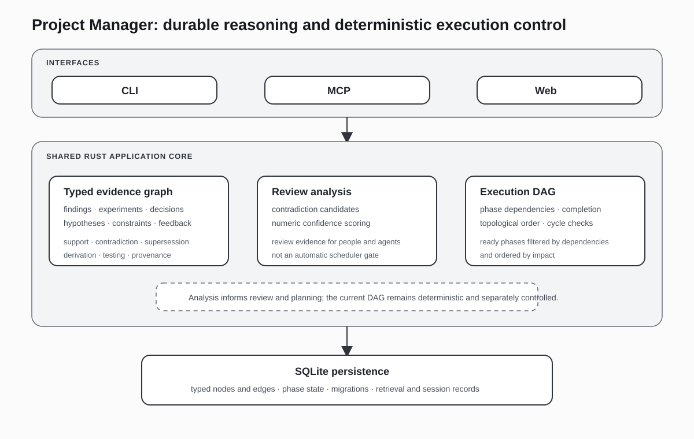

# Project Manager

> Project memory and execution control for long-running technical work: preserve what was learned, why decisions changed, and what can proceed next.

## At a glance

| | |
|---|---|
| **Product** | A local project-intelligence system that combines a typed evidence graph with a dependency-ordered execution graph. |
| **Users** | Engineers, researchers, technical leads, and AI agents working across many sessions, experiments, decisions, and handoffs. |
| **Core problem** | Long projects lose their reasoning history. Notes preserve text but rarely preserve what supports, contradicts, supersedes, depends on, or derives from what. Task boards preserve status but not epistemic context. |
| **Engineering focus** | Typed graph storage, provenance, contradiction and confidence review, deterministic DAG scheduling, retrieval, session orientation, and shared behavior across CLI, MCP, and web surfaces. |
| **Primary implementation** | Rust with SQLite-backed persistence and a shared application core exposed through multiple interfaces. |
| **Source** | [`wahargis/project-manager`](https://github.com/wahargis/project-manager) |

## The product problem

A long-running technical project accumulates more than tasks. It accumulates:

- findings whose confidence changes as new evidence arrives;
- experiments that produce or invalidate conclusions;
- decisions that depend on constraints and can later be superseded;
- literature, feedback, principles, and hypotheses that affect multiple workstreams;
- project phases whose order depends on actual prerequisites;
- incomplete work that must be handed from one person or agent session to another.

Conventional project-management tools usually reduce this to tickets, statuses, and comments. Document systems preserve more prose, but a later reader must reconstruct the relationships manually. Prompt history is even less dependable: it is session-bound, difficult to query, and mixes observations, plans, and conclusions without durable types.

Project Manager addresses the missing middle. It treats project knowledge as structured, connected state and project execution as a separate dependency graph. A reviewer can ask both:

1. **What do we believe, and why?**
2. **What work is ready to proceed, and why?**

Those questions are related, but the implementation does not pretend they are identical.

## Representative workflow

Consider a project in which an engineer is evaluating a new architecture:

1. **Create typed project objects.** The architecture hypothesis, benchmark experiment, measured finding, constraint, decision, and implementation phase are recorded as distinct node types.
2. **Connect the evidence.** Edges state that an experiment produced a finding, a finding supports or contradicts a hypothesis, a decision was informed by evidence, a test validates a change, or a new conclusion supersedes an older one.
3. **Review belief quality.** Confidence scoring can evaluate numeric finding sets. Contradiction analysis identifies high-recall candidates using structural and textual signals and can prepare a second-stage natural-language-inference review.
4. **Trace consequences.** A reviewer can traverse from a decision to its evidence, from a finding to downstream work, or from a superseded conclusion to the newer state that replaced it.
5. **Advance execution deliberately.** Project phases are represented in a DAG. Completed dependencies unlock later phases; the current scheduler recommends dependency-satisfied candidates in impact order.
6. **Orient the next session.** CLI, MCP, and web views can retrieve the relevant project state instead of asking a new session to rediscover the project from raw files and conversation history.

The value is not that every fact becomes a graph node. The value is that load-bearing project reasoning—evidence, decisions, contradictions, dependencies, and derivations—remains inspectable after the original context has disappeared.

## Two graphs with different responsibilities

```text
Evidence graph                          Execution DAG
--------------                          -------------
Finding --supports--> Decision          Phase A -----> Phase C
   |                    |                   \
   +--produced_by--> Experiment              +-------> Phase D
   |
   +--contradicts--> Finding

Explains what is known,                 Explains what work is ordered,
where it came from, and                 which prerequisites are complete,
what changed it.                        and which phase can proceed.
```

### Evidence graph: what is known and why

The evidence graph stores typed nodes such as findings, experiments, decisions, literature, phases, research items, principles, hypotheses, constraints, and feedback. Typed edges represent relationships including support, contradiction, supersession, dependency, derivation, testing, and provenance.

This model allows queries that are difficult to answer from documents alone:

- Which findings support this decision?
- Which evidence was produced by this experiment?
- What contradicts the current hypothesis?
- What replaced an older conclusion?
- Which downstream objects depend on a finding that changed?
- Which tests or artifacts are attached to a phase?

The graph is not an aesthetic visualization layer over notes. It is the project’s queryable reasoning structure.

### Execution DAG: what can proceed and why

The execution DAG models phases and their prerequisites. Topological ordering detects cycles, completed phases satisfy dependencies, and ready phases can be selected deterministically.

The current implementation’s recommendation rule is intentionally concrete: it filters for dependency-satisfied phases and orders the candidates by impact. This makes the behavior explainable and testable.

### The current coupling boundary

Contradiction detection and confidence scoring are implemented as review tools. They do **not** currently act as automatic hard gates inside the phase scheduler.

That distinction is important. The system can surface epistemic risk alongside execution state, and a human or agent can use that evidence when changing a plan or phase status. The portfolio does not claim that a confidence drop automatically blocks the DAG or that every contradiction is resolved without review.

This is a stronger and more useful description than collapsing the two graphs into a vague claim of “self-correcting execution.” It states exactly what the implementation does and leaves a clear architectural seam for deeper policy coupling.

## Architecture



### 1. Shared domain and persistence core

Node types, edge types, graph operations, phase state, and persistence behavior live in a common Rust core. Interface-specific code does not redefine the project model.

This reduces a common source of drift: a CLI command, an MCP tool, and a web route should not disagree about what a finding, decision, dependency, or ready phase means.

### 2. Typed storage and traversal

The store defines a closed vocabulary of node and edge types. The knowledge-graph engine supports direct and multi-hop traversal, filtering, and contradiction-oriented relationships.

Typed relationships improve both human comprehension and machine use. An agent can request “evidence that supports this decision” rather than retrieve every nearby text fragment and infer the relationship from prose.

### 3. Deterministic execution logic

The DAG engine performs topological ordering, cycle detection, ready-phase selection, and stagnation checks. Recommendation remains explainable because it is based on persisted phase state, dependency completion, and impact—not on an opaque model judgment.

### 4. Layered epistemic review

Contradiction review begins with high-recall heuristics: negation, antonym pairs, numeric divergence, and contradiction markers can identify candidate pairs. A deeper NLI prompt can then be prepared for model-assisted review.

Confidence scoring is likewise a distinct analysis surface. Numeric findings can be evaluated statistically without making every project object pretend to have a precise scalar confidence.

### 5. Multiple control surfaces

The system exposes project behavior through CLI, MCP, and web paths. The MCP surface is particularly relevant for coding and research agents: it gives an agent structured access to nodes, edges, dashboards, review operations, and project state without requiring the agent to scrape Markdown.

The interfaces are different ways into the same project model, not separate implementations with independent semantics.

## Key design decisions

### Preserve relationships, not only text

A document can say that one experiment changed a decision, but the relationship is difficult to query unless it is represented directly. Project Manager stores that relationship as data while retaining human-readable content on the nodes themselves.

### Separate epistemic state from workflow state

A finding can be uncertain while a phase is technically unblocked. A phase can be blocked even when its evidence is strong. Keeping the evidence graph and execution DAG distinct avoids turning one dimension into a misleading proxy for the other.

### Use typed edges as an API contract

`supports`, `contradicts`, `supersedes`, `depends_on`, `derived_from`, and related edges carry semantics that can be used consistently by the CLI, MCP clients, web views, and future policy layers.

### Keep recommendations deterministic by default

A scheduling rule based on completed dependencies and impact can be reproduced and explained. Model-assisted analysis is used where language interpretation is genuinely required, such as contradiction review, rather than inserted into every control decision.

### Treat retrieval as project orientation

Retrieval is not merely semantic search over archived prose. The useful result includes relationship and lifecycle context: what kind of object this is, how it connects to the active work, whether it has been superseded, and why it matters to the current session.

## Failure and consistency concerns

The project model addresses several forms of project-state decay:

- **Lost rationale:** decisions remain connected to the evidence and constraints that informed them.
- **Stale conclusions:** supersession and contradiction relationships preserve change instead of silently overwriting history.
- **Unreproducible sequencing:** phase readiness follows a persisted dependency graph.
- **Interface drift:** shared core logic serves CLI, MCP, and web entry points.
- **Session amnesia:** project state can be queried independently of the conversation that created it.
- **False automation claims:** contradiction and confidence analysis are exposed as review signals unless and until an explicit policy connects them to execution gating.

## Implementation evidence

| Source | What it demonstrates |
|---|---|
| [`src/store/mod.rs`](https://github.com/wahargis/project-manager/blob/main/src/store/mod.rs) | The persisted node and edge vocabulary, including evidence, lifecycle, dependency, testing, contradiction, and provenance relationships. |
| [`src/kg/mod.rs`](https://github.com/wahargis/project-manager/blob/main/src/kg/mod.rs) | Knowledge-graph traversal, filtering, multi-hop exploration, and contradiction-oriented graph operations. |
| [`src/dag/mod.rs`](https://github.com/wahargis/project-manager/blob/main/src/dag/mod.rs) | Topological ordering, dependency satisfaction, ready-phase selection, impact ordering, and stagnation detection. |
| [`src/analysis/contradictions.rs`](https://github.com/wahargis/project-manager/blob/main/src/analysis/contradictions.rs) | High-recall contradiction candidate generation and the handoff to deeper language-based review. |
| [`src/analysis/confidence.rs`](https://github.com/wahargis/project-manager/blob/main/src/analysis/confidence.rs) | Numeric finding confidence analysis as a separate, reusable review capability. |
| [`src/cli_runner.rs`](https://github.com/wahargis/project-manager/blob/main/src/cli_runner.rs) | Application-level use of the DAG and project store, including the current next-phase recommendation behavior. |
| [`src/mcp/`](https://github.com/wahargis/project-manager/tree/main/src/mcp) | Agent-facing tools for structured project access rather than document scraping. |

## What the project demonstrates

For a recruiter or general interviewer, Project Manager shows a clear product thesis: long technical projects need durable reasoning and handoff state, not only tasks and notes.

For a software reviewer, it demonstrates domain modeling, persistence, graph algorithms, deterministic scheduling, interface reuse, and the discipline to state coupling boundaries accurately.

For an AI technical lead, it demonstrates an alternative to treating prompt history or vector retrieval as complete memory. The system gives agents typed project state, provenance, contradiction candidates, confidence signals, and an execution model that can be inspected independently of model output.

## Scope and boundaries

- Project Manager is not intended to replace a general issue tracker for routine team administration.
- The evidence graph is not a claim that every sentence or file should be converted into a node.
- Contradiction heuristics generate candidates; they are not presented as infallible semantic judgments.
- Confidence scoring is strongest for appropriate numeric finding sets and is not applied indiscriminately to qualitative evidence.
- The current DAG scheduler does not automatically block work based on contradiction or confidence results.
- This page describes the shared project-control architecture; it does not inventory every command, MCP tool, or web route.

## Review paths

**Five minutes:** read **The product problem**, **Representative workflow**, and **Two graphs with different responsibilities**.

**Twenty minutes:** continue through **Architecture**, **Key design decisions**, and the first six source links.

**Deep review:** inspect the store, graph, DAG, analysis, and MCP modules together to see how the same project model is carried across interfaces.

[← Back to portfolio](../README.md) · [View source repository](https://github.com/wahargis/project-manager)
