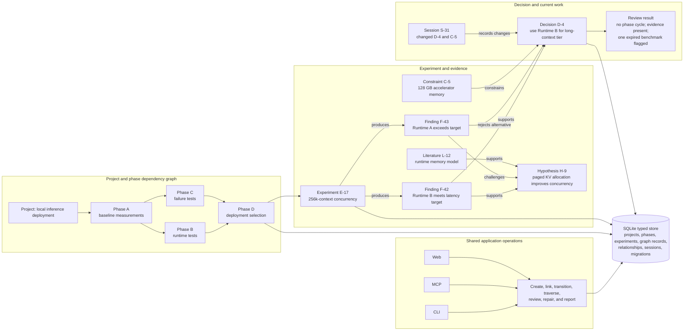

# Project Manager

Project Manager is a local-first system for technical research, experiment tracking, project execution, and decision records. It stores project structure, phase dependencies, experiments, findings, hypotheses, literature, constraints, decisions, and work sessions in one typed model.

[Source repository](https://github.com/wahargis/project-manager)

## Example workflow

The diagram follows a project that compares local inference runtimes for a long-context deployment.

1. The project is divided into phases with explicit dependencies.
2. A phase creates an experiment with a question, configuration, run state, and result artifacts.
3. The experiment produces a typed finding.
4. The finding supports or challenges a hypothesis.
5. Literature and constraints add external evidence and operating limits.
6. A decision cites the findings and constraints it uses.
7. Review services check the scheduling graph and evidence graph before the next phase starts.
8. A later session loads current state and the changes since the previous session.

The records remain connected after the experiment is complete. A user can trace a decision back to the specific benchmark, result, source, and constraint that informed it.

## Project and phase scheduling

Projects can contain subprojects. Phases form a dependency graph. The scheduler uses that graph to determine which phases are ready, blocked, active, or complete.

Dependency validation runs before a phase edge is stored. This prevents cycles from becoming normal scheduling state. Review commands can still find damaged or imported records that require repair.

A phase can reference its goals, experiments, constraints, findings, and decisions. This keeps execution status connected to the research that changed the plan.

## Evidence graph

The evidence graph uses typed nodes and relationships. Important examples include:

| Record | Relationships used in the workflow |
|---|---|
| Experiment | belongs to a project or phase; produces findings and artifacts |
| Finding | result of an experiment; supports or challenges a hypothesis; informs a decision |
| Hypothesis | supported or challenged by findings and literature |
| Literature | supports, challenges, or supplies background for a claim |
| Constraint | applies to a project, phase, experiment, or decision |
| Decision | addresses a question and cites the evidence and limits it uses |
| Session | records the active work context and the records changed during that work |

Graph traversal answers questions that a task list cannot answer directly. It can show which evidence supports a decision, which findings conflict, which constraints apply to a phase, and which records would be affected by changing a hypothesis.

## Review and repair

Project Manager runs structured checks over stored state. These checks can report:

- Phase dependency cycles.
- Blocked or dangling phases.
- Findings without an experiment or source.
- Decisions without supporting evidence.
- Contradictory findings or claims.
- Low-confidence conclusions.
- Expired temporal facts.
- Orphaned graph nodes or relationships.

Repair operations use the same typed store and validation rules as normal writes. They can attach an orphaned record, remove an invalid edge, refresh derived state, or mark a temporal fact as no longer current.

## Interfaces

The CLI, MCP server, and web interface expose the same application operations. They do not maintain separate project models.

- The CLI supports direct local work, scripts, review, and repair.
- MCP exposes typed project, graph, session, and review operations to AI tools.
- The web interface presents current projects, phases, graph records, and review results.
- Dashboard operations assemble project status from the stored model.

This allows a person, an AI client, and an automated check to update the same records without translating through free-form notes.

## Storage and transactions

SQLite stores the project, graph, session, and relationship records. Mutations run through typed store methods and transaction boundaries. Migrations update the schema while preserving local project data.

Validation occurs before or during writes for identifiers, relationship types, phase dependencies, and required fields. Graph traversal and review use stored identifiers instead of parsing references from prose.

## Session continuity

A session records the project, active objective, referenced nodes, and work completed. On the next session, Project Manager can return:

- Current project and phase state.
- Open experiments and unresolved findings.
- Recent decisions and constraints.
- Records changed since the previous session.
- Review results that require action.

This provides a compact restart context without asking the user or an AI tool to reconstruct the project from the full history.

## Implementation references

| Workflow area | Source |
|---|---|
| Phase dependency graph | [`src/dag/mod.rs`](https://github.com/wahargis/project-manager/blob/main/src/dag/mod.rs) |
| Typed knowledge graph | [`src/kg/mod.rs`](https://github.com/wahargis/project-manager/blob/main/src/kg/mod.rs) |
| Graph traversal | [`src/kg/traversal.rs`](https://github.com/wahargis/project-manager/blob/main/src/kg/traversal.rs) |
| Confidence analysis | [`src/analysis/confidence.rs`](https://github.com/wahargis/project-manager/blob/main/src/analysis/confidence.rs) |
| Contradiction analysis | [`src/analysis/contradictions.rs`](https://github.com/wahargis/project-manager/blob/main/src/analysis/contradictions.rs) |
| MCP project and graph operations | [`src/mcp/nodes.rs`](https://github.com/wahargis/project-manager/blob/main/src/mcp/nodes.rs) and [`src/mcp/tools.rs`](https://github.com/wahargis/project-manager/blob/main/src/mcp/tools.rs) |
| Review operations | [`src/mcp/review.rs`](https://github.com/wahargis/project-manager/blob/main/src/mcp/review.rs) |
| SQLite store | [`src/store/sqlite.rs`](https://github.com/wahargis/project-manager/blob/main/src/store/sqlite.rs) |
| Validation | [`src/validation.rs`](https://github.com/wahargis/project-manager/blob/main/src/validation.rs) |
| Web interface | [`src/web.rs`](https://github.com/wahargis/project-manager/blob/main/src/web.rs) |

## Scope

Project Manager is designed for local technical work where project execution and evidence need to remain connected. It is not presented as a generic corporate ticket system. The case study focuses on typed state, research traceability, multi-interface access, validation, and repair.
